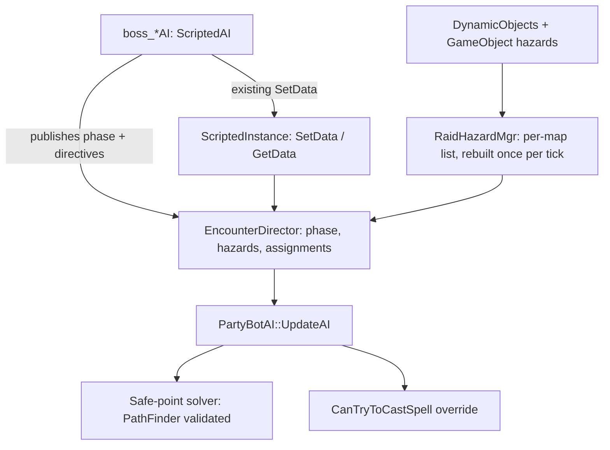

# Bot Encounter Awareness

Give player bots enough awareness of scripted instance mechanics that a single human player can clear
the game's group content with bots: 5-man dungeons, 20-man raids, and 40-man raids. The approach
favors a generic mechanics layer that instance and boss scripts publish into, rather than duplicating
encounter knowledge inside the bot AI.

Companion document: [persistent-bot-raid-guild.md](persistent-bot-raid-guild.md) covers the roster
and gearing side. This document covers combat and encounter behavior.

All claims below were verified against the code. Symbol and function names are the durable
reference; line numbers drift as files are edited and are indicative only.

## Progress

Status key: **not started** / **in progress** / **done**. Phase headings carry the marker. This
section carries the phase status, the commit history, the ordered tasking, and the findings that
changed the plan.

### Phase status

| Phase | Status | What is left |
| --- | --- | --- |
| 0 - Death and wipe recovery | **in progress** | Applying a soulstone before the pull, which needs a warlock spell slot that does not exist yet. Everything else is done and tested at raid scale |
| 1 - Generic combat correctness | **in progress** | Tick responsiveness. Spell reflect is contingent on there being content that needs it, and there may be none |
| The rotation engine | **not started** | All of it. Spell population, its prerequisite, is done |
| 1a - Playing the class properly | **not started** | All of it. The largest phase in the project |
| 1b - Raid flow, pull control, tank assignment | **not started** | All of it |
| 2 - Movement arbitration and hazard avoidance | **not started** | All of it, and gated on 3a rather than the reverse |
| 3a - Encounter directive layer | **not started** | All of it |
| 3b - Instance objective orchestration | **not started** | All of it |
| 4 - Content rollout, smallest first | **not started** | All of it |
| 4b - Difficulty tuning | **not started** | All of it, built alongside 1a rather than after it |
| 5 - Tooling | **in progress** | Hazard and directive inspection, attempt logging |

### Landed

| Commit | What |
| --- | --- |
| `5e77b066d` | Bots no longer wait on movement acks that can never arrive |
| `e04904be4` | Test harness for driving the server without a game client |
| `700a41239` | Two corpse-path bugs that strand a dead player |
| `2c28cd731` | Wipe recovery: release, healer window, spirit-healer fallback |
| `203d9e1a9` | Wipe recovery test, and the death state `.harness info` needed to see it |
| `64d8df0f3` | Map-transfer acks moved to `PlayerBotAI`, so headless characters can change map |
| `22989e473` | Corpse run: graveyard back to the corpse or the way into the instance |
| `c905be64c` | Navmesh diagnostics: `.harness path`, `graveyard`, `loadmmaps`, `.mmap loc` |
| `24bb1f211` | Sweep of every instance entrance for a walkable corpse run |
| `18c47ba47` | Six offmesh links bridging entrances the mesh leaves unreachable |
| `8b21ca2b6` | `.harness rewardquest`, the only way to attune a bot to anything |
| `45ae0768d` | Ghost entrance height read from the trigger rather than the terrain |
| `7bbba792a` | Bots report every area trigger they stand in, not the lowest numbered |
| `caf3f2494` | Spell slots that name matching never reached, and `.harness spells` |
| `677a9cc14` | Totems and blessings chosen by role and group rather than at random |
| `9b9fd9ee6` | Ghost run speed applied to the ghost rather than to the corpse |
| `410e4a1e1` | Corpse runs judged by ground covered, and walked into the door |
| `25a44417d` | Two live party bots can no longer be given the same name |
| `f2514c6a8` | Every instance and every raid proving its own corpse run |
| `ec47f1e2a` | A corpse's faction derived from its race rather than dereferenced unset |
| `a23a5ac39` | Death, drinking and ammo made costly by default, and visible to the harness |
| `8ac59f148` | Rogue poisons applied from a vial that is then gone, rather than cast for free |
| `a79512778` | Rebirth, soulstones and Ankhs, so a death mid-pull need not end the pull |
| `3b77aadb4` | The harness commands written down, since agents were re-deriving them |
| `162942935` | Damage dealers wait for the tank before opening |
| `5c864516e` | The field cleared before the resurrection suite summons its target |
| `bb0a65648` | The threat ceiling tuned for damage rather than for tidiness |
| `51007f390` | A bot below sixty learns the class spells its level would already have |
| `1ba9c0df2` | `.harness threat` reports which flip rule each attacker is judged by |
| `6477e5e16` | The tank holds the target at full raid size |

### Next

In order. The first two close Phase 0 and Phase 1; the third is the gate on everything after them.

1. **Apply a soulstone before the pull.** Consuming one works and Rebirth and Ankhs are done, so
   this is the last of Phase 0. It is blocked on the warlock spell struct having no soulstone slot,
   which is `PopulateSpellData` work.
2. **Author tank specs at 19, 29, 39 and 49.** A low-level bot asked to tank now has the right
   spellbook but spends its talents on an arms twink build. Data work rather than code.
3. **The rotation engine**, which gates Phase 1a and therefore most of the project. Build the
   action pipeline first, since chain casting alone is roughly 17 percent of caster throughput and
   needs no new hooks.

Two items are deliberately parked. **Tick responsiveness** is part of the engine's action pipeline
rather than a separate task, and doing it early would mean doing it twice. **Spell reflect
avoidance** waits on evidence that any scripted boss in this codebase reflects, since a grep for
`SPELL_AURA_REFLECT_SPELLS` across `src/scripts` returns nothing.

### Findings that changed the plan

Recorded because each one cost real investigation and would otherwise be re-derived.

- **The 110 and 130 percent pull thresholds are real here, and the melee test is the creature's
  reach rather than the attacker's class.** `ThreatContainer::selectNextVictim` keeps the current
  victim while the best candidate is within 110 percent of it, and switches above 130 percent
  outright or above 110 percent when `CanReachWithMeleeAutoAttack` says the creature can hit the
  candidate. So the threshold follows position, not role: a caster that has drifted into reach is
  judged at 110 like anything else, which means a mage sitting at 117 percent of the tank looks
  safe against 130 and is not. Anything reasoning about this has to ask the creature.
- **A per-cast threat gate cannot hold a warlock, because the threat it is throttling has already
  been committed.** The warlock kept climbing after it stopped casting, since damage over time
  goes on arriving for another fifteen seconds. The quantity to leave room for is everything in
  flight, not the next spell, which is why the caster headroom is thirty points rather than the
  ten a single cast suggests and why a real threat estimate beats a bigger constant.
- **Threat is invisible from outside and the two failures look identical.** A damage dealer
  holding station below the tank and one that has run out of things to cast produce the same
  observation, as do a raid whose tank is holding and one whose boss is a second from turning
  round. `.harness threat` exists for that, and the first thing it showed was that peaks measured
  from the opening seconds are arithmetic rather than behaviour: the tank's threat starts near
  zero and every ratio against it is enormous.
- **A binary that is built is not a binary that is running.** The service runs an installed copy
  and the loop was only calling `make`, so several hours of threat measurements described code
  that had never executed. Anything measured on this server is worthless without `make install`
  and a restart first.
- **Bot sessions report connected, and the consequence is a third outcome this document did
  not consider.** Phase 0 asked whether `GetSession()->IsConnected()` is true for a bot,
  since the corpse-run design rests on it. It is: `m_connected` is initialized `true` in the
  `WorldSession` constructor regardless of whether a socket exists, and only
  `SetDisconnectedSession` clears it, which the bot path never calls. So release took the
  deferred branch and then waited on a water-walking ack that could never arrive. It did not
  hang forever, though — a timeout under `CheckPendingMovementChanges` force-resolves after
  `Movement.PendingAckResponseTime`, four seconds by default, and charges a
  `CHEAT_TYPE_PENDING_ACK_DELAY` violation each time. Fixed in `5e77b066d` by treating a bot
  as having no client at both sites. **The corpse-run design in Phase 0 is therefore sound as
  written.**
- **A path query whose destination sits in an unloaded tile does not fail; it abandons the
  mesh and returns a straight line.** Tiles load with the grids around a player, so anything
  that reasons about a route from a distance reports success everywhere. This produced a
  fully green first sweep that was entirely false, including a 1786-yard "path" straight
  through Dustwallow Marsh. `.harness loadmmaps` exists to make such reasoning valid. The
  same trap applies to any future tooling that asks about somewhere nobody is standing.
- **A survey is only worth what its agreement with the live code is worth, and two of them
  disagreed silently.** The sweep took Blackwing Lair's entrance height from the area trigger
  standing at the map's ghost entrance; the bot took it from `GetHeight` on the terrain. Both
  are defensible readings of two coordinates that carry no height, and they differ by 144
  yards, because the Orb of Command is inside Blackrock Mountain and there is walkable summit
  above it. So the sweep passed and the live run walked to precisely the right spot on the map,
  a hundred and forty yards over the orb, and stalled there until the spirit healer collected
  it. A ghost entrance names a trigger, and a trigger knows its own height; both now ask it.
- **Area triggers overlap, and taking the lowest numbered one is not a tie-break, it is a
  coin toss.** Two triggers sit within a foot of each other at the Orb of Command. 3846 has no
  script, no teleport and no effect of any kind; 3847 is the only way a ghost re-enters
  Blackwing Lair. `ActivateNearbyAreaTrigger` reported the first it found and stopped, so the
  bot completed an eighteen hundred yard run, fired the inert one, and walked away. It now
  reports all of them, which is what a client does and what the handler is written to expect:
  it re-tests range per packet, so once one moves the bot the rest lapse.
- **A test that asserts the destination rather than the route will pass on the wrong
  mechanism.** The first BWL run ended with the bot alive inside Blackwing Lair and was
  scored a pass. It had in fact stalled, been revived at the graveyard by the spirit healer,
  and follow-teleported to its leader. Any recovery test needs to fail on the deadlock
  breakers firing, not just on the final position.
- **Measuring a corpse run by distance remaining calls a stall on every route that goes the long
  way around.** Progress was scored as closing on the destination, so a ghost spiralling through
  Blackrock Mountain or working down into the Maraudon canyon was walking perfectly well while its
  straight line got no shorter, and the sixty-second deadline collected it. This is what made the
  suite flaky rather than broken: which instances failed changed run to run with server load, and
  every failure looked identical to a genuinely unreachable corpse. Progress is now ground covered,
  which is the thing a stuck ghost actually stops doing, with an overall cap so that covering
  ground in a circle still ends.
- **A silenced setup step reappears as a route bug.** Attunements were applied with failures
  ignored, so a bot that never got Blackhand's Command ran the full eighteen hundred yards and was
  turned away at the door, which reads exactly like a broken entrance. Worse, it only happened
  under leaders whose bots had not been attuned by some earlier test, so it moved around.
- **Recruiting where the group happens to be standing means recruiting inside the last dungeon.**
  A leader that has just finished a five-man is still in it, and that instance's player cap turns
  away the fifth bot of the raid group being formed for the next one. The harness reported "only
  4 of 5 bots joined", which is the room being full and not the group. Groups now form on open
  ground in the Barrens before going anywhere.
- **An audit finding is a hypothesis until the game data agrees with it.** Four of the five
  spell-population defects recorded in this document were wrong or wrongly explained once `spell_template`
  and `skill_line_ability` were actually queried: mages have no decurse problem at all, the Disease
  Cleansing Totem slot was empty rather than holding the wrong totem, the resurrection slot was decided by
  hash order rather than by spell ID, and the rogue poison defect was the exact inverse of the one
  described. Two of them would have produced a *worse* bot if implemented as written. The world database is
  not in the checkout, which is why the claims went unchecked for so long; it is reachable on the dev
  server and costs one query.
- **Randomness hides magnitude.** The rogue poison bug was in plain sight for as long as the file has
  existed, and it survived a nine-class rotation audit, because the poison is picked at random from a pool
  and therefore looked different every spawn. What nobody checked was the one thing that never varied,
  which was that the rank was always 1. Anywhere `SelectRandomContainerElement` appears, the varying part
  is camouflage for whatever is constant underneath it.
- **A slot that population never fills is invisible from outside the process.** Every one of these bugs
  presents as "the bot never casts X", which is what a deliberate rotation decision also looks like, so
  they survived a nine-class audit of the rotations themselves. `.harness spells` exists to end that class
  of confusion: it names every slot and reports what is in it.
- **A spell name is a prefix of other spell names, and `find()` does not know that.** Three separate bugs
  now share this shape. The rogue poison lookup matched `"Deadly Poison"` and so could only ever find rank
  1. The blessing matchers matched `"Blessing of Kings"`, which is a substring of *Greater* Blessing of
  Kings — the reagent-consuming version that buffs a whole class at once — so a paladin could end up with
  one filed as its ordinary single-target blessing. And `"Disease Resistance Totem"` matched nothing at all
  because no spell is named that. Two of the three were only found because a *different* change made the
  output deterministic enough to read. The rule going in: when matching a spell by name, decide explicitly
  what the longer names containing it are and rule them out.
- **Attunement cannot be granted by `.quest complete`.** It stops at `QUEST_STATUS_COMPLETE`,
  and only quests flagged `AUTO_REWARDED` go further, whereas the gates are checked with
  `GetQuestRewardStatus`. Blackhand's Command is flagged `RAID`, not auto-rewarded. Hence
  `.harness rewardquest`, which the roster work needs anyway for Onyxia, Molten Core and
  Naxxramas.
- **Detour's path type must be read as flags, never matched as a value.** The interesting
  answers are combinations: `NORMAL|NOT_USING_PATH` is a straight line drawn because the
  mesh was unavailable. Matching on the value alone reported it as "OTHER" and concealed the
  bug above.
- **A dungeon portal is a volume, not a point, and testing arrival by distance to its centre
  is wrong.** Half of them are box shaped with a radius of zero, and Ragefire Chasm's box is
  twenty one yards tall — a ghost standing in the doorway measures ten yards from the centre.
  Using a fixed radius produced five false failures out of nine. Arrival is
  `IsPointInAreaTriggerZone` with the same tolerance the bot uses, and nothing else.
- **`areatrigger_teleport` is not the complete set of ways into an instance.** Blackwing Lair
  is entered by a C++ scripted trigger beside the Orb of Command (`at_orb_of_command`,
  trigger 3847) that fires only for a dead player whose corpse is inside, and it has no row
  in that table. Reading the table alone concluded the raid was permanently unreachable. The
  map's `ghost_entrance` names the spot correctly, so that is the fallback. Auditing the
  other 56 scripted triggers found no further instance entrances, so this is the only case.
  Note the trigger also requires quest **7761** (Blackhand's Command) rewarded, which is a
  roster attunement problem rather than a corpse-run one.
- **Entrance descents are routinely missing from the mesh, and the pattern is recognisable.**
  Wailing Caverns, Blackrock Depths, Blackrock Spire, Sunken Temple and Blackfathom Deeps all
  stalled with the ghost directly above its dungeon: both sides meshed, no connection, drops
  of eighty to a hundred and thirty yards. An offmesh link in `contrib/mmap/offmesh.txt` plus
  a single-tile regeneration fixes each in a few minutes. The tile field in that file is
  `(32 - y/533.33),(32 - x/533.33)`, which is not the order the header comment suggests.
- **`ProcessDelayedOperations` holds a verbatim copy of the tail of
  `ResurrectUsingRequestData`.** Any fix to one needs applying to both. This is the path taken
  whenever the resurrector is on another map, which is the common raid case.
- **The movement anticheat is off on the dev server** (`Anticheat.Enable = 0`), so anticheat
  violations are inert locally and cannot be used as a signal that a bot-movement fix worked.
- **Most raid bosses are static spawns; the gated finales are not.** Verified against the
  world database for Molten Core: 8 of 10 bosses have `creature` rows on map 409, while
  Majordomo Executus and Ragnaros have none and are summoned by the instance script after the
  rune event. Teleporting a raid into a boss room therefore works for the majority of
  encounters and fails for exactly the endgame boss you most want to test. `.npc add <entry>`
  spawns a working scripted boss for isolated testing, at the cost of not reproducing whatever
  the real chain sets up around it; `.instance setdata` records encounter state but has no
  spawn side effect, so it opens doors rather than conjuring bosses.
- **Weekly raid lockouts do not block iteration.** `.instance unbind` and
  `.instance groupunbind` both exist, so a boss can be killed and re-tested. The
  smallest-content-first ordering in Phase 4 still holds, but for the reason that 5-man bosses
  are almost all static rather than because raid binds are a hard ceiling.
- **Waiting for a resurrection needs a deadline, not just a condition.** The obvious rule —
  hold the corpse while a healer is alive and in range — deadlocks on a healer who survived
  the wipe but is out of mana, which is a common way to lose. The same applies to the ghost
  stage. Both waits are bounded by `PartyBot.DeathRecoveryTimeout`. The healer window resets
  while they are mid-cast, because Resurrection is a ten second cast and a healer working
  down a pile of corpses would otherwise blow the budget for everyone further down the pile.
- **`partybot remove` removes the selected player only, and a character with nothing selected
  counts as selecting itself.** So the natural "clear the roster" call is a silent no-op that
  reports success, and each bot has to be told to remove itself. The reset in
  `test_raid_group.py` was never doing anything; it only passed because it happened to run
  against an empty roster.
- **Two of the four free-resource cheats this document catalogued were not what it said, and one
  was not a cheat at all.** Both had been reasoned from upstream MaNGOS rather than read here.
  Environmental death was said to charge the ten percent durability loss twice; it does not, since
  `EnvironmentalDamage` passes `durabilityLoss = false` down and `Unit::Kill` skips its own charge
  on the same flag. The weapon buff was said to be free because a triggered spell skips the mana
  cost; in this fork `Spell::TakePower` exempts `m_triggeredByAuraSpell` and not
  `m_IsTriggeredSpell`, so shaman imbues were always paid for. Read the fork, not the family.
- **A weapon enchant the character never learned comes out of an item, and that alone identifies
  the fix.** [fixed] A rogue learns the trade spell that makes the poison vial, never the enchant
  the vial applies, so the bot casting the enchant by name was not having consumption waived — no
  poison ever had to exist. This looked like a poison-selection problem and needed no part of it:
  `CastWeaponBuff` splits on `HasSpell`, casting a shaman imbue and applying anything else through
  `Player::CastItemUseSpell`, which is the path the client uses and spends a charge. Verified live,
  a rogue carries 19 of each of two poisons after buffing both hands.
- **Free full health and mana out of range was load-bearing, so removing it alone hangs the
  bot.** The out-of-combat block tests for food and drink before it tests for distance, and a
  bot that needs either never falls through, so the only way one could ever reach the teleport
  back to the leader was to stop needing them: which is what the free restore did. Deleted on
  its own, a straggler sits and drinks forever and never rejoins. Distance is now dealt with
  first, so the bot is brought back and drinks with everyone else, at the same cost in time.
- **A corpse never had a faction, and the getter dereferenced it anyway.** `m_faction` is
  assigned in exactly one place in the tree, in `Map::RemoveCorpses` and only when the owner is
  still on the map, so every corpse loaded from the database and every set of bones left by a
  player who has gone elsewhere carried a null pointer into `Corpse::GetFactionTemplateId`.
  The race is on the corpse in all three cases and is what set the owner's faction to begin
  with, so it is derived from that rather than left to a caller to remember.

### Test coverage

Every test runs against a live server over SOAP; there is no unit test layer. The roster and gearing
suites are listed in the companion document.

| Test | What it proves |
| --- | --- |
| `test_wipe_recovery.py` | A partial wipe recovered by the surviving healer with nobody releasing, and a full wipe recovered with nobody left to cast anything |
| `test_raid_wipe_recovery.py` | Each of the seven raids filled to its own cap and wiped with nobody standing, the whole raid walking back into an instance holding no live player |
| `test_corpse_runs_live.py` | A bot killed inside each of the 26 instances releasing, crossing the world between, and letting itself back in unaided, with a spirit-healer rescue counted as a failure |
| `test_bwl_corpse_run.py` | The one instance with no portal a ghost can walk into: the fallback to the map's ghost entrance, eighteen hundred yards of Blackrock Mountain, and a scripted trigger no search of the teleport table finds |
| `sweep_corpse_runs.py` | Every entrance reachable from its release graveyard, as a mesh property rather than a walk. Cheap enough to run over all of Dire Maul's twenty-eight doors |
| `test_combat_resurrection.py` | A bot that dies mid-fight brought back before the fight ends, by Rebirth and by self resurrection, three runs each |
| `test_threat_throttling.py` | The tank leading the list when damage is released, no single loss of the target lasting more than fifteen seconds, and the tank holding it for at least 85 percent of the settled fight |
| `test_spell_population.py` | Every named spell slot on a bot of each of the nine classes, asserting both that the bot knows what is in the slot and that the rank matches its level |
| `test_totem_and_blessing_choice.py` | That a bot makes the same totem and blessing choice on every spawn, that the choice moves when group composition moves, and that each member holds the blessing suited to it |

### Build and test loop

Working on the WSL host, since SOAP binds to loopback. Source at `~/vmangos`, build at
`~/build-vmangos`, install at `~/server`. `~/bin/vmangos-sync` mirrors the Mac working copy.

- **Fast syntax check on one file**, no link:
  `cd ~/build-vmangos/src/game && make Objects/Player.o`. The convenience target is the source
  path relative to the `CMakeLists.txt` directory with a `.o` suffix.
- **Full build**: `cd ~/build-vmangos && make -j12 mangosd`. Always start it in the background
  writing to a log and poll, rather than blocking on it. Piping through `grep` hides all
  progress and makes a slow build indistinguishable from a hung one.
- **`Player.cpp` is a single 22,000-line translation unit, so `-j12` buys nothing when it is
  the file that changed.** It serializes the whole build and a genuine edit to it costs
  minutes on its own. Batch edits to it. Measured points of reference: a full rebuild after a
  `World.h` change is about 2.5 minutes, and a link-only rebuild is 15 seconds.
- **Touching `World.h` rebuilds almost everything**, so batch config additions rather than
  adding them one at a time.
- **ccache was silently doing nothing** until `sloppiness` was set: the build has
  `USE_PCH=ON`, and ccache refuses to cache precompiled-header compilations unless
  `sloppiness` includes `pch_defines,time_macros`. It sat at a 4 percent hit rate with 90
  percent of calls uncacheable. Now set, with `include_file_mtime,include_file_ctime` as well
  and a 20G cache. Recompiling an unchanged `Player.cpp` went from minutes to 0.4 seconds.
  Be clear about what this does and does not buy: it rescues rebuilds of content that has
  been compiled before, which covers rsync touching mtimes, reverting an experiment, and
  moving between branches. It does **not** make a genuinely new edit faster, and it does not
  help when a widely included header's contents change, since that changes the hash of every
  translation unit that includes it.
- **`make` is not deployment.** The service runs the installed copy under `~/server/bin`, so a build
  without `make install` and a restart leaves the old binary running and every measurement taken
  against it worthless. This cost several hours once already.
- **Restarting mangosd** needs an explicit wait for port 7878 to be released and rebound,
  otherwise the next SOAP call races the restart.
- **There is a second world, `~/bin/server2`, for when two people are working at once.** A
  restart takes the whole dev server down for a minute or so, which is fatal to a suite like
  `test_corpse_runs_live.py` that runs for five, so two strands of work on one world serialize
  hard. server2 is realm 2 on world port 8086 and SOAP 7879, with its own `characters2`
  database and its own logs, sharing the world database and the map data — those are read-only
  in practice and the world database is 165 MB, so copying it would be waste. Drive it by
  setting `VMANGOS_SOAP_URL=http://127.0.0.1:7879/`; the harness already reads that.
  `~/bin/server2 restart` reinstalls the binary from the build directory and waits for the
  port, and its config is regenerated from server1's by `~/bin/make-server2-conf` on every
  start, so a rate tuned on one is not silently different on the other. Two gotchas found
  setting it up: `account_access` is keyed by realm, so a GM account on realm 1 is an ordinary
  account on realm 2 until its rows are mirrored, and the `mangos` database user cannot create
  databases, so `characters2` has to be created as root and granted.
- The harness reads credentials from `VMANGOS_SOAP_USER` and `VMANGOS_SOAP_PASSWORD`.
- `src/game/Chat/Chat.cpp` is CRLF while its neighbours are LF, with no `.gitattributes`.
  Editors that normalize it turn a ten-line diff into eight thousand.

## Scope: orchestration is bounded, rotations are not

The orchestration half of this project is bounded and is argued below. The rotation half is not, and
it is the single largest piece of work here: a nine-class audit found the combat layer resting on a
framework that caps quality no matter how much per-class code is added. See the rotation engine
section below.

The codebase has 113 `boss_*.cpp` scripts across 24 `instance_*.cpp` scripts, roughly 50 boss scripts
in 5-man dungeons and 63 in raids. That count overstates the work, because a large majority of
scripted 5-man bosses are timed-spell AI with at most one health-threshold phase, which a competent
generic combat layer handles with no encounter awareness whatsoever. Several dungeons — Stockade,
Shadowfang Keep, Blackfathom Deeps, both Razorfens — have no boss scripts at all and run on database
creature AI.

The real work concentrates in **instance event orchestration**: sequences, objectives, and timers
owned by `instance_*.cpp` rather than by any single boss. Examples across 5-man content include the
Wailing Caverns escort, Zul'Farrak's pyramid wave event, the Sunken Temple statue puzzle,
Scholomance's wing-kill gating for Gandling, Stratholme's ziggurats and the Baron timer, Blackrock
Depths' Ring of Law, the Upper Blackrock Spire rookery, Uldaman's altar activation, Gnomeregan's bomb
faces, and Dire Maul's tribute run — which is an avoid-aggro exercise rather than a combat problem.

This is a different vocabulary from the hazard-and-positioning directives that raid encounters need,
so it is treated as its own subsystem in Phase 3b rather than bolted onto the combat directive layer.

A dedicated coverage audit confirmed the load-bearing assumption: **every vanilla raid boss has a substantial
registered C++ script**, so the directive layer has somewhere to publish from. Molten Core is 10 of 10,
Blackwing Lair 8 of 8, AQ40 9 of 9, AQ20 6 of 6, Naxxramas 15 of 15 wings, with C'Thun at roughly 2000 lines
and Thaddius, Kel'Thuzad, Four Horsemen, Razorgore, Vaelastrasz, Nefarian, Ragnaros, Viscidus, and Onyxia all
implemented. The gaps are annotations rather than absences - Shazzrah's teleport and Sulfuron's adds are
marked not-implemented, and **Gothik is the one genuinely partial encounter at 60 percent, with its add
control and split-room logic unfinished**. Zul'Gurub's Edge of Madness trio have source files that are
commented out of `ScriptLoader.cpp` and therefore never register.

Two consequences for sequencing. First, **prototype the EncounterDirector against a scripted encounter, not
against the earliest content.** The rollout starts in 5-mans for iteration speed, but the earliest dungeons
are exactly where boss scripts do not exist, so there is nothing there to publish directives from; the
generic combat layer carries that content and the director needs a raid or a late dungeon to prove itself.
Second, **EventAI coverage cannot be assessed from this checkout at all** - the world database is an external
release artifact, not in the repository - so any claim about a specific non-scripted boss's behavior has to be
verified against an imported database rather than read from source.

### Explicitly out of scope

Declared so the project has an edge and does not quietly expand into all of vanilla:

- **Battlegrounds and PvP.** `BattleBotAI` is a separate existing system and stays that way. None of the
  work here targets player-versus-player behavior.
- **Alliance-side playtesting.** Code stays faction-agnostic where that is free, since class AI is
  shared and only Paladin versus Shaman logic actually diverges, but validation targets Horde content
  only. Alliance-specific dungeon routes and attunement chains are untested.
- **Real professions.** Crafted outputs are granted directly rather than simulated, as covered in the
  companion document's readiness section.

### The trivialization risk, and why difficulty is built alongside the class work

The campaign grants attunements, world buffs, consumables, enchants, and free repairs, and it builds bots
with perfect reaction times, flawless threat discipline, and no missed interrupts. Left unchecked, that
combination trivializes content — a strange way for this project to fail after everything else lands.

The competence model is therefore **not a final polish step**. It is built incrementally alongside the
per-class work, so each competence gain is tuned as it arrives rather than as one large correction
applied to a finished system that already feels too easy. Concretely, the reaction and execution
degradation hooks at the tick timer, `CanTryToCastSpell`, and `DoCastSpell` land early enough that every
subsequent class improvement is measured against completion rates rather than raw throughput. The one
firm constraint stays in place: nothing in the death or wipe-recovery path is ever randomized, since
failure there produces stuck bots rather than lost attempts.

## Starting position

Bots are real server-side `Player` objects driven by C++ in the same process as the boss scripts, so
they have perfect information available for free. `WorldObject::GetInstanceData()` at
[src/game/Objects/Object.cpp](../src/game/Objects/Object.cpp) lines 1588-1591 reaches instance state
from any object on the map.

Despite that, searching all of `src/game/PlayerBots/` for `GetInstanceData` or `m_pInstance` returns
nothing. There is currently zero connection between bot AI and encounter scripts.

Three things already work and need no effort:

- **School immunity.** `CombatBotBaseAI::CanTryToCastSpell` already calls
  `pTarget->IsImmuneToSpell(pSpellEntry, false)`. Ragnaros' fire immunity is pure data
  (`creature_template.school_immune_mask = 4` for entry 11502), and the mage rotation reaches
  Frostbolt before Fire Blast and Fireball, so "mages must use frost on Ragnaros" already works.
- **Redundant aura suppression.** The same function refuses to re-apply an aura the target already
  has. This is also the line that breaks every damage-over-time refresh; see the rotation engine.
- **Accepting resurrection.** Bots auto-accept `SMSG_RESURRECT_REQUEST` through the proper
  `ResurrectUsingRequestData()` path. This was the seed wipe recovery was built from.

## Two remaining structural blockers

There were three. **No wipe recovery** was the first and is closed: a wiped raid now releases, runs
back and lets itself in, at forty bots, in every instance in the game. Phase 0 has the detail.

**The AI tick is 1000ms.** `PB_UPDATE_INTERVAL` in
[src/game/PlayerBots/PartyBotAI.cpp](../src/game/PlayerBots/PartyBotAI.cpp) throttles each bot to one
decision per second. Adequate for a rotation, fatal for Heigan's dance or a Deep Breath, and the
reason roughly 17 percent of caster throughput is currently lost between casts.

**Boss phases are private.** Onyxia's `m_uiPhase` is a plain member variable on the AI struct.
Instance-wide progress goes through `ScriptedInstance::SetData/GetData`, which is publicly readable,
but per-boss phase integers are not mirrored there. There is also no event bus, so consumers poll.

## Architecture



Boss scripts remain the single source of truth; they publish directives rather than having the bot AI
re-derive boss knowledge. This is the difference between a maintainable system and 40 bespoke bot
scripts that silently desync whenever an encounter bug is fixed.

There is precedent for this pattern already: Thaddius drives its own phase transitions off
`m_pInstance->GetData(TYPE_THADDIUS)` at
[src/scripts/eastern_kingdoms/eastern_plaguelands/naxxramas/boss_thaddius.cpp](../src/scripts/eastern_kingdoms/eastern_plaguelands/naxxramas/boss_thaddius.cpp)
lines 979-1003.

### The director needs two backends, because outdoor content has no instance

**`GetInstanceData()` is null on maps 0 and 1**, so a director hung off `InstanceData` alone covers
no outdoor content at all. `Map::CreateInstanceData` returns immediately when the map entry has no
script id, and the continents have an empty `ScriptName` in `map_template`. That leaves out every
outdoor encounter this campaign wants: Azuregos, Lord Kazzak, the four dragons of nightmare, and
Prince Thunderaan for the Thunderfury chain.

Define the director as an interface with two implementations:

- **Instanced backend** on `InstanceData`, as originally planned, for every dungeon and raid.
- **Outdoor backend** keyed by boss GUID on the `Map`. There is an existing per-map channel to build on:
  `Map::GetScriptedMapEvent` ([src/game/Maps/Map.h](../src/game/Maps/Map.h) lines 466-482) is available
  on any map rather than only instanceable ones, and `sObjectMgr.GetSavedVariable` already carries
  persistent outdoor state — the dragons of nightmare use it for their weekly spawn permutation.

A second complication is that two of these bosses have no C++ script to publish from. The dragons of
nightmare are full `ScriptedAI` in
[src/scripts/world/dragons_of_nightmare/](../src/scripts/world/dragons_of_nightmare/) and are the right
place to prototype the outdoor backend. Azuregos, Kazzak, and Thunderaan are **EventAI driven from SQL
with an empty `script_name`**, so publishing directives for them requires a thin `ScriptedAI` wrapper
that leaves the existing spell lists alone and adds only phase and hazard publication. That is a modest
per-boss cost and worth paying, because their signature mechanics are exactly the kind bots cannot infer:

- **Azuregos' Arcane Vacuum** (spell 21147) teleports the entire raid to him and wipes threat
  ([src/game/Spells/SpellEffects.cpp](../src/game/Spells/SpellEffects.cpp) lines 949-960). Bots need to
  re-establish threat and reposition afterwards rather than treating it as an ordinary knockback.
- **Kazzak's Mark of Kazzak** (21056) drains mana and detonates when the target hits zero
  ([src/game/Spells/SpellAuras.cpp](../src/game/Spells/SpellAuras.cpp) lines 6133-6137), which is a
  run-away-from-the-raid directive aimed at a specific member.
- **Lethon's spirit shades** are summoned copies that heal him if they reach him, and **Taerar's shades**
  split off at health thresholds. Both are add-priority directives.

Outdoor logistics are otherwise easier than instanced ones. There is no raid-group requirement outside
dungeon maps, and the existing behavior where a bot more than 100 yards from the leader teleports to
them ([src/game/PlayerBots/PartyBotAI.cpp](../src/game/PlayerBots/PartyBotAI.cpp) lines 796-817) solves
continental travel outright, if inelegantly. World boss respawn is `spawntimesecsmin`/`spawntimesecsmax`
on the `creature` row, three to seven days by default, and can be shortened for testing.

## Phase 0 - Death and wipe recovery [in progress]

**Status.** A wiped raid recovers on its own, unaided, in every instance in the game. The deadlock
that made this the first blocker is gone: `ShouldAutoRevive` is gated, release is explicit, a
surviving healer gets a budgeted window, and the spirit healer is the outer deadline. Recovery costs
distance rather than a flat timeout, because the corpse run works — every entrance is reachable from
the graveyard its ghosts release to, six of them only after an offmesh link.

Two suites prove it. `test_corpse_runs_live.py` kills a bot inside each of the 26 instances and
requires it to release, cross whatever world lies in between and let itself back in, counting a
spirit-healer rescue as a failure however alive it leaves the bot; it runs in about five minutes and
comes in clean. Four bot bugs and two engine bugs were found in the gap between "a route exists" and
"a bot walks it", all recorded under findings.

`test_raid_wipe_recovery.py` does it at scale: each raid filled to its own cap and wiped with nobody
left standing including the leader, so the instance holds no live player at all while the raid walks
back. **All seven recover**, in 11 minutes for the set:

| Raid | Bots | Back inside |
| --- | --- | --- |
| Onyxia's Lair | 39 | 77s |
| Zul'Gurub | 19 | 45s |
| Molten Core | 39 | 57s |
| Blackwing Lair | 39 | 67s |
| Ruins of Ahn'Qiraj | 19 | 81s |
| Ahn'Qiraj Temple | 39 | 92s |
| Naxxramas | 39 | 62s |

Blackwing Lair is the hardest, since the way back in is the scripted Orb of Command rather than a
portal and all thirty-nine need Blackhand's Command to use it. Forty ghosts on one road is also the
load case the single-bot suite cannot produce, and it holds: releases land within two seconds of the
wipe and the run back is no slower per bot than it is alone.

**What is left is applying a soulstone before the pull.** Consuming one works, but nothing applies
one and nothing can until the warlock spell struct has a slot for it.

The spirit-healer fallback is not scaffolding to be deleted now that the corpse run works. It stays
as the outer deadline, since a corpse somewhere the bot cannot path to would otherwise stall the
whole roster.

**The free-resource cheats are off by default, not merely switchable.** Several paths handed bots
free resources, and each one hid the failure it was compensating for. A realistic path exercised only
during measurement runs rots, and the gap between measured behaviour and played behaviour becomes a
permanent source of confusion, so the harness and the human see the same game.

The line is not "cheat versus no cheat" but **whether the shortcut erases a time or risk cost or
merely a gold cost.** Time and risk are what make the content a game and are what the harness
measures, so those go. Gold and inventory bookkeeping are tedium nobody is watching, and those stay.

Erasing time or risk, therefore off by default. Three of these five turned out to be different bugs
than this document originally described; the corrected versions are under findings.

- **Full health and mana out of combat.** [done] Granted when the bot was more than 100 yards from
  the party *leader*, not from enemies, so that a bot left out of range did not sit drinking forever.
  Bots now drink like players and mana burnout across a spread-out raid is visible. Removing it alone
  hangs the bot; see findings for why distance has to be handled before hunger.
- **Ammo refilled on a failed shot.** [done] `AddHunterAmmo` granted a full stack whenever auto-shot
  failed for want of ammo, so a hunter could never run dry. The accepted cost is that roster
  provisioning must stock and restock ammo, or hunters silently stop contributing.
- **Auto-resurrection between pulls.** [done] `ShouldAutoRevive` and the resurrect at its call site
  erased the death penalty entirely. Off by default makes the corpse run the only recovery path, and
  therefore load-bearing rather than optional.
- **Weapon buffs cast as triggered spells.** [done, and two thirds of the original claim was wrong]
  `CastWeaponBuff` built the spell with `triggered = true`, which was said to make shaman imbues free.
  It did not: `Spell::TakePower` exempts `m_triggeredByAuraSpell` and not `m_IsTriggeredSpell`, so
  they were always paid for. What the flag really skipped was the global cooldown, range and line of
  sight, and the silence and school lockouts, which is worth having and is what the fix bought.
- **Rogue poisons, which were genuinely free for a reason no flag controls.** [done] A rogue learns
  the trade spell that makes the vial, not the enchant the vial applies, so the bot cast the enchant
  by name without ever holding a poison. `CastWeaponBuff` now splits on `HasSpell` — exactly the line
  between an imbue and a poison — and applies the latter by using the vial, which spends a charge.

Bot mount copying does the same and worse, setting `PLAYER_CHEAT_NO_CAST_TIME` and
`PLAYER_CHEAT_NO_POWER` around a triggered cast, but that one only affects travel.

Worth knowing when interpreting cast failures: `CanTryToCastSpell` checks cooldown, global cooldown,
power, immunity, shapeshift, aura state and range, but **omits line of sight and silence**. Those are
discovered only at cast time, which is much of why bots appear to stutter behind pillars.

Erasing only gold, therefore acceptable to keep:

- **Free reagents at spawn.** `AddAllSpellReagents` grants every reagent and totem the bot's spells
  require. Costs gold only, and forty bots shopping for Sacred Candles is pure tedium. Poison vials
  are stocked here too, one stack per poison and only when the bot has none, since spending them is a
  cost in gold and applying them is not a cost in anything else.
- **Fake food and drink.** `DrinkAndEat` casts spells 1131 and 1137 rather than consuming real items,
  which removes the gold cost of water while **keeping the time cost of drinking** — the part that
  matters.

Two consequences of turning auto-resurrection off are easy to miss:

- **Spawn-time full restore is a corpse-run bypass.** [done] Bot initialization set health and power
  to 100 percent, so despawning and re-summoning a wiped roster resurrected it at full strength and
  skipped the corpse run. A character conjured seconds ago still starts whole, having no history to
  keep, but one loaded from the database keeps what it logged out with.
- **A stuck corpse run deadlocks the whole roster.** With no auto-revive, a bot whose corpse is
  unreachable stays dead forever and the harness waits on it indefinitely. This is why the
  spirit-healer fallback fires on elapsed time rather than on a failed path query.

The `ResurrectPlayer` call in `PlayerBotMgr::Update` stays as is. It fires only on bot removal and
exists to avoid leaving corpses behind on despawn.

**The death and corpse code was cold while bots self-resurrected, and turning that off made it hot.**
Three engine bugs, all fixed. `ResurrectUsingRequestData` never cleared the resurrect request on
success, and since a resurrection spell is refused while `IsRessurectRequested()` is true, a bot that
accepted one resurrection could not be resurrected again until it died afresh — for a healer working
down a pile of corpses, the difference between recovering and not. `BuildPlayerRepop` could leave a
bot holding the ghost flag while still in `CORPSE` state if `CreateCorpse` failed, after which it
could neither release nor be resurrected. And `Corpse::GetFactionTemplateId` dereferenced an
`m_faction` that is never set for database-loaded corpses, which is a crash rather than a glitch.

A fourth, the claimed double durability loss on environmental death, was never real; see findings.

The engine behaviour the recovery path rests on. Each was verified, and none of it is obvious from
the source:

- **Ghosts cannot follow.** `FollowMovementGenerator::Update` and `ChaseMovementGenerator` both
  return immediately when the owner is not alive, and silently, so the obvious implementation does
  nothing at all. The run is therefore a `MovePoint` reissued each time the previous leg ends.
  Ghosts are otherwise unrestricted: only the `CORPSE` state is rooted.
- **Re-entering as a ghost auto-resurrects at the portal.** `Player::TeleportTo` resurrects at 50
  percent and destroys the corpse when the destination map holds it, so the run ends at the entrance
  rather than at the body, and `CMSG_RECLAIM_CORPSE` is rarely the resurrection path in practice.
- **Ghosts may re-enter mid-encounter.** The anti-rush check blocks living players only.
- **Release must be explicit**, since patch 1.11 stopped auto-release inside instances. Release and
  the `ShouldAutoRevive` gate had to land together: ungated, a released bot resurrects on the spot
  and destroys the corpse the run depends on; gated without release, it freezes in `CORPSE` forever
  because `ShouldAutoRevive` finds no living ally.
- **`SelectResurrectionTarget` skipped any member not in `CORPSE` state**, so a surviving healer
  silently lost the ability to help teammates the instant they released, which is backwards. The
  spell engine accepts any non-alive target.
- **Corpse reclaim escalates** — 30, then 60, then 120 seconds by recent deaths, within a 39-yard
  radius. Both checks are plain C++ with no client dependency. The escalation matters for the
  harness, since repeated wipe testing pushes every bot to the two-minute delay.
- **Graveyard resolution prefers `MapEntry::ghostEntranceMap`** when the corpse is inside an
  instance. Naxxramas is the exception at -1, relying on an explicit `game_graveyard_zone` row for
  zone 3456. If nothing resolves, the ghost stays where it died.
- **Steep slopes must not be excluded** the way they are for a living bot. Several dungeon mouths sit
  at the bottom of a drop, and refusing the descent leaves the ghost pacing the rim above its corpse.
- **The area-trigger scan is correct and should not be optimised away.** Sending a known entrance id
  instead fails on Blackwing Lair, whose entrance is a scripted trigger absent from the teleport
  table. It is merely gated on being within 60 yards so a long run does not pay for it each tick.
- **Non-saveable bots do get working in-world corpses.** `CreateCorpse` always registers with
  `sObjectAccessor`; `IsSavingDisabled()` gates only the database write. An earlier assumption here
  said otherwise.
- **Ghost run speed is configured against the wrong death state.** The configs applied at `CORPSE`
  rather than `DEAD`, so the rate reached the body on the floor and never the ghost, which is the
  only one of the two that walks anywhere. Fixed, along with the speed recalculation
  `BuildPlayerRepop` was missing. `Death.Ghost.RunSpeed.World = 3.0` took the 26-instance suite from
  14 minutes to 5.
- **Durability is not exempted.** Bots take the standard 10 percent loss per death, so wipe-heavy
  testing destroys roster gear without the repair work from the companion document. Spirit-healer
  resurrection costs 25 percent across all items plus resurrection sickness.
- **If the human leaves, every bot requests removal**, and removal resurrects dead bots first. The
  instance stays loaded with only bots present, because `Map::HaveRealPlayers()` is consulted by
  temporary battleground bots and never by `PartyBotAI`.

Combat resurrection is done (`a79512778`). Rebirth is cast during the fight above the healing
rotation and drops shapeshift to do it, which is most of its value, since it cannot be cast in any
form and a feral or balance druid is the ordinary case. Self resurrection reads
`PLAYER_SELF_RES_SPELL`, which the engine has already resolved into whichever of soulstone, Ankh or
Twisting Nether applies, so all three are one branch; it is spent during combat, and otherwise only
once the window for a living healer has closed, since a healer's mana comes back and these do not
for half an hour. A surviving healer is preferred over a corpse run throughout: `UpdateDeadAI` holds
a bot in `CORPSE` while a healer is alive and casting.

## Phase 1 - Generic combat correctness [in progress]

No boss knowledge required. These fix behaviour that is wrong in every raid encounter. Threat and
tanking are done and tested at full raid size; tick responsiveness is folded into the rotation
engine's action pipeline.

- **Tank threat generation.** [done] Every ceiling below is a share of the tank's threat, so the
  tank's own output sets what the whole raid is allowed to do, and it was the thing most wrong.
  A bot tank finished the eight second hold on 251 threat at full raid size, which is not a
  throttle problem but an empty rotation, and the numbers underneath it were all consequences.

  Four faults, each of which looks like a working rotation from outside. **Taunt and Revenge were
  absent from the warrior spell data**, never populated. **The tank shared the damage warrior's
  list**, which spends its early slots on Execute, Overpower and Rend and reaches Sunder Armor
  eleventh. **Heroic Strike's test was inverted**, dumping rage only below thirty and pooling in
  silence above it, so the tank being hit hardest did least with what that earned. And **Sunder
  Armor has no cooldown and never fails**, which makes it a floor that Demoralizing Shout sat
  under, unreachable.

  `UpdateInCombatAI_WarriorTank` splits the tank off and orders it by what the spell data says
  rather than by habit. Defensive Stance first, since Taunt, Revenge and Shield Block are all
  stance locked and the stance is worth a third again on every point of threat made in it. Then
  the abilities carrying `StartRecoveryTime` 0 — Bloodrage, Shield Block, Heroic Strike and
  Cleave — none of which returns, because they are free of the global cooldown and using one
  *instead of* a cooldown ability rather than *as well as* it gives up a whole cast of threat.
  Then the cooldown itself, best threat per rage first: Shield Slam, Revenge, the two shouts held
  behind their own auras, and Sunder Armor as the floor.

  Thunder Clap and Mocking Blow are deliberately absent. Both carry stance mask 65536, Battle
  Stance, so a Defensive tank calling them was calling something that always failed.

  **Taunt was already handled and this document previously said it was not.** `UpdateInCombatAI`
  taunts for every tank class off `m_spellListTaunt`, built from anything carrying
  `SPELL_EFFECT_ATTACK_ME` or `SPELL_AURA_MOD_TAUNT`, so it catches a druid's Growl as readily as a
  warrior's Taunt. That shared path was missing two things rather than existing. It fired whenever
  the mob was merely looking at someone else, which takes it off the *other tank* as readily as off
  a mage and leaves two tanks trading it all encounter with no taunt left when a damage dealer
  needs saving; `ShouldTauntTarget` now requires a group member who is not another tank. And it
  returned on a successful cast, giving up the tank's global cooldown on top of the target it had
  just lost. Taunt is off the global cooldown, so it now breaks and carries on into the rotation.

- **A bot below sixty barely knew its class.** [done] Found while checking that the tank above
  degrades properly at Wailing Caverns levels, and much larger than the thing it was found
  under. Premade specs exist at 60 and as twink builds at 19, 29, 39 and 49, and applying one
  was the *only* thing that taught a bot spells. A level 20 tank was handed the level 19 arms
  twink and ended with two of its thirty-six ability slots filled: no Defensive Stance, no Taunt,
  no Sunder Armor, none of them talents and all of them things a real level 20 warrior has.

  `LearnClassSpellsForLevel` fills the gap when the bot's level does not match the level its spec
  was written for. It is `.learn all_myspells` with the one thing that command lacks, a level
  test, since unfiltered it would hand a level 20 warrior rank 6 Revenge. Level 20 now fills 19
  slots and level 45 fills 29, at the ranks each level would actually hold.

  Still open: there is no low-level *tank* spec. A level 45 bot asked to tank gets a tank role
  and now a correct spellbook, but its talents come from an arms twink build. Authoring tank
  specs at 19, 29, 39 and 49 is data work rather than code.

- **Threat throttling.** [done] `PartyBotAI::IsOverThreatCeiling` gates every harmful cast in
  `CanTryToCastSpell`, comparing the bot's threat against `getCurrentVictim()->getThreat()` and
  refusing while the ratio is within a role's headroom of the flip. Healing is deliberately exempt:
  refusing to heal because healing makes threat trades one lost raid for another. Tanks are exempt
  outright, and so is the case where the mob is already on this bot or on something that is not a
  group member, since there is then no ceiling worth deferring to.

  **What this is for is control, not tidiness.** A damage dealer that clips past the tank and is
  overtaken again a second later costs the raid nothing, and a throttle tuned so that never happens
  has spent damage to buy something worthless. What loses raids is a damage dealer that goes past
  the tank and stays past it. So the headroom is exactly the measured overshoot and no wider —
  twenty points for melee, whose abilities are instant and small, thirty for casters, whose nukes
  are several times that and whose damage over time keeps arriving for fifteen seconds after the
  decision to stop. Melee were on thirty until it was measured; that was fifteen points of damage
  bought for nothing.

  The opening is handled separately, because the ratio cannot handle it. A share of the tank's
  threat means nothing while the tank has almost none, and a single nuke crosses any ceiling drawn
  from near zero, so damage dealers hold outright for the first eight seconds of a fight and do not
  open on a mob that is not yet fighting at all — casting into one is not merely early, it *is* the
  pull. This is the discipline a real raid keeps for the same reason, and it sits ahead of every
  question about who is currently holding the mob, including whether the mob is on this bot: a stray
  opening pull comes back to the tank soonest if whoever it landed on stops feeding it. The ramp
  applies only to targets carrying at least five times the bot's health, since eight seconds of
  silence is discipline in a boss fight and most of the fight against a trash mob.

  `contrib/harness/test_threat_throttling.py` measures control rather than forbidding contact. It
  asserts that the tank leads the threat list at the moment damage is released, that no single loss
  of the target lasts more than fifteen seconds, and that the tank holds it for at least
  eighty-five percent of the settled fight. Peaks per bot are printed for the opposite reason: a
  throttle that worked by never attacking would satisfy every assertion above and show up as a raid
  idling at half the tank's threat.

  **Five seconds of hold was tried and is not enough**, which is worth recording because it looks
  like free damage. A bot tank does not open like a player one: five seconds into a twenty-five bot
  pull it held 215 threat and was behind a rogue's auto-attacks, where at eight it held 966.
  Releasing onto a tank that low is worse for damage as well as for safety, because every ceiling is
  a share of it and the whole raid stalls at once waiting for it to catch up.

  **Being over the ceiling is no longer a reason to stop, only a reason to cast something smaller.**
  `PickRankForThreat` answers "which rank" where the ceiling used to answer "whether", walking down
  the chain from `GetPrevSpellInChain` and taking the highest rank whose threat fits the room left.
  The estimate is exact enough because threat for a damage spell *is* the damage: `SpellEffects`
  hands the number it just dealt straight to `AddThreat`, so `CalculateSpellEffectValue` through
  `SpellDamageBonusDone` answers the question before the cast. Only direct damage is downranked; a
  lower rank of a damage over time effect would hold the target's slot with the weak version for the
  full duration, and melee ranks barely differ.

  A cast may spend half the distance still left to the flip rather than all of it, because a cast is
  never the only thing in flight: earlier damage over time keeps ticking and two more casts may land
  before the next look at the list. This applies mid-fight as well as in the opening, which is where
  most of its value is — a warlock beating the hold gets around fifty threat a cast where its full
  rank is worth eleven hundred.

  **Melee auto-attack is gated too, and it was the last thing failing at full raid size.** Only
  spellcasts pass through `CanTryToCastSpell`, so the hold was silence for a caster and nothing
  whatever for a rogue, which finished the eight seconds level with the tank having cast nothing.
  `HoldOpeningSwings` pushes the swing timer out to the end of the hold rather than stopping the
  attack, so the bot goes on attacking, chasing and running its rotation and everything that asks
  what it is fighting gets the same answer; only the swings land later. It runs ahead of every early
  return in `UpdateInCombatAI`, since a bot that took a different branch this tick is still swinging.
  Ranged and off-hand timers go with it, because a hunter's auto shot bypasses the cast gate for the
  same reason.

  **Where it stands, measured against a deployed binary.** Damage dealers originally ran to 143
  percent of the tank and took the mob off it; with the ceiling alone a warlock still pulled at 127
  percent, having opened before the tank had anything to be a percentage of. Now, at twenty-five
  bots, the tank ends the hold on 2069 threat against a next best of 781 and never loses the target,
  with the best damage dealer peaking at 86 percent. At thirty-nine, three consecutive runs never
  lose it either, peaking at 63 percent with nobody within a tenth of the tank. Rogues, in melee
  reach for the whole fight, peak in the twenties and thirties where they used to finish the opening
  level with the tank.

  Every number in this section predating that deployment was measured against a binary that was
  never running; see findings.

  `test_threat_throttling.py` reports one failure worth recording, in which eight mages reached
  100-117 percent and handed the boss round three of them for 28 seconds. It has not reproduced
  across three subsequent runs, and it opened by reporting a punching bag left standing by the
  previous run, so bots were already engaged on a second mob when the measured fight began. Treat a
  leftover target in the output as invalidating the run.

  One limit remains: the ramp is a fixed eight seconds rather than a wait for the tank to have
  enough. Downranking takes most of the sting out of that, since the hold is quiet rather than
  silent, but an adaptive release would still end it early on a clean pull and late on a messy one.
- **Tick responsiveness.** Lower `PB_UPDATE_INTERVAL` or, better, add an event-driven wake so a
  hazard spawn or directive change resets the timer immediately. Event-driven is preferable because
  39 bots polling at high frequency is the main CPU risk in this project. Do this as part of the
  rotation engine's action pipeline rather than on its own, since that work has to touch the same
  timer and doing it twice buys nothing.
- **Spell reflect avoidance, contingent on there being content that needs it.** The APIs exist:
  `SPELL_AURA_REFLECT_SPELLS` and `SPELL_AURA_REFLECT_SPELLS_SCHOOL` resolved at
  [src/game/Objects/SpellCaster.cpp](../src/game/Objects/SpellCaster.cpp) lines 199-212, checkable
  ahead of a cast via `GetTotalAuraModifier` and `GetAurasByType`. However, grepping all of
  `src/scripts` for `SPELL_AURA_REFLECT_SPELLS` returns **zero matches**, so no scripted raid boss in
  this codebase currently reflects. An earlier draft of this document claimed Blackwing Lair applies a
  zone-wide reflect through spell 18173; that was wrong. The `spell_area` row exists (18173 mapped to
  area 2677) but the migration comment identifies it as scoping Vaelastrasz's Burning Adrenaline to
  BWL, and `boss_vaelastrasz.cpp` uses 23620 for that effect. Confirm real reflect content exists
  before spending effort here.

## The rotation engine [not started]

A full nine-class audit established that the per-class rotations are not merely thin. They sit on a
framework whose properties cap quality regardless of how much per-class code is added, and every class is
a hand-written if-chain with no shared structure. Building an engine comes **before** the five
coordination mechanisms in Phase 1a, because those mechanisms are conditions and priorities and there is
currently nowhere to express either.

Its one prerequisite, spell population, is done. The engine itself is not started.

### What the audit found

Each class is a fixed-order if-chain in `UpdateInCombatAI_<Class>` that runs top to bottom and returns on
the first successful cast. There is no priority table, no condition system, no spec profile, and no
scoring anywhere in `src/game/PlayerBots/`. Function sizes range from 91 lines for Shaman to 315 for
Druid, and the entire combat brain for Mage, Priest, and Warlock together is about 512 lines.

Four framework properties, not the if-chains, are the actual ceiling:

- **The tick is a fixed 1000 ms and each pass casts at most one spell.** `PB_UPDATE_INTERVAL` in
  [src/game/PlayerBots/PartyBotAI.cpp](../src/game/PlayerBots/PartyBotAI.cpp) gates `UpdateAI`.
  Nothing GCD-tight is expressible, interrupt reactions land up to a second late, and combinations
  with tight windows cannot be timed at all.
- **Being mid-cast skips the entire tick.** `if (me->IsNonMeleeSpellCasted(false, false, true)) return;`
  means there is no queue and no way to begin the next cast the instant the current one finishes. The
  only self-interrupt is cancelling a heal whose target reached full health.
- **One condition breaks DoT refresh and all debuff stacking.** `CanTryToCastSpell` ends with a check
  that refuses any aura-applying spell when the target already has that aura, with no duration and no
  stack awareness ([src/game/PlayerBots/CombatBotBaseAI.cpp](../src/game/PlayerBots/CombatBotBaseAI.cpp)
  lines 2807-2859). This single line is why every DoT falls off completely before reapplication and why
  Sunder Armor stops at one stack when five is the point.
- **There is no rotation abstraction.** Improvements mean editing a growing function per class, and
  cross-cutting concerns such as difficulty degradation, threat throttling, and encounter directives have
  to be re-implemented in nine places or not at all.

### Fix spell population before touching any rotation [done]

An audit of `CombatBotBaseAI::PopulateSpellData` found abilities missing from the bot's spell struct
entirely. This mattered for sequencing more than for severity: each presents as *"the AI never uses
X"*, indistinguishable from a rotation bug, so debugging rotations on top of them wastes time on
symptoms whose cause is one layer down.

Population walks `me->GetSpellMap()` and assigns into named struct slots by matching spell **names**,
which is the root of most of these. All of it landed in `caf3f2494` with `.harness spells` and
`test_spell_population.py`, live-verified on a bot of each of the nine classes. Every claim was
re-checked against `spell_template` and `skill_line_ability` first, and two did not survive that
check; they are kept, corrected, because the corrected version is the useful record.

- **Shaman never dispels.** [fixed] `PartyBotAI::CheckForDispelTargets` reads `m_spells.shaman.pCureDisease`
  and `pCurePoison`, but the shaman branch of population had no matcher for either name, so both stayed null
  forever. Horde's primary dispeller did nothing, in party bots and battleground bots alike. Cure Poison
  (526, level 16) and Cure Disease (2870, level 22) are both real shaman spells that a trainer-taught bot
  knows.
- **Disease Cleansing Totem was matched by a name no spell has.** [fixed] The matcher looked for
  `"Disease Resistance Totem"`. **Correction to the original audit:** that string does not name anything in
  the game — the resistance totems are Frost, Fire and Nature — so the slot was not holding the wrong totem,
  it was simply never assigned. The real spell is Disease Cleansing Totem (8170, level 38).
- **Correction: mages decurse fine.** The original audit claimed `"Remove Lesser Curse"` is superseded by
  `Remove Curse` at level 24, leaving the slot null above that level. It is not. Remove Lesser Curse (475)
  is class-masked to mage and is the *only* vanilla mage decurse; Remove Curse (2782) is class-masked to
  druid. There was nothing to fix here, and fixing it would have introduced a druid spell into the mage
  slot.
- **Paladins matched only `"Cleanse"` and warlocks only `"Demon Armor"`.** [fixed] Both are real gaps but
  both are level-gated rather than permanent: Purify covers levels 8-41 until Cleanse arrives at 42, and
  Demon Skin covers 1-19 until Demon Armor arrives at 20. A level 60 raider was never affected, which is
  why this had gone unnoticed. Handled the way the file already handles Frost Armor standing in for Ice
  Armor: the lower spell is kept aside and fills the slot only if the higher one never appeared, so
  iteration order cannot decide the outcome.
- **The resurrection spell had no rank selection at all.** [fixed] It was overwritten by every resurrect
  effect seen during iteration. **Correction to the original audit:** the outcome was not "whichever spell
  ID sorts last wins" — `PlayerSpellMap` is a `std::unordered_map`, so it was whichever the hash order
  happened to visit last. A level 60 shaman could be left holding Ancestral Spirit Rank 1. All four
  resurrection lines carry proper `"Rank N"` text, so ordinary rank selection resolves it exactly.
- **Every rogue bot in the game has been applying rank 1 poisons.** [fixed] **Correction to the original
  audit**, which had this backwards: the worry was that scanning the whole spell database could name a rank
  the rogue never learned, and the real defect was the opposite. Poison ranks are written into the *name* —
  Deadly Poison, then Deadly Poison II through V — and the lookup matched the base name exactly, so the only
  spell it could ever find was rank 1. A level 60 rogue applied the level 30 Deadly Poison and the level 20
  Instant Poison. The two `SelectRandomContainerElement` calls were noisy enough to hide it: the poison
  changed every spawn, so nobody looked at which rank it was.

  Worth understanding rather than patching, because the shape is unusual. A rogue learns the spell that
  *crafts* a poison and never the enchant that *applies* it; those are two different spells that share a
  name exactly. So the fix is to keep the highest-level crafting spell the rogue actually knows and look the
  enchant up by that spell's name, which gets the rank right and cannot select a poison the rogue could not
  make. This is also the one place a slot legitimately holds a spell `HasSpell` returns false for, and
  `test_spell_population.py` exempts exactly those two slots and asserts on the rank instead.

Rank selection generally is worth understanding before trusting it. A named slot keeps the higher rank via
`GetRank()`, which parses the literal string `"Rank N"` from the spell entry; when that parse yields zero it
**falls back to comparing raw spell IDs**, which are not ordered by rank in vanilla. Passive spells are
skipped before name matching entirely, so any slot mapped to a passive talent stays null.

Repopulation is wired correctly for party bots, which set `m_resetSpellData` on learn, supersede, and remove
packets; BattleBot has no equivalent and keeps stale pointers for its whole session.

Filling the Disease Cleansing Totem slot made a pre-existing bug worse before it made anything
better: that slot fed a pool the water totem was drawn from **at random**, so a reachable slot meant
a raid shaman sometimes dropped it instead of Mana Spring. Closed by `677a9cc14`, below.

### Behaviors that are actively harmful, not merely suboptimal

These are separable from the engine and should land first as cheap wins, because they are the difference
between a weak raider and a self-sabotaging one:

- **Demonic Sacrifice fires whenever the warlock has a living pet, with no other condition.** Warlock
  bots kill their own pets on cooldown.
- **Rogue finishers are chosen at random** from Eviscerate, Kidney Shot, Expose Armor, and Rupture once
  Slice and Dice is up, via `SelectRandomContainerElement`. Bosses are immune to Kidney Shot, and Expose
  Armor overwrites the warrior's Sunder stacks.
- **Warrior Overpower is dead code.** It is attempted, but combat stance logic only ever selects
  Defensive or Berserker, and Overpower requires Battle Stance.
- **Healer priests and healer shamans never deal damage**, even with nothing to heal.
- **Totems, paladin auras, non-tank blessings, and caster weapon imbues were chosen at random once** at
  spell-populate time and never revisited, so Windfury Totem was one entry in a random pool. The pools were
  not merely unordered, they contained choices no raider would make: Fire Resistance Totem sat in the water
  pool next to Mana Spring, and Disease Cleansing Totem joined it once the population fix made that slot
  reachable at all. [fixed] **Role is the right input for only two of the four.** The aura and the weapon
  imbue are facts about the shaman or paladin itself. The other two are not, and the original
  prescription of "role should pick these" would have got them wrong.

  A totem is a question about the group. It reaches the party within
  `TOTEM_AURA_RADIUS` of where it is planted, so the right air totem depends on whether anyone in range
  swings a weapon, and two shamans running the same totem in one group does not stack and wastes one of
  them. Deciding that at spawn cannot work. `SummonShamanTotems` already ran per school on a live tick and
  re-dropped whenever a slot came up empty, so the place to make the decision already existed; only the
  choice was frozen. It now surveys who is in range and which schools the other shamans already cover. The
  four slots keep the resting choice, which is what `.harness spells` reports, and the totem on the ground
  is allowed to differ from it.

  A blessing is a question about the *target*: `effectImplicitTargetA1` is 21, single-target friendly, and
  the bot picked one blessing at spawn and gave that same one to everybody through `SelectBuffTarget`. That
  is how a paladin came to put Blessing of Wisdom on the warriors. Choosing per target is shaped like the
  existing `SelectBuffTarget` overload that decides between Arcane Intellect and Arcane Brilliance.

  Counting composition by class rather than by role does not work, and this is worth remembering before the
  duty roster in Phase 1a repeats it: by class every shaman counts *itself* as a melee weapon user, so
  every group looks like a melee group and the answer never changes.

  Not done, and the obvious next step: reacting to what the fight is doing rather than to who is in it.
  Tremor Totem for a fear, the cleansing totems for a poison or a disease, and the resistance totems for
  the fight that calls for them. All four are matched and recorded; none is a default, which is the part
  that was actively harmful.
- **Trinkets fire on cooldown unconditionally** whenever the bot has a victim.
- **Hunter is missing roughly half the class** — no Rapid Fire, Bestial Wrath, traps, or stings beyond
  Serpent — and has zero pet handling in combat, so a pet dies unnoticed.

A later dedicated bug-hunting pass over the rotations found a further set, all of them small and mechanical.
They are listed separately because they are individually cheap and share no root cause with the above:

- **Warlock Searing Pain is gated on the target being below 20 percent health**
  ([src/game/PlayerBots/PartyBotAI.cpp](../src/game/PlayerBots/PartyBotAI.cpp) lines 2245-2251). It is a
  filler nuke, not an execute; the adjacent Shadowburn uses 10 percent, so this reads as a copied threshold.
  The spell is effectively dead for most of every fight. Mage Scorch has the same shape at lines 1890-1894.
- **Paladin Judgement is skipped on the tick the Seal is applied.** `hasSeal` is computed *before* the seal
  is cast and then reused for the Judgement decision
  ([src/game/PlayerBots/PartyBotAI.cpp](../src/game/PlayerBots/PartyBotAI.cpp) lines 1298-1314), so the
  stale false value suppresses the Judgement that should follow.
- **Cat druids break their own stealth for nothing.** Tiger's Fury sits inside the stealth-opener block, so
  when Pounce and Ravage are unavailable the bot casts Tiger's Fury while stealthed - dropping stealth
  without delivering an opener - then returns without running the normal cat rotation
  ([src/game/PlayerBots/PartyBotAI.cpp](../src/game/PlayerBots/PartyBotAI.cpp) lines 3119-3139).
- **Rogue Evasion triggers below 80 percent health**, which is almost always true, so a major defensive
  cooldown is spent as an opener ([src/game/PlayerBots/PartyBotAI.cpp](../src/game/PlayerBots/PartyBotAI.cpp)
  line 2876).
- **Healer paladins only ever Holy Shock themselves**, and only below 50 percent, despite
  `FindLowestHpFriendlyUnit` being used for their other heals
  ([src/game/PlayerBots/PartyBotAI.cpp](../src/game/PlayerBots/PartyBotAI.cpp) lines 1268-1279).
- **Guard and cast disagree about the target in places.** Mage Cone of Cold validates with
  `CanTryToCastSpell(me, ...)` and then casts with `DoCastSpell(pVictim, ...)`
  ([src/game/PlayerBots/PartyBotAI.cpp](../src/game/PlayerBots/PartyBotAI.cpp) lines 1819-1824), while the
  neighboring Blast Wave and Arcane Explosion use `me` for both. Whatever the spell's own targeting does with
  this, the guard is checking range and immunity against the wrong unit, so it is not guarding anything.
  Warrior Thunder Clap and bear Demoralizing Roar are suspected instances of the same confusion and should be
  checked against `spell_template` targeting rather than assumed.
- **Priest Shackle and warlock Banish pick their target by raw health** where the surrounding code uses
  percentages ([src/game/PlayerBots/PartyBotAI.cpp](../src/game/PlayerBots/PartyBotAI.cpp) lines 2026 and
  2257), which biases crowd control toward whichever attacker has the largest health pool.

**A structural note that matters more than any single item above.** These rotations exist twice:
`BattleBotAI.cpp` is a roughly ninety percent copy of `PartyBotAI.cpp`, and the two copies have **diverged**.
BattleBot alone has Shield Slam cast on self, Polymorph selecting one target and casting at another, and rage
thresholds written in display units against a field stored at ten times that scale, so its Bloodrage
essentially never fires. We do not care about battleground bots, but we do care that fixing a rotation bug
currently means finding and fixing it in two places, and that the copies drift when someone forgets. This is
an argument for the rotation engine being genuinely shared rather than a third copy.

### The engine

Four parts, in order.

**1. Action pipeline.** Replace the fixed tick with a shorter interval plus event-driven wakes, and add a
cast queue so the next action is selected before the current cast ends and fires immediately on
completion.

Raising the rate is **safe from a correctness standpoint and cheap to try**, which makes it a good early
experiment rather than a late refactor. `CanTryToCastSpell` already validates both cooldown and global
cooldown through `me->IsSpellReady` and `me->HasGCD`, so a faster tick cannot produce illegal casts; it
only lets the bot notice sooner that it is allowed to act. Make the interval a config value rather than
the `PB_UPDATE_INTERVAL` constant so it can be tuned without a rebuild, and note there is already a
precedent for varying it per bot — `PlayerBotMgr` forces the timer to at least 3000 ms in one path
([src/game/PlayerBots/PlayerBotMgr.cpp](../src/game/PlayerBots/PlayerBotMgr.cpp) lines 1144-1145).

**Do not raise the rate uniformly, though, because the expensive work is not the rotation.** Reading
`UpdateAI` end to end, a single pass can include raid-wide scans: the out-of-combat path runs buff target
selection across the whole forty-member group per buff spell, plus dispel scanning, and there is a grid
search through `SelectRandomUnfriendlyTarget` in the feign-death branch. Multiplying all of that by five
across forty bots is the main CPU risk in this project. The in-combat rotation, by contrast, is mostly
pointer and aura checks against self and the current target, which is cheap.

A scalability audit sharpened that picture and moved one item to the front of the queue. The genuinely
quadratic cost is **healer target selection**: `SelectHealTarget` loops the group and calls
`AreOthersOnSameTarget`, which loops the group again
([src/game/PlayerBots/CombatBotBaseAI.cpp](../src/game/PlayerBots/CombatBotBaseAI.cpp) lines 1990-2033 and
1847-1873). At forty members that is around sixteen hundred inner iterations per healer per tick before a spell
is even chosen, and `FindAndPreHealTarget` adds an attackers loop per member on top. With five to eight healers
and a shortened tick this is the first thing that will show up in a profile, so the fast tick should carry heal
target selection only after that loop is restructured - or the result should be cached for a tick.

Three other facts are useful for calibrating expectations:

- **A shorter AI interval does not touch the dominant fixed cost.** All forty bots run a full `Player::Update`
  every map player-update cycle regardless of the AI gate, and instances do not skip inactive players
  ([src/game/Maps/Map.cpp](../src/game/Maps/Map.cpp) lines 907-937). The AI interval only scales the work layered
  on top of that floor.
- **Forming the raid is cubic, once.** `Group::SendUpdate` builds an entry for every member for every member and
  sends one packet per member ([src/game/Group/Group.cpp](../src/game/Group/Group.cpp) lines 1357-1426), and it is
  called from `AddMember`. Adding forty bots one at a time is roughly sixty-four thousand inner iterations
  cumulatively. It is a one-time cost at spawn rather than a steady drain, but it argues for adding the roster in
  as few group operations as possible.
- **Persistent bots do save synchronously, and temporary ones do not.** Bots created through `Player::Create` have
  `m_saveDisabled` set, but the DB-loaded persistent bots our roster depends on do not, so each runs a blocking
  `SaveToDB` on the world thread every fifteen minutes. First saves are staggered by
  `urand(interval/2, interval*3/2)`, which spreads them, but our save-on-award design will add unstaggered writes
  and should batch them.

Pathfinding is the remaining unknown. Every follow and chase retarget constructs a fresh `PathFinder` and runs a
full Detour calculation, re-checked as often as every hundred milliseconds while the target moves, with no cache
([src/game/Movement/TargetedMovementGenerator.cpp](../src/game/Movement/TargetedMovementGenerator.cpp) lines
182-184 and 640-645). Cost per query does not scale with roster size, but thirty-nine bots following one moving
leader issue thirty-nine queries per window. Paths cap at 256 polygons and degrade to shortcuts or
`PATHFIND_NOPATH` rather than failing loudly, which is also why bots stutter in large open rooms. This is
structural rather than measured; the harness should report it rather than assume it.

That asymmetry is convenient: the work that needs to be fast is the cheap work, and the work that is
expensive is out-of-combat maintenance where once per second is already generous. So the pipeline splits
into two tiers — a fast combat decision pass, and a slow maintenance pass that keeps roughly the current
cadence — rather than one uniformly faster loop. Stagger the fast tier across bots so forty of them do not
land on the same world update.

#### Chain casting: the largest single throughput loss, and the cheapest to fix

Casters currently idle between casts, and it is systematic rather than occasional. The update timer resets
every time it passes, whether or not the body did anything, so evaluation happens on a fixed 1000 ms grid.
While a cast is in progress the tick does nothing and returns. A cast that completes between grid points
therefore leaves the bot idle until the next one.

Worked through for the spells that matter:

- A **2.5 second cast** — talented Frostbolt, Shadow Bolt, Lightning Bolt — begun on a grid point finishes
  at 2500 ms and is not noticed until 3000 ms. That is 500 ms idle on every single cast, an effective 3.0
  second cycle against a 2.5 second ideal, so **roughly 17 percent of casting throughput is lost**, and
  because the phase is stable it happens every cast rather than on average.
- A **1.5 second global cooldown** between instants finishes at 1500 ms and is not noticed until 2000 ms,
  losing **25 percent**.
- A **3.0 second cast** happens to align with the grid and loses almost nothing, but that is luck rather
  than design: any jitter that pushes completion a millisecond past a boundary costs nearly a full second.
  Behavior is bimodal and unpredictable rather than merely suboptimal.

Multiply about 17 percent across every caster in a 40-man raid and it is likely the difference between
beating and missing an enrage timer.

**The fix does not need new hooks.** `Spell::GetCastedTime()` returns the remaining timer
([src/game/Spells/Spell.h](../src/game/Spells/Spell.h) line 295), and `getState()` distinguishes
`SPELL_STATE_PREPARING` from a channel. So instead of returning unconditionally while casting, sleep for
the smaller of the remaining cast time and the fast tick interval:

```cpp
if (Spell* pSpell = me->GetCurrentSpell(CURRENT_GENERIC_SPELL))
{
    m_updateTimer.Reset(std::min(pSpell->GetCastedTime(), fastTickIntervalMs));
    // existing heal-cancel check still runs on the intermediate wakes
    return;
}
```

Taking the minimum gives both properties at once. Intermediate wakes still occur during the cast, so the
existing behavior of cancelling a heal whose target reached full health survives, and channels stay
re-evaluable. But once the remaining time drops below one interval, the bot wakes **exactly** as the cast
completes, so the gap collapses to zero rather than to the quantization error of whatever tick rate was
chosen.

The same pattern applies to the global cooldown for instant-cast chains, which needs one small addition:
`HasGCD` returns only a boolean ([src/game/Objects/SpellCaster.h](../src/game/Objects/SpellCaster.h) line
368), so a public accessor for the remaining global cooldown has to be exposed from `m_GCDCatMap` before
the bot can schedule a wake against it.

**One caveat, and it is a design decision rather than a bug.** Zero-gap chain casting is *better* than a
human, who has reaction time and relies on the client's roughly 400 ms spell queue window. So the reaction
delay belongs in the same change as a configurable value: zero while validating that the fix works, then
set to a human-like value by the competence model. This is the clearest concrete argument for difficulty
being built alongside the class work rather than at the end — the very first throughput fix already
overshoots human performance.

#### The same root cause produces worse bugs: early returns create sticky states

The idle-between-casts problem is not an isolated quirk. `PartyBotAI::UpdateAI` is a single function gated
by one timer, and it contains eighteen early `return` statements before the class rotation is ever reached.
Any state that keeps triggering one of those returns is a state the bot cannot think its way out of,
because the escape logic lives *below* the return. Three of the findings below are that exact shape.

**The wand soft-lock, which is the most damaging bug found anywhere in this audit.** Every caster rotation
ends with a wand fallback at low mana — 5 percent for mage and warlock, 10 percent for priest. Once the
wand is firing, `CURRENT_AUTOREPEAT_SPELL` is set, and this block returns before the rotation on every
subsequent tick:

```754:768:src/game/PlayerBots/PartyBotAI.cpp
    if (me->GetCurrentSpell(CURRENT_AUTOREPEAT_SPELL))
    {
        // Stop auto shot if no target.
        if (!me->GetVictim())
            me->InterruptSpell(CURRENT_AUTOREPEAT_SPELL, true);
        else if (me->GetClass() == CLASS_HUNTER)
        {
            if (me->GetCombatDistance(me->GetVictim()) < 8.0f)
                me->InterruptSpell(CURRENT_AUTOREPEAT_SPELL, true);
            else
                UpdateInCombatAI_Hunter();
        }

        return;
    }
```

Note that hunters are explicitly handled: their rotation still runs. Nobody else's does. So a mage that
dips to 4 percent mana starts wanding and then **wands for the remainder of that target's life, even at
full mana**, because Evocation, Life Tap, Innervate, and Mana Tide all live inside the rotation that is
never reached. The only escape is losing the target. On a long boss fight that is a 50 to 80 percent
personal damage loss for the rest of the pull, and it triggers precisely when it hurts most. The fix is to
extend the hunter special case to every class, or to interrupt the wand once mana recovers.

**Low mana triggers a second bug at the same moment, and the two compound.** `BeginChasing` grants the
25-yard caster hold distance only when `IsRangedDamageClass` passes *and* the bot is above 10 percent mana
or holds a ranged weapon
([src/game/PlayerBots/CombatBotBaseAI.cpp](../src/game/PlayerBots/CombatBotBaseAI.cpp) lines 3023-3035).
Below that, the bot reverts to a melee chase and walks into the boss. So a caster running low on mana
simultaneously starts wanding forever *and* closes to melee range, where it eats cleaves and AoE. Separately
and permanently, `IsRangedDamageClass` omits paladin
([src/game/PlayerBots/CombatBotBaseAI.h](../src/game/PlayerBots/CombatBotBaseAI.h) lines 178-191), so a
**holy paladin healer always chases into melee range**, at every mana level.

**Casting while moving wastes a full tick per attempt.** `UpdateInCombatAI` runs even when the bot is
moving. A cast-time spell then fails with `SPELL_FAILED_MOVING`, and `DoCastSpell` only calls `StopMoving`
*after* that failure, so the retry waits for the next grid tick. There is no proactive stop-to-cast
anywhere. Every time the raid repositions, following casters lose a second per attempt.

**There is a silent do-nothing band between 28 and 30 yards.** Reposition triggers test
`me->GetDistance(pVictim) > 30.0f`, but range validation uses `GetCombatDistance`, which subtracts both
combat reaches. A bot parked just inside 30 yards with a target outside its actual spell range fails every
cast in the priority list and never repositions, because it is not far enough away to trigger a chase. It
simply idles, potentially for many ticks.

**Melee swing timers reset on target switches.** Re-issuing `AttackStart` against the same target is
correctly a no-op, but `AttackStop` followed by `AttackStart` on a *changed* target resets the swing timer.
Combined with target selection having no hysteresis and re-evaluating every tick, melee bots lose swings
whenever the leader tab-targets. The rogue Blind branch also calls `AttackStop` and `AttackStart` on the
same victim, which is a gratuitous reset.

**Nobody can be resurrected during an encounter.** [fixed in `a79512778`] `pRebirth` was populated and
never referenced anywhere in the AI, `m_resurrectionSpell` was only consumed from the out-of-combat path,
and `ShouldAutoRevive` returns false while any party member is in combat, so a bot that died was inert for
the rest of the fight. Rebirth and self resurrection now both fire mid-fight. Applying a soulstone ahead
of the pull is still missing, and Divine Intervention still does not appear in the bot code at all.

**No potions, healthstones, or bandages exist.** `UseItemEffect` handles trinket slots only, and
out-of-combat regeneration uses the fake `PB_SPELL_FOOD` and `PB_SPELL_DRINK` auras rather than real items.
A bot never drinks a mana potion, which matters twice over: it is a real throughput loss, and it is the
thing that would otherwise rescue a caster from the low-mana state that triggers the two bugs above.

**Weapon imbues and rogue poisons can lapse mid-fight and never return.** Both are applied only from the
out-of-combat path, and `CastWeaponBuff` refuses to reapply while the temporary enchantment slot is
occupied. Windfury Weapon charges and poison durations expire during long pulls with no in-combat refresh.
For a Horde melee raid this is a meaningful share of damage.

Minor by comparison: follow positions are re-rolled randomly between 3 and 6 yards at a random angle each
time follow is re-entered, so there is no deliberate raid formation and mild clustering is expected.

**2. Duration-aware and stack-aware aura checks.** Replace the single `HasAura` refusal with three cases:
a non-stacking aura with a duration becomes castable inside a refresh window near expiry; a stacking aura
stays castable below maximum stacks; a permanent aura still blocks. Vanilla has no pandemic mechanic, so
clipping loses the remaining ticks and the refresh window should be tight. This one change fixes DoT
uptime across every caster and Sunder stacking for tanks.

**3. Priority tables with composable conditions.** An ordered list per spec, each entry pairing a spell,
a target selector, and conditions. The condition vocabulary is small and reusable: own and target health
percent, own resource percent, target casting, nearby enemy count, aura present or absent on self or
target, aura remaining duration, combo points, stance or form, cooldown readiness, threat headroom, an
active burn window, and an active encounter directive. That last one is how Phase 3a's directives reach
combat decisions without every class parsing them.

Keep the tables as static C++ data with lambda conditions for speed and type safety, but expose the
numeric thresholds as configuration so tuning a rotation does not require a rebuild. Given how much this
project depends on cheap iteration, that split matters more than full data-driven rotations would.

**4. One evaluator.** Because a single function walks the table, the cross-cutting concerns apply in one
place: competence degradation, threat throttling, directive overrides, and the burn-window concept all
become properties of the evaluator instead of nine separate edits. This is the main reason the engine
pays for itself even ignoring rotation quality.

### Per-spec identity

Rotations are authored per spec, not per class, so a fire mage plays fire and a fury warrior plays fury.
Spec is not inferred from talent inspection; the roster already assigns talent builds during provisioning,
so it records the intended spec on the roster row and the bot selects its table from that. Bots spawned
outside the roster fall back to the heaviest talent tab, then to a class default.

Roughly twenty tables cover raid-relevant vanilla specs, but most entries are shared, so the engine needs
a base table per class with a spec overlay rather than twenty independent copies. Authoring these tables
is the bulk of the remaining volume in this phase, and it is deliberately the *last* part, because on the
engine it is data entry with a test harness rather than surgery on if-chains.

## Phase 1a - Playing the class properly [not started]

The largest phase in the project, and it gates everything: a raid that executes mechanics flawlessly
still loses to an enrage timer. The per-class rotations are adequate for a 5-man assist bot and thin
for a 40-man raid. Everything below is expressed as entries and conditions in the rotation engine
rather than as new if-chain branches.

**Design goal: each bot should be the best version of its class at all times.** Four testable
properties follow. Nothing a bot knows goes unused. Every collective duty is assigned rather than
independently guessed. Anything with a duration is maintained rather than reactively noticed.
Reactions are driven by events rather than a one-second poll.

An audit found roughly thirty distinct shortcomings, but they are not thirty bugs. They are symptoms
of five missing mechanisms, and building each mechanism fixes them in groups.

### Mechanism 1: A duty roster

The highest-value change. Nobody is assigned anything, so every bot independently scans the raid and
picks, which manages to produce duplicated effort and uncovered responsibilities at the same time.

`SelectBuffTarget` is the clearest example. It does reach the whole raid, since `me->GetGroup()` is the
full 40-member group (`MAX_RAID_SIZE` is 40). The problem is what it does with that:

```2292:2300:src/game/PlayerBots/CombatBotBaseAI.cpp
                if (!pFirstMissingMember)
                    pFirstMissingMember = pMember;

                ++missingMemberCount;
                if (missingMemberCount > 1)
                {
                    pSelectedSpellEntry = pGroupSpellEntry;
                    return pFirstMissingMember;
                }
```

If more than one member lacks a buff it casts the **party** version at whichever member it found first,
with no `SameSubGroup` check anywhere in the function. Prayer of Fortitude and Gift of the Wild cover
only the target's own subgroup of five, so across 40 players this sprays the expensive version at
arbitrary subgroups and converges only by accident.

Compute a duty roster when the raid forms, recomputed on roster change and overridable per encounter:

- **Buff coverage by subgroup**, so each group-target buff is cast deliberately at a subgroup that needs
  it and single-target versions fill the gaps.
- **Totems per shaman per subgroup.** Totems are currently chosen **once at initialization, at random**
  from each element's pool
  ([src/game/PlayerBots/CombatBotBaseAI.cpp](../src/game/PlayerBots/CombatBotBaseAI.cpp) lines
  1688-1744), so Windfury Totem is not guaranteed and a healer shaman can end up carrying Windfury
  instead of Grace of Air. Assign per encounter, including Tremor Totem on fear fights and resistance
  totems where they matter.
- **Curse assignment across warlocks.** Only Curse of Agony is ever cast; Recklessness, Elements,
  Shadow, and Tongues are all learned and never used.
- **Healer assignments.** Healing targets the lowest-health member with no role awareness, and
  `AreOthersOnSameTarget` explicitly **exempts tanks** from the duplicate-target check, so every healer
  is free to stack Greater Heals on the same tank. Split tank healers from raid healers.
- **Interrupt order and dispel duty**, so an interrupt is not wasted by six bots at once and a decurse
  is not left to whoever happens to appear first in group iteration order.
- **Tank assignment**, already specified in Phase 1b via raid icons, sharing this mechanism.

### Buff timing and mana discipline

Separate from *who* buffs *whom* is the question of *when*, and specifically whether a healer will burn its
mana rebuffing in the middle of Ragnaros.

**Today the answer is mostly no, but by accident rather than design.** All buffing lives in
`UpdateOutOfCombatAI`, which `UpdateAI` only reaches inside `if (!me->IsInCombat() && !me->IsMounted())`
([src/game/PlayerBots/PartyBotAI.cpp](../src/game/PlayerBots/PartyBotAI.cpp) lines 827-836). A healer
actively healing an encounter is in combat and therefore will not stop to rebuff. The pre-pull ordering is
also correct: `DrinkAndEat` returns early while `m_isBuffing` is set
([src/game/PlayerBots/PartyBotAI.cpp](../src/game/PlayerBots/PartyBotAI.cpp) line 187), so a bot finishes
buffing and only then drinks, which is the right sequence.

Four holes remain, and the first is exactly the failure the design needs to prevent.

- **"Out of combat" is per-bot, not per-encounter.** Any bot that is not personally in combat runs the
  full buff pass, so a member resurrected mid-fight, one that drops off the threat table, or the group
  standing at the instance door after a partial wipe will all start buffing *while the encounter is
  running*. There is no notion of an encounter being in progress. The directive layer in Phase 3a supplies
  exactly that signal, so buffing is suppressed on it regardless of individual combat state.
- **There is no mana gating on buffing at all.** The only check is `CanTryToCastSpell`, which asks whether
  the bot can *afford* the spell, never whether spending is wise. A healer at 20 percent mana that steps
  out of combat for a moment will spend what is left on buffs.
- **Nothing prevents two buffers duplicating work.** Two priests each scan independently, and at a
  one-second tick neither sees the other's in-progress cast, so both can cast Prayer of Fortitude at the
  same subgroup. Ownership in the duty roster removes this, not just the subgroup targeting.
- **Buffs are never refreshed proactively.** `IsValidBuffTarget` returns false whenever the aura is present
  at all ([src/game/PlayerBots/CombatBotBaseAI.cpp](../src/game/PlayerBots/CombatBotBaseAI.cpp) lines
  2213-2232), with no duration awareness, so a buff has to fall off completely before reapplication.
  Combined with no buffing in combat, a ten-minute buff such as Thorns or Inner Fire that expires during a
  long fight stays gone for the rest of it.

The rules that follow:

- **An encounter-in-progress flag suppresses buffing** for the whole raid, not per-bot combat state.
- **The suppression has a narrow whitelist**, because "never buff in combat" is also wrong. A human warrior
  refreshes Battle Shout mid-fight because it costs rage, not mana, and a paladin rebuffs a resurrected
  member. The condition is cheap *and* the caster has mana headroom, so it is expressed as a mana-floor
  condition in the engine rather than a blanket ban.
- **Healers hold a mana reserve.** Buffing may not take a healer below a readiness floor while an
  encounter is pending, and mid-encounter buffing is off entirely below that floor.
- **Pull control gates on readiness**, so the sequence is buff, drink to full, report ready, and a pull
  is refused while any healer is below threshold. This is the same readiness check as the companion
  document's raid preparation, and belongs with pull control in Phase 1b.
- **Pre-pull, refresh any buff whose remaining duration is shorter than the expected encounter length**,
  using the duration-aware aura checks from the rotation engine rather than waiting for expiry.

Reagents are not a concern, since free reagents stay enabled: `AddAllSpellReagents` runs during bot
initialization ([src/game/PlayerBots/PartyBotAI.cpp](../src/game/PlayerBots/PartyBotAI.cpp) line 665) and
`DoCastSpell` adds a missing one on cast failure, so the group buff versions will not fail for want of a
Sacred Candle. Note that the on-demand top-up carries a destructive bug that must be fixed regardless of
any cheat setting - see the gear-safety note in the roster plan.

### Mechanism 2: Upkeep separated from spending

Rotations are flat if-chains, so everything is "cast if ready" in a fixed order and nothing is
*maintained*. Split each rotation into an upkeep pass evaluated first, using expiry-aware timers rather
than mere presence checks, and a spend pass for damage or healing.

Upkeep covers Sunder Armor stacks, curses, Hunter's Mark, Battle Shout, Faerie Fire, totems, and tank
HoTs. This is where **damage-dealing warriors start to Sunder**: it is currently gated on
`m_role == ROLE_TANK` and nobody tracks stack count at all.

Add a **burn window** in the same pass. Cooldowns fire on crude health gates today, and trinkets fire at
the end of any tick where the bot has a victim, off cooldown, with no timing logic whatsoever. Align
both with the pull and with the encounter phases the Phase 3a directive layer already knows.

### Mechanism 3: Positional preconditions

There are **zero** behind-target checks anywhere in the bot code. Rogues attempt Backstab, the cast fails
with `SPELL_FAILED_NOT_BEHIND`, and the rotation falls through to Sinister Strike, so rogue damage sits
well below where it should be. Let spells declare a positional requirement that the bot satisfies before
casting, reusing the Phase 2 safe-point and pathing machinery.

The same mechanism covers two adjacent problems: the hunter dead zone, currently a bare 8-yard heuristic
with no optimal range band, and healers who **skip** an out-of-line-of-sight target rather than moving to
reach them.

### Mechanism 4: Event-driven reactions

The one-second tick is not only a latency problem. Combined with the early return while casting
([src/game/PlayerBots/PartyBotAI.cpp](../src/game/PlayerBots/PartyBotAI.cpp) lines 786-787) it means
bots cannot react to anything mid-action. Interrupts are best-effort against a 1.5-second cast, heal
decisions lag by up to a second, and totem placement steals healing ticks badly enough that filling four
slots takes four seconds during which a healer shaman does not heal.

The event-driven wake from Phase 1 becomes load-bearing here. Triggers: enemy cast started wakes
interrupt duty, harmful aura applied wakes dispel duty, ally health dropping wakes healing, hazard spawn
wakes movement. Totem maintenance also needs decoupling from the heal path.

Interrupts additionally need target awareness. Six classes do check `IsNonMeleeSpellCasted` on their
current victim, but with no spell filtering, so an enemy heal and a trivial nuke are treated identically,
and nothing ever interrupts a caster who is not the current target.

### Mechanism 5: Mana-aware healing

`SelectMostEfficientHealingSpell` picks the rank whose base heal is closest to the target's missing
health. That minimizes *overheal*, not mana, and it reads raw `EffectBasePoints` with no accounting for
healing gear or talents. Vanilla healing skill is largely mana efficiency, so add cost-aware rank
selection, a conserve mode, and healer mana potions.

**Chain Heal needs to stop being anonymous.** It lands in the generic direct-heal set alongside Healing
Wave and is selected as a single-target heal with no chain awareness, so the signature Horde raid heal is
effectively wasted. Give it clustering logic that counts injured allies within jump range.

The emergency layer is also absent: Nature's Swiftness is learned and never cast, there is no fast-cast
preference when a target is about to die, and the existing pre-heal logic perversely *prefers* casts
longer than one second.

### Racials are entirely absent

Called out separately because it is free value and Horde-specific. Grepping the whole bot directory finds
no reference to Berserking, Blood Fury, Will of the Forsaken, or War Stomp; they are never even learned.
Will of the Forsaken is fear immunity on demand, which matters directly on the encounters this project
targets.

### Learned and never used

Quick wins, each individually verifiable, all already parsed into spell data and never cast: druid
Rebirth and Nature's Swiftness, rogue Riposte, the warlock curse suite. Not even parsed: priest Fear
Ward, rogue Feint and Sap, hunter traps.

### Debuff discipline

The 16-debuff limit is implemented and configurable through `DebuffLimit`, with priority-based eviction
rather than rejection. Sunder Armor and Curse of Recklessness sit in a protected tier, but same-tier
debuffs compete on recency, so 39 bots applying debuffs freely causes churn at the cap. The upkeep pass
needs to know which debuffs are raid-critical and which are personal filler.

### Consumables and crowd control quality

Bots never proactively consume anything: no flasks, no elixirs, no combat potions, no bandages, and
out-of-combat recovery uses fake spells 1131 and 1137 rather than real items. Loadouts live in the
companion document; the timing belongs here, as a pre-pull phase plus threshold-triggered potion use.

Crowd control needs re-application when it breaks, which nothing currently does. The code only checks
whether the target is presently controlled and otherwise relies on it becoming a valid target again.
Pets also need mid-fight resummoning rather than only at combat entry, and warlocks currently sacrifice
living pets for a self-buff.

## Phase 1b - Raid flow, pull control, and tank assignment [not started]

A raid is led from the front by its tanks, but bots currently follow the human and assist whatever the
human attacks. For a human playing a caster that inverts the whole flow: the human walks at the front
of the raid and wins the threat race by accident on every pull.

### Existing foundation

More of this exists than expected. `.partybot pull`
([src/game/PlayerBots/PlayerBotMgr.cpp](../src/game/PlayerBots/PlayerBotMgr.cpp) lines 1748-1799)
already sends tanks at a selected target while pausing damage-dealers. Raid target icons are fully
wired server-side through `MSG_RAID_TARGET_UPDATE` and `Group::SetTargetIcon`, and the bot AI already
reads them via `PartyBotAI::GetMarkedTarget`
([src/game/PlayerBots/PartyBotAI.cpp](../src/game/PlayerBots/PartyBotAI.cpp) lines 350-357), with
`m_marksToFocus` acting as a kill-priority override and `m_marksToCC` as a crowd-control list.

Commands are also keybindable with no code change, because the server consumes any chat message
starting with a period before broadcasting it
([src/game/Handlers/ChatHandler.cpp](../src/game/Handlers/ChatHandler.cpp) lines 66-76), so a vanilla
macro sending `.partybot pull` works as a hotkey. Note that `.partybot` is registered at
`SEC_ADMINISTRATOR`.

### Icon-driven tank assignment

Use the convention human raids already use: each tank owns an icon, and the human marks mobs to assign
them. This needs no custom UI, scales from one tank to eight, and is visible at a glance.

- New per-bot tank assignment, `tank1` holds skull, `tank2` holds cross, `tank3` holds square, and so
  on, reusing the same `GetTargetWithIcon` lookup that focus marks already use.
- Skull doubles as the damage-dealer kill target through the existing `m_marksToFocus` path. This is
  consistent rather than conflicting: the raid kills skull while other tanks hold cross and square
  alive, which is exactly the human convention.
- A hold-only flag per icon, meaning tank this but deal no damage to it. Vanilla needs this: Golemagg's
  Core Ragers must be held and never killed, and Garr's Firesworn explode on death.
- Unmarked adds fall back to the nearest unengaged tank, so trash pulls need no micromanagement.
- Runtime reassignment so the Phase 3a directive layer can drive tank swaps. The icon system provides
  the mechanism; the *timing* must come from the encounter script. Four Horsemen rotates tanks on mark
  stacks and Twin Emperors swaps when the bosses teleport, both of which stay Tier 7 bespoke work.

### Pull semantics

The trigger is solved; the behavior is not.

- Replace the blunt timed damage-dealer pause, currently defaulting to ten seconds, with a
  threat-based release built on the Phase 1 threat work. Holding until the tank has established threat
  is the correct condition, and with a caster human it is the difference between functional and
  unplayable.
- Add pull-and-return. Today the tank calls `AttackStart` and fights wherever the mob stands; it should
  bring the target back to a staging position. `.partybot cometome` already exists as a primitive for
  designating one.
- Add a ranged pull so a tank can shoot or throw to peel one mob from a pack instead of charging in.

### Tank-led formation

- A formation mode where the designated main tank leads and the rest of the raid follows the tank,
  leaving the human free to move independently at range.
- Movement direction comes from the human without route authoring: marking a target walks the lead tank
  to pull distance and holds it there, then the pull command engages. Composing existing primitives
  this way gives the feel of a tank-led raid without per-zone paths.
- A hold-everything default, so nothing engages without explicit instruction.

## Phase 2 - Movement arbitration and hazard avoidance [not started]

**Only about a quarter of dangerous raid mechanics exist as observable world objects**, so scripts
declaring hazards is the primary mechanism and perception is the supplement, not the other way
round. This was assumed backwards until the mechanics were audited against how they are actually
implemented here, and it inverts a dependency in the roadmap.

### What is perceivable, and what is not

Perceivable, because a persistent world object exists to find: standard persistent-area-aura spells such
as Blizzard and Rain of Fire, which become `DynamicObject`s; void zones, which are summoned creatures;
and Ragnaros' Lava Burst, which is a summoned GameObject.

Not perceivable, because no hazard entity is ever created:

- **Ragnaros' Wrath knockback** is an instant spell with a threat reset and no telegraph.
- **Baron Geddon's Living Bomb** is a debuff on a player, so the hazard is a raid member, not a place.
- **Baron Geddon's Inferno** is a rooted boss pulsing damage by range, with no zone object.
- **Onyxia's Deep Breath** is a boss flight path plus breath spells, readable only as boss position and
  phase.
- **Whirlwind mechanics** are a boss aura plus range, again with no zone.

The dependency this reverses: the Phase 3a directive layer is a prerequisite for most avoidance
rather than an enhancement on top of it, because a script broadcasting "the Deep Breath lane is here
for the next eight seconds" is the only way that hazard becomes knowable at all.

### The real blocker: nothing owns movement intent

`MotionMaster` is a `std::stack<MovementGenerator*>` with **no priority model at all**
([src/game/Movement/MotionMaster.h](../src/game/Movement/MotionMaster.h) lines 82-83). The active
generator is whatever is on top, so priority is implicit and last write wins. `MovePoint` will happily
override a chase, but the chase is **destroyed rather than suspended** by `Mutate`
([src/game/Movement/MotionMaster.cpp](../src/game/Movement/MotionMaster.cpp) lines 680-707), and nothing
restores it; the bot only resumes chasing because `PartyBotAI` re-issues `BeginChasing` on a later tick.

There is exactly one protected movement intent today, and it is instructive: `DISTANCING_MOTION_TYPE`
gets a hand-written special case in `Mutate` that preserves the chase underneath it, plus matching guard
checks in `PartyBotAI` for hunter kiting and mage blink. Someone already hit this exact problem and
solved it once, narrowly.

Meanwhile combat handlers call `GetMotionMaster()->Clear()` unconditionally in several places, and the
tail of every tick re-asserts follow or chase whenever the bot is not moving
([src/game/PlayerBots/PartyBotAI.cpp](../src/game/PlayerBots/PartyBotAI.cpp) lines 885-907). A naive
hazard `MovePoint` survives while its spline runs and then gets overwritten.

The missing mechanism is a **bot-level movement intent arbiter**: a single choke point through which all
bot movement is issued, holding a current intent with a priority and a minimum hold time, so that
`HAZARD_DODGE` and `SCRIPTED_POSITION` cannot be stomped by `COMBAT_CHASE` or `FOLLOW_LEADER`. Adding a
priority slot to `MotionMaster` alone is not sufficient, because every existing caller would have to
respect it and none do. The arbiter belongs above `MotionMaster`, in bot code, and every current
movement call site in `PartyBotAI` needs routing through it.

### Implementation notes that survived the audit

- `RaidHazardMgr`, one per map, rebuilding the hazard list once per map tick rather than once per bot.
  Confirmed necessary: `Cell::VisitAllObjects` walks both grid containers across every intersecting
  cell, so 39 bots scanning a 30-yard radius at 1 Hz is tens of thousands of checks per second in an
  add-heavy raid.
- Enumerating dynamic objects requires a custom searcher; there is no `DynamicObjectSearcher`. Use
  `WorldObjectListSearcher` through `Cell::VisitAllObjects` and filter on `TYPEID_DYNAMICOBJECT`, then
  read `GetSpellId()`, `GetRadius()`, and `GetCaster()` at
  [src/game/Objects/DynamicObject.h](../src/game/Objects/DynamicObject.h) lines 49, 53, and 57.
  Prefer hooking DynamicObject creation and destruction to maintain the registry rather than polling.
- GameObject hazards use the existing `GetGameObjectListWithEntryInGrid` declared at
  [src/game/Maps/GridSearchers.h](../src/game/Maps/GridSearchers.h) lines 43-44.
- **Pre-validate every safe point.** This is now confirmed as mandatory rather than good practice:
  `MovePoint` with `MOVE_PATHFINDING` does **not** refuse an unreachable destination. On
  `PATHFIND_NOPATH` or missing mmap tiles, `PathFinder` falls back to `BuildShortcut`, a straight line
  through geometry ([src/game/Maps/PathFinder.cpp](../src/game/Maps/PathFinder.cpp) lines 97-104 and
  477-491). Validate candidates the way `MotionMaster::MoveDistance` already does at
  [src/game/Movement/MotionMaster.cpp](../src/game/Movement/MotionMaster.cpp) lines 889-904, rejecting
  `PATHFIND_NOPATH` and shortcut-only results, then move with
  `MovePoint(id, x, y, z, MOVE_PATHFINDING | MOVE_RUN_MODE)`.
- Spread and stack need building from scratch. The only formation code in the tree is creature-only:
  `CreatureGroup` with `OPTION_FORMATION_MOVE`, and `ChaseMovementGenerator::DoSpreadIfNeeded`, which
  is melee anti-stacking around a target rather than a raid spread. Neither is reusable.
- Threat is usable as-is and needs no new API. `ThreatManager::getThreat` is accessible, threat is
  server-side authoritative, and `PartyBotAI` already compares its own threat against the tank's for
  area-damage safety ([src/game/PlayerBots/PartyBotAI.cpp](../src/game/PlayerBots/PartyBotAI.cpp) lines
  302-306), so threat-based damage throttling can reuse that pattern directly.

## Phase 3a - Encounter directive layer [not started]

Reordering note: because most raid hazards are not observable world objects, this layer is a
**prerequisite** for Phase 2 avoidance on the majority of encounters rather than a refinement of it.
Build the directive channel and the hazard-declaration API before investing further in perception.

- `EncounterDirector` owned by `InstanceData`, exposing current phase, active hazard zones,
  per-player assignments, target priority overrides, and simple commands such as stop damage,
  spread, stack, and move to point.
- Mirror boss-local phase state into instance data via `SetData` so it is readable without touching
  each boss AI's private members. The existing `EncounterState` enum
  (`NOT_STARTED`, `IN_PROGRESS`, `FAIL`, `DONE`, `SPECIAL`) is at
  [src/game/AI/ScriptedInstance.h](../src/game/AI/ScriptedInstance.h) lines 15-22 and may need
  extending for finer-grained phases.
- Bots consume directives in `PartyBotAI::UpdateAI`, resolved once per tick and cached.
- Add a raid-role assignment concept beyond the current five roles in
  [src/game/SharedDefines.h](../src/game/SharedDefines.h) lines 114-121, so encounters can address
  "main tank", "kite target", "interrupt duty", or "polarity group A".

## Phase 3b - Instance objective orchestration [not started]

A separate vocabulary from combat directives, covering the non-combat and sequencing problems that
dominate 5-man content. Without this, bots stand still through half the game's dungeon events.

- Objective directives distinct from combat ones: escort and defend a friendly NPC, interact with a
  specific GameObject, interact with a set of GameObjects in a required order, hold a position until
  an instance flag flips, avoid pulling anything, and beat a deadline.
- GameObject interaction has a starting point already: the `.partybot usegobject` command exists, so
  the plumbing to make a bot use an object is present and needs promoting from a manual command to a
  directive the instance script can publish.
- Escort support should build on the existing `npc_escortAI` waypoint model rather than a parallel
  system, since the instance scripts already drive escorts that way. This is cheaper than expected:
  `npc_escortAI::IsPlayerOrGroupInRange` accepts **any** group member within `m_MaxPlayerDistance`,
  defaulting to 100 yards ([src/game/AI/ScriptedEscortAI.cpp](../src/game/AI/ScriptedEscortAI.cpp) lines
  180-201), so bots trailing the human already keep an escort alive. What bots cannot do is *start* one,
  because escorts begin from gossip or a script event that requires a player invoker, and success or
  failure fires on the quest holder alone.
- Instance scripts publish objective state through `SetData`/`GetData`. The API is reachable from bot
  code, but **nothing in `PlayerBots` reads instance data today**, so this is a new consumer rather than
  an existing one being extended. Keeping the instance script authoritative for event order is still the
  right call.
- Quest participation is a real prerequisite for some of this and is entirely absent. Kill and event
  credit already propagate to group members in range through `RewardPlayerAndGroupAtEvent` and
  `GroupEventHappens` ([src/game/Objects/Player.cpp](../src/game/Objects/Player.cpp) lines 20085-20107
  and 13966-13980), but only for members who actually hold the quest, and bots never accept one —
  `CloneFromPlayer` copies spells and gear and not the quest log. Either batch `Player::AddQuest` across
  the roster or grant the outcome and skip the quest machinery, consistent with the companion
  document's attunement decision, which grants the reward rather than running the chain.
- **Loss of control is a bigger hole than mind control alone.** `PartyBotAI::UpdateAI` returns at the
  top whenever the bot has `UNIT_STATE_CAN_NOT_REACT_OR_LOST_CONTROL`
  ([src/game/PlayerBots/PartyBotAI.cpp](../src/game/PlayerBots/PartyBotAI.cpp) lines 725-728), attempting
  only `BreakCrowdControlEffects`, which tries an immunity trinket, Divine Shield, Ice Block, or Blink.
  That state mask includes `UNIT_STATE_POSSESSED` alongside fear, confusion, and fleeing
  ([src/game/Objects/UnitDefines.h](../src/game/Objects/UnitDefines.h) lines 395-402), so a
  mind-controlled bot is completely inert and so is a feared one, with no repositioning or regrouping
  once control returns. Baroness Anastari is the obvious case, but the same early return is why fear
  encounters go badly, which is what makes Tremor Totem and Fear Ward in Phase 1a load-bearing rather
  than nice to have.
- Deliberate aggro avoidance is still needed for the Dire Maul tribute run.

## Phase 4 - Content rollout, smallest first [not started]

Build against 5-man dungeons before raids. This is a deliberate reordering: the generic layer is
identical, but dungeons need 4 bots instead of 39, test cycles run in minutes instead of an hour, and
critically, **5-man instance binds are not permanent.** A boss kill only extends a two-hour reset for
non-raid maps ([src/game/Maps/Map.cpp](../src/game/Maps/Map.cpp) lines 3525-3544), whereas raid kills
call `PermBindAllPlayers`. Iterating on Molten Core burns weekly lockouts; iterating on Deadmines is
free. This also matches the companion document's leveling roster, which gears up through dungeons long
before it sees a raid.

**Tier 0, no encounter work needed.** Most scripted 5-man bosses, plus every dungeon whose bosses run
on database AI. Requires only Phase 1 combat correctness. Verify by clearing Deadmines, Wailing
Caverns' bosses, Scarlet Monastery, and Razorfen Kraul with nothing but the generic layer.

**Tier 1, simple phase awareness.** Mr. Smite's equip phase, where bots must stop chasing a boss that
has left combat to fetch weapons; Arcanist Doan's shield; Noxxion's split; Herod's whirlwind;
Balnazzar's transform. Needs phase detection and stop-damage directives from Phase 3a.

**Tier 2, instance events.** Wailing Caverns escort, Zul'Farrak pyramid and stairs, Sunken Temple
statue puzzle and Jammal'an chain, Scholomance wing gating and Kirtonos braziers, Stratholme
ziggurats, Uldaman's altar, Blackrock Depths' Ring of Law and Lyceum, Upper Blackrock Spire rookery
and the Drakkisath door chain, Dire Maul's Immol'thar force field. Needs Phase 3b.

**Tier 3, hard 5-man mechanics.** Thermaplugg's bombs, Stratholme's Baron run timer, Baroness
Anastari's mind control, Dire Maul's tribute run, Scholomance's Rattlegore bone piles. Each is
bespoke, and Rattlegore in particular has no C++ script at all to publish state from.

**Tier 4, 20-man raids.** Zul'Gurub with 9 boss scripts and Ahn'Qiraj Ruins with 5. A natural
intermediate step between dungeons and 40-mans, and the first real test of roster subsetting.

**Tier 5, 40-man raids, covered by the generic layer.** The bulk of Molten Core, Onyxia phases one and
three plus whelps and Deep Breath, Ragnaros submerge and Sons of Flame, Chromaggus breaths,
Vaelastrasz Burning Adrenaline, Loatheb healing windows, most of Blackwing Lair.

**Tier 6, 40-man raids needing light scripting.** Thaddius polarity, where the charge auras are
already applied as spells 28059 and 28084 so bots can read them with `HasAura` and act on a position
directive; Nefarian class calls; Sapphiron.

**Tier 7, bespoke and possibly requiring deliberate simplification.** Razorgore, which needs a raid
member to drive the boss through the orb while others kite adds. Instructor Razuvious, which requires
mind-controlling Understudies to tank. Gothik, which splits the raid across a closing gate. Heigan,
whose dance is a sub-second positional check. Four Horsemen, needing an eight-way rotation with mark
stacks. Kel'Thuzad. Naxxramas is disproportionately represented here because it was designed
specifically to punish coordination failures, which is what bots are worst at. Expect some of these
to need a config toggle that softens the mechanic.

A per-zone audit of intended flow versus what the generic layer covers is worth maintaining as a
separate living document, since the tier assignments above are first-pass estimates from reading
scripts rather than from observed bot behavior.

## Phase 4b - Difficulty tuning [not started]

There is currently no dial at all. Bots evaluate readiness, range, and power perfectly once per second,
never miss an interrupt, and have no reaction delay, and there is no `PartyBot.Difficulty` config. This
cuts both ways: close the Phase 1a throughput gaps and encounters risk trivializing, leave them and the
raid cannot clear. Nothing exists in between to tune, which for a campaign is the difference between
content that feels earned and content that feels scripted.

- A competence model per bot: reaction delay before responding to a hazard or directive, a probability
  of missing an interrupt or a dispel, and imperfect threat discipline.
- Tie competence to something diegetic rather than a raw slider if possible, so it reads as character
  quality rather than a difficulty setting.
- Deliberately do **not** simulate incompetence in ways that produce unrecoverable states. Missing an
  interrupt is interesting; failing to move out of Heigan's slime for ten seconds is just a wipe. The
  hard rule: never randomize anything in the death and recovery path. A bot that probabilistically skips
  release, corpse reclaim, or resurrection acceptance turns a recoverable wipe into a stuck raid, which
  is precisely the failure Phase 0 exists to remove.
- Calibrate against harness data. Since the harness reports completion rate across repeated attempts,
  difficulty can be tuned to a target success rate per encounter rather than by feel.
- Injection points, in increasing granularity: the tick timer `PB_UPDATE_INTERVAL` for a blunt
  per-bot reaction delay, `CombatBotBaseAI::CanTryToCastSpell` for probabilistic skips of a specific
  response, and `DoCastSpell` for mistimed or mistargeted casts. There is precedent for per-bot
  randomization to follow, since follow distance and angle are already jittered with `urand` and
  `frand`.

## Phase 5 - Tooling [in progress]

**Status.** The out-of-band half exists: `.harness exec`, `info`, `createchar` and `login` behind
`Harness.Enable`, plus a Python SOAP driver and seventeen suites in `contrib/harness`. Added since:
`path`, `graveyard`, `loadmmaps` and `rewardquest` for the corpse-run work, `spells`, `threat` and
`despawn` for the combat work. `contrib/harness/README.md` documents every command, its output
fields and the Python client, and is the reference to read before adding another. The in-game
debugging commands below are not started.

- `.harness spells <character>` reports every named spell slot for the bot's class, what
  population put in it, that spell's rank and level, and whether the bot actually knows it.
  Written because a null slot and a rotation that declines to cast are the same observation
  from outside, and several slots had been null for the life of the file on that account.
  `known=` catches a slot pointing at a spell the bot never learned; `level=` catches the
  quieter failure where the slot is filled but holds a rank far below the bot, which is how
  the rogue poison bug looked. `contrib/harness/test_spell_population.py` drives it across
  all nine classes and asserts both, and its per-class filled-slot counts are the baseline
  the rotation work should be measured against. Current counts, whose empties are almost all
  untaken talents: hunter 16/16, druid 41/45, warrior 29/34, priest 20/25, warlock 21/25,
  rogue 21/27, mage 19/24, shaman 16/18, paladin 16/20.

  It also lists the totems actually on the ground, which the slots cannot tell you now that a
  totem is chosen where it is planted rather than at spawn. A slot holds the resting choice and
  the ground holds the real one, and the two are meant to disagree.
  `contrib/harness/test_totem_and_blessing_choice.py` covers the choosing itself: that a bot
  makes the same choice on every spawn, that the choice moves when the group composition moves,
  and that each group member ends up holding the blessing suited to it. Two of its assertions
  are membership rather than equality, because a premade talent spec is rolled per spawn and
  decides whether Sanctuary and Sanctity were learned at all — the choice is settled, the set
  it chooses from is not.
- Debug commands to visualize the hazard list, dump current directives, and inspect encounter phase.
- Attempt logging so wipes can be analyzed: which bot died to what, whether avoidance fired, whether
  a directive was published but ignored.

## Risks and open items

- Navmesh quality was the largest unknown and is now half answered. Corpse runs were the harsher of
  the two tests and they pass in all 26 instances, which retires the risk for long open-world routes
  and leaves it open for the positional mechanics of Phase 2, where a safe point may be a few yards
  away in a room the mesh describes badly. Six entrances needed a hand-authored offmesh link, so
  expect the same class of gap indoors.
- CPU cost of 39 bots at a faster tick, mitigated by per-map hazard caching and event-driven wakes.
  Healer target selection is quadratic and must be restructured before the tick is shortened.
- Maintenance coupling: directives keep boss scripts authoritative, but every new directive is still
  an edit inside a boss script. Keep the directive vocabulary small and generic.
- The 1000ms tick means some mechanics may never be cleanly solvable without a larger movement
  refactor. Decide per encounter whether to simplify rather than chase precision.
- The rotation engine is now what Phase 0 was: on the critical path for everything after it, and
  large. If it stalls, the coordination mechanisms of Phase 1a have nowhere to be expressed and the
  content rollout has nothing to run on.
- Whole-game scope is large and the tier assignments are estimates from reading scripts, not from
  observed behavior. Expect encounters to move between tiers once bots actually attempt them, and
  treat Tier 0 completion across several dungeons as the checkpoint that validates the generic layer
  before committing to Tier 2 and beyond.
