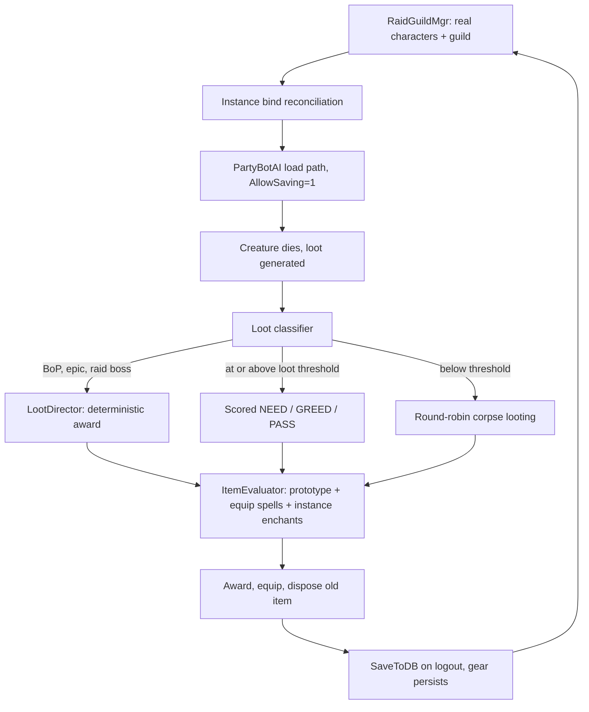

# Persistent Bot Raid Guild

Build a persistent bot raid guild whose members are real saved characters that gear up over time
through hybrid loot distribution, backed by a vanilla-aware item scoring engine.

All claims below were verified against the code. Line numbers are accurate as of review.

## Progress

Status key: **not started** / **in progress** / **done**. Phase headings carry the marker. This
section carries the commit history, the ordered tasking, and the findings that changed the plan.
See the companion document's Progress section for the combat side and the shared build and test
loop.

### Phase status

| Phase | Status | What is left |
| --- | --- | --- |
| 0 - Roster, persistence, instance entry | **done** | Spell ranks are not matched to level, and a member dropped below its authored level does not re-spend its refunded talents |
| 1 - Item evaluation engine | **done** | Nothing. Caps and set bonuses are scored on the loadout, bags are walked, and the roster's spec reaches the lookup. Talent-granted hit is not yet subtracted from the caps, which leaves them loose in the safe direction |
| 2 - Loot distribution and award safety | **not started** | All of it. The safety rules first, then the four loot defects that destroy or strand items |
| 3 - Raid readiness | **in progress** | Talent specs are done at every level; consumables, resistance sets, repair, world buffs, composition rules and `.raidguild report` are not started |
| 4 - Bridge to encounter awareness | **not started** | Gated on wipe recovery, which lives in the companion document |

### Landed

| Commit | What |
| --- | --- |
| `a19dc86dc` | Party bots can fill a raid group instead of silently capping at five |
| `e04904be4` | Test harness, which is how roster work gets verified without a client |
| `09bae86c1` | The roster table, `RaidGuildMgr`, and `.raidguild` provisioning |
| `0afbb14e3` | Summoning a roster into a raid that keeps what it earns |
| `181386612` | The guild, filled without summoning anyone |
| `b34c72bd6` | Bind reconciliation, so a raid enters one copy of a map rather than two |
| `7e160ca74` | Attunement mirrored from the leader by reading the doorways |
| `547a3416c` | Talent specs asked for by name instead of drawn at random, plus the six level 60 builds that did not exist |
| `b2d572839` | Those six builds rebuilt on the published vanilla specs, and a template audit that applies a spec rather than counting it |
| `266f26265` | The four bot AI paths that destroyed gear to make room |
| `6a46f7e1b` | Gear preservation tests, consumables kept rather than drunk, and roster level matching |
| `8819f45db` | Specs spent in a recorded order, so one build fits every level instead of only the one it was authored for |
| `c31bdee0c` | `ItemEvaluator`: gear chosen by what the spec wants rather than by what fits |
| `a31b06272` | `.harness itemstats` and `.harness spellstats`, the engine read back from outside the process |
| `d73c9647c` | The engine checked against a published ranker, and the bot checked against the engine |
| `62a821ba7` | Phase 1 closed: loadout scoring with stat caps and set bonuses, bags walked, the roster's spec reaching the weight lookup, and `.raidguild spec` to author it |

### Next

In order, because each depends on the one before it.

1. **Re-spend talents after level matching.** `MatchMemberLevel` writes the level before the
   session loads, and `LoadFromDB` then calls `InitTalentForLevel`, which refunds anything the new
   level cannot afford. Nothing re-applies the spec, so a member dropped below its authored level
   arrives with free points. The ordered spend list this needed now exists, and so does the spec
   name on the AI, so the work is to apply the first N rows of the member's spec after the level
   write.
2. **Match spell ranks to level**, so a member dropped to 25 is not casting rank 11 Frostbolt.
3. **Subtract talent hit from the caps.** The cap columns hold the gear total at which a spec is
   capped, and the authored numbers ignore the hit talents grant, so a rogue with Precision is
   credited five points of hit it does not need. Loose in the safe direction — the error is that
   some hit stays overvalued, which is the behaviour the caps replaced — but closing it means
   deriving a per-spec figure from the authored talent build and keeping the two in step.
4. **Phase 2**, beginning with the safety rules and then the four loot defects, since bots cannot be given
   real loot until an award cannot strand or destroy it.

### Findings that changed the plan

- **A roster character's account needs no `realmd` row, and this is now tested rather than
  reasoned.** The claim was read out of `AccountMgr::GetSecurity` falling back to
  `SEC_PLAYER` and `LoadFromDB` skipping the ownership check for bots, but nothing had ever
  logged one in. A character whose account number exists in no table anywhere reaches the
  world through `.harness login` normally. What the account is still needed for is
  distinctness: `PlayerBotMgr::AddBot` refuses a bot whose account already has a session, so
  a roster sharing one account would spawn its first member and silently stop.
- **The player name cache and the `characters` table can disagree, and provisioning against
  the cache turns that into two characters with one name.** `GetPlayerGuidByName` answers
  from `m_playerNameToGuid`, `Player::SaveNewPlayer` is a `REPLACE` keyed on guid, and
  `Player::DeleteFromDB` is the only thing that clears the cache entry. So any path that
  drops a cache entry while leaving the row makes the name look free, and the next provision
  writes a second character under it. Observed for real: three test runs produced a duplicate
  `Rgtesttwo`. Provisioning now asks the table.
- **Erasing a character that is still leaving the world misses it.** `.character erase`
  resolves the name through the same cache, and a character part way out of the world is not
  reliably found, so the erase reports "Player not found!" and the row survives. This is what
  produced the duplicate above. Anything that dismisses a roster member has to wait for it to
  be gone before deleting it, not merely ask it to log out.
- **A subgroup cannot be assigned when a member is summoned, because it is not in the group
  yet.** The bot joins on its own first update tick, a couple of seconds after the session
  loads, so anything that tries to place it at the point of spawning is placing a player the
  group has never heard of. Placement is reconciled from a world-update timer instead. The
  same gap is why the group is promoted to a raid before anyone is summoned rather than when
  the sixth member is turned away.
- **Persistence is now demonstrated rather than argued.** The whole reason for the load path
  is that `Player::Create` sets `m_saveDisabled` and nothing clears it, which was read out of
  the source. It is now a test: a level set on a summoned member is still there after the
  member is dismissed and summoned again.
- **A talent spec is a set, not an order, and that is the whole reason sub-60 members do not
  work.** The plan had asked for ordered spend lists without saying what the current data
  actually is: `player_premade_spell` is `(entry, spell)` with no sequence column at all, so a
  template can only ever be applied whole, at the level it was authored for. Templates exist at
  five levels and nowhere else. Fixed by a `spend_order` column holding one row per talent point;
  written up under Phase 3.
- **Filling a talent tree from the top down is legal for free, which is what makes a spend order
  generatable rather than authored.** A talent on row r needs 5r points above it in its own tree,
  and a finished build already satisfies that for every talent it holds, so spending its points
  row by row can never reach a row early — the prefix sums are the same numbers the final check
  already passed. Only prerequisites need real handling, by deferring a talent until the one it
  depends on is paid for. So the order comes out of the build itself, and the author's only
  remaining choice is which tree to spend first.
- **Talent trees are client data with no server-side table, so nothing in SQL can check a
  build.** There is no `talent` table in the world database; trees live in Talent.dbc. Combined
  with specs being applied through `LearnSpell`, which validates nothing, an authored build had
  no checker anywhere. `contrib/harness/talent_dbc.py` reads the DBCs the server reads and is
  now that checker. It immediately found two prerequisites that were not obvious from the game:
  Deep Wounds requires Improved Rend at rank 3, and Mortal Strike requires Sweeping Strikes.
- **`TalentTabEntry::tabpage` is wrong for mage.** Tabs 41 (Fire) and 81 (Arcane) both report
  page 0, while all eight other classes are consistent. Anything naming or ordering trees must
  key off the tab id.
- **A legal build and a good build are different things, and only one of them can be checked by
  a machine.** The DBC validator confirms tiers, prerequisites and the point budget, and it
  passed six builds written from memory in which four spent points on talents that do nothing to
  a raid boss — stuns, parry, fear resistance — purely as a toll to reach the next row, and two
  were not builds anyone runs. Vanilla is a closed patch with a settled answer per spec, so
  builds get sourced from the surviving 1.12 guides and the validator's job is only to stop a
  transcription error. Two of the six splits differ by one point from the number those guides
  quote, in both cases because the quoted number is not buildable: the fire mage's published
  17/31/3 cannot reach Arcane Meditation, which sits on row 3 and so needs 15 points above it.
- **Counting a template's talents offline against Talent.dbc under-reports the build.** A
  template may store a rank id that the DBC chain for that talent does not list, so the match
  fails and the point is not counted. That produced a confident and entirely wrong conclusion
  that eleven shipped templates under-spend and that `ds-ruin-pve` is illegal; applying each one
  to a character shows all of them at 51 of 51 and legal. `contrib/harness/audit_premade_specs.py`
  is the trustworthy form. Never report a talent count that has not been applied to a character.
- **A pass that equips whatever fits gives an order-dependent answer, and a test that hands it one
  item cannot see that.** The old pass walked the bags and equipped everything it could, so which
  of two usable items ended up worn was decided by which it looked at last. The discriminating test
  is handing over the same pair in both orders and demanding the same verdict, in a slot the
  character has exactly one of. A ring proves nothing, because two finger slots let a bot wear the
  good one and the bad one at once.
- **An external stat sheet disagrees with the server, and the server wins.** The differential
  against Classic Gear Ranker covers 2475 items and 498 equip spells and found three real
  resolution bugs in the engine, but most of the residual disagreement is the sheet's: it omits
  shield base block from all 76 shields, bakes the orc Axe Specialization racial into all 57 axe
  rows because it was built for an orc warrior, and has no row for 30 of the equip effects the
  engine resolves. Every divergence is attributed to a named cause and still fails if the
  arithmetic does not come out, which is what keeps the fixture from degrading into a blanket
  exemption.
- **Gear that raises several weapon skills is worth the largest, not their sum.** A character
  swings one weapon, so gloves granting +7 to axes, daggers and swords are worth 7. The sheet adds
  the three together, and the same trap applies to any future stat that appears once per skill
  line.
- **Stat caps and set bonuses cannot be expressed per item, so finishing them replaced how gear is
  chosen rather than how it is scored.** Whether the tenth point of hit is worth anything depends
  on the other nine, and three pieces of a set are worth more than three pieces. Neither statement
  can be made about one item, so a pass that picked the best candidate per slot could not reach
  either conclusion no matter how the weights were tuned. Selection now maximises the score of the
  whole loadout.
- **The pass is monotone because one of its starting points is the gear already worn.** Improvement
  is a hill climb, ties never displace the incumbent, and the best finish across all starting points
  wins, so the score a member ends a pass with is never lower than the one it started with. An
  8/8 tier set survives not because sets are protected but because every single-piece swap out of
  one scores lower.
- **Improving one slot at a time cannot assemble a set from scratch**, since each piece may be a
  downgrade until the bonus lands. That is why there is a starting point per set the member holds
  more than one piece of, with those pieces forced in. Keeping a set needs no such help; only
  building one does.
- **The roster's `spec` column could not be set by any command.** `.raidguild add` took a role and
  never a spec, so the column that decides which weights judge a member's gear was authorable only
  by direct SQL — and the harness fixture's `spec` argument was being read as the role, which is why
  nothing had noticed. Fixed by a trailing argument on `add` and a `.raidguild spec` setter, both of
  which say so when the name has no weight row.
- **`CanEquipItem` refuses an off-hand while a two-hander is held, which read literally makes a
  two-hander a one-way door.** The answer is correct about right now and wrong as a question about
  what the member could wear, so a pass that trusted it would never trade a two-hander for a weapon
  and shield. Both hands are therefore decided together, and that one error is accepted for the
  off-hand slot only.
- **The fallback weight row was whichever the hash table happened to yield first.** Two members of
  the same class with an unauthored spec could be judged by different rows, and the same member by a
  different row after a restart. Lowest spec name now wins, and the miss is logged.
- **Once scoring exists, a test that hands a bot an item can no longer assume it is worn.** The
  gear preservation suite's two-hander was a low level weapon, which the evaluator correctly
  declines for a tank holding a shield and a fast one-hander, and a declined weapon proves nothing
  about the off-hand rule it was there to check. Any test that depends on a bot equipping something
  now has to make that item a genuine upgrade for the spec being tested.

### Test coverage

Every test in this list runs against a live server over SOAP; there is no unit test layer.

| Test | What it proves |
| --- | --- |
| `test_raid_group.py` | A 40-member raid across 8 subgroups forms, and the 41st is refused cleanly |
| `test_raid_guild_roster.py` | Authoring, provisioning, idempotence, account distinctness, adoption of an existing character, and that a provisioned member logs in |
| `test_raid_guild_summon.py` | A seven member roster guilded with six of them offline, reaching the world as a raid, landing in its rostered subgroups, inheriting the leader's attunements, entering Zul'Gurub as one instance rather than two, dropping a planted stale bind, arriving on the leader's level rather than the one it was left on, leaving on dismissal, and keeping what it earned across the round trip |
| `test_premade_specs.py` | A spec applied by name, and `--only levels` applying all six ordered specs at levels 22, 45 and 60 |
| `audit_premade_specs.py` | Every level 60 template applied to a character and read back, spend and legality measured on the character rather than offline |
| `test_bot_gear_preservation.py` | The four ways the bot AI used to lose gear, plus the off-hand and level restriction rules |
| `test_item_evaluator.py` | `ItemEvaluator::ResolveItem` against the Classic Gear Ranker fixtures, item by item and spell by spell |
| `test_item_evaluator_behaviour.py` | A bot wearing the better of two necks, declining the worse, keeping both, and reaching the same answer in either hand-over order |
| `test_item_evaluator_loadout.py` | Hit and weapon skill paying nothing past their caps and full value below them, and a set bonus reaching the score at its threshold and not before |
| `test_item_evaluator_sets.py` | A bot assembling a six-piece set, keeping it against a piece better by less than the bonus, breaking it for one better by more, taking an upgrade out of a bag, and reporting the spec the roster authored |

The harness commands that exist only to make the above observable. `.harness items` reports what a
character wears, carries — bags included — **and holds in the mail**, which is the distinction
between displacing an item and destroying it. `.harness equipnew` runs the equip pass directly,
since trade completion is its only other trigger and a trade cannot be conducted over SOAP.
`.harness itemstats` and `.harness spellstats` dump the resolved stat vector for an item entry or a
bare equip spell, which is the only way to compare the engine against an external oracle without a
client. `.harness loadout <class> <spec> <entry>...` scores a hypothetical set of gear that nobody
is wearing, which is the only way to ask about a cap or a set bonus: naming the same shoulders ten
times is how twenty points of hit gets tested. `.harness wear` and `.harness stow` set up a state
the AI would never produce on its own — nothing in the bot AI equips a bag, and `additem` fills the
backpack before it fills one, so without them "this upgrade is inside a bag" is unreachable.

### Environment

There is a third world, `~/bin/server3`, built the same way as server2 and for the same reason:
realm 3 on world port 8087 and SOAP 7880, with its own `characters3` database, sharing the world
database and map data. Drive it with `VMANGOS_SOAP_URL=http://127.0.0.1:7880/`.

One bug in the script it was copied from is worth fixing in server2 as well: `stop` waits for the
SOAP port to be released, but a graceful shutdown closes that socket early and keeps the port until
the process actually exits, so the next `start` races it and comes up with a working game port and
no SOAP at all. server3 waits for the process to go first.

## Architecture

The design rests on one existing capability: `.partybot load <name>` already loads a real database
character via `LoginPlayer()` and, with `PlayerBot.AllowSaving=1`, saves it back on logout at
[src/game/Server/WorldSession.cpp](../src/game/Server/WorldSession.cpp) line 803. Everything else
layers on top of that.

Contrast with `.partybot add`, which is a dead end for persistence: `Player::Create()` hardcodes
`m_saveDisabled = true` at [src/game/Objects/Player.cpp](../src/game/Objects/Player.cpp) lines
401-403 with the comment "only temporary bots are created this way".

Note that all `.partybot` and `.bot` commands require `SEC_ADMINISTRATOR`
([src/game/Chat/Chat.cpp](../src/game/Chat/Chat.cpp) lines 83-98, 1217). New `.raidguild` commands
should match. The human player driving this needs a GM account, which is also useful for the
instance cap discussed below.



## Phase 0 - Roster, persistence, and instance entry [done]

The goal is a set of stable, named, guilded characters that spawn identically every time. Group
joining, the roster table, provisioning, summoning, the guild, bind reconciliation, attunement
mirroring and level matching are all in and verified live. Two items are carried into the Next list
above: a member dropped below its authored level does not re-spend its refunded talents, and spell
ranks do not follow level.

### Roster [done]

Landed as `RaidGuildMgr` with a `raidguild_member` characters migration and the `.raidguild`
command group of `add`, `remove`, `list`, `provision`, `summon`, `dismiss`, `status`, `guild`,
`resetbinds`, `attune` and `reload`. A row carries name, race, class, gender, role, spec,
loot-priority group and subgroup; `guid` and `account` are filled in when the character exists, so
an unprovisioned member is the one state in which the roster and the `characters` table are allowed
to disagree. Provisioning is idempotent and adopts a character that already carries the name, which
is what a rebuilt roster table needs.

A new table rather than the existing `characters.playerbot`, which is close in shape but has no
write path in code and is not consulted by the load path.

Accounts are allocated from a base of 5,000,000, clear of the range `GenBotAccountId` draws
from, which starts at the highest real account plus ten thousand and rises by one per bot
spawned.

### Summoning [done]

`.raidguild summon <leader> [name]` brings the roster, or one member of it, into the world
around a named character, and `.raidguild dismiss [name]` sends it home. The leader is named
rather than taken from the session because the harness drives all of this over SOAP, where
there is no session player to take it from; an in-game caller may leave it off and mean
itself.

Group setup happens before any member arrives rather than as they do:

- The group is created once, up front, by the summon command. No member ever creates it, so
  the concurrent-creation race cannot happen however many arrive on one tick.
- It is promoted to a raid up front too, sized for what the group is about to hold rather
  than for what is being added now, so summoning the second half of a raid one member at a
  time does not leave a party to be promoted partway through.
- The loot method, looter and threshold are stated rather than inherited from
  `Group::Create`, which hardcodes them.

Subgroup placement is the exception, and cannot be done up front: the bot joins the group on
its own first update tick, seconds after the session loads, so at summon time there is no
membership to place. `RaidGuildMgr::Update` reconciles it once a second instead, and declines
silently when the wanted subgroup is full, which is the right answer to a roster that asks
for nine people in one of them.

`.raidguild status` reports who is in the world, whether the group is a raid, the subgroup
each member is in against the one it is rostered for, and the guild each one is carrying. It
exists because nothing here happens on the tick the command returns: summoning takes a
session load then a group join, and dismissal takes a logout, so anything waiting on either
has to be able to ask.

### The guild [done]

`.raidguild guild <name> [founder]` finds or founds the guild and puts every provisioned
member in it, and is idempotent, so it is how a guild is brought up to date after the roster
grows rather than something to run once.

Only the founder has to be in the world. `Guild::Create` needs a session, because it reads
the locale off it to name the default ranks; filling the tables by hand instead would leave a
guild with no ranks, so the requirement is kept rather than worked around. Everyone else goes
in through `Guild::AddMember`, which writes `guild_member` directly for an offline character.
A roster of forty does not have to be summoned to be guilded.

The one sharp edge is that the offline branch of `AddMember` reads the member's name, level
and class out of the player cache and refuses outright if there is no entry. A provisioned
member normally has one, but an adopted character need not, since adoption reads the
`characters` table precisely because the cache can be missing a row that exists. So the cache
is reloaded for that member first rather than the add failing for a character that is
demonstrably there.

Members join at `GR_MEMBER` rather than the lowest rank, since every one of them was rostered
deliberately.

### Instance binds [done]

The rule is that **a roster member holds no personal instance bind.** It is a body following
the leader, not a raider with a lockout of its own, so the group's bind should be the only
thing deciding which copy of a map it walks into. `SummonMember` clears the member's
`character_instance` rows before the session loads, and `.raidguild resetbinds [name]` does
the same on demand for weekly resets and experimentation. `.raidguild status` reports how
many binds each summoned member is carrying, which should always be none.

Clearing before the session loads is not incidental. It is the only race-free moment: after
login the bot is teleported to the leader within a couple of seconds, and if that lands it at
an instance door holding a bind that disagrees, the answer is `MANGOS_ASSERT` rather than an
error. `DungeonMap::BindPlayerOrGroupOnEnter` has four such branches
([src/game/Maps/Map.cpp](../src/game/Maps/Map.cpp) lines 2201-2305) and three of them fire on
a personal bind that does not match. Deleting the rows of an offline character is also what
`Group::ChangeLeader` and `Player::ConvertInstancesToGroup` already do, so it is not a new
kind of write.

A member already in the world keeps two things: the bind for the map it is standing on, since
unbinding that is how a character ends up inside an instance it has no claim to, and any bind
the group already agrees with.

The failure being guarded against is not a refusal at the door; it is a raid that silently splits
across two instance IDs, which from the outside looks like bots that will not follow.
`test_raid_guild_summon.py` therefore takes the seven member raid into Zul'Gurub and requires all of
them to arrive in **one** copy of the map.

That test plants a bind rather than waiting for one to appear. Entering behind a group that is not
permanently saved leaves no personal bind at all, because `BindPlayerOrGroupOnEnter` only binds the
entrant when `groupBind->perm` is set, so a test that merely observed binds staying at zero would
pass whether or not anything was being cleared. It writes a `character_instance` row directly while
the member is offline and requires the summon to have removed it.

### Group joining: why the path used to cap at five, silently [done]

Fixed in `a19dc86dc`: the group is promoted to a raid when it fills, `AddMember`'s return value is
checked, a bot that fails to join is removed rather than left running its AI ungrouped,
`PartyBotAddRequirementCheck` measures against `MAX_RAID_SIZE`, and the eight `me->GetGroup()` call sites
that iterated without a null check are guarded. The diagnosis is kept because it is the argument for doing
group setup up front in the summon command rather than letting members do it as they arrive.

`PartyBotAI::AddToPlayerGroup` was not usable for a roster of forty, for two compounding reasons. The
function is now at [src/game/PlayerBots/PartyBotAI.cpp](../src/game/PlayerBots/PartyBotAI.cpp) line 1182;
the line references below are to the code as it stood before the fix.

When the human has no group yet, the bot creates one - and `Group::Create` sets the type to
`GROUPTYPE_NORMAL` unless it is a battleground group
([src/game/Group/Group.cpp](../src/game/Group/Group.cpp) line 127), so what gets created is a five-person
party. `Group::_addMember` then returns false once `IsFull()`
([src/game/Group/Group.cpp](../src/game/Group/Group.cpp) lines 1563-1566), so **bots six through forty
cannot join at all** unless the human happens to have converted to a raid beforehand.

The second half is worse than the first, because the failure is silent:

```cpp
group->AddMember(me->GetObjectGuid(), me->GetName());
```

The result is discarded, and the bot proceeds to set `m_initialized = true` and run its AI regardless. A
bot that failed to join therefore behaves as though it had, until `GetPartyLeader` notices it is not in the
leader's group and sets `requestRemoval`, at which point it despawns. The visible symptom is a roster that
mysteriously settles at five members with bots flickering in and out, and nothing in the log explaining why.

Two further details are why the summon command owns group setup:

- **Concurrent creation races.** If two bots initialize on the same tick with the human ungrouped, both see
  `!group` and both call `Create`, and the second `AddMember` takes the `SetOriginalGroup` path and corrupts
  the leader's group pointers.
- **`Group::Create` hardcodes the loot rules** to `GROUP_LOOT` with an uncommon threshold
  ([src/game/Group/Group.cpp](../src/game/Group/Group.cpp) lines 132-133). The loot design in Phase 2
  depends on both the threshold and the method, so neither may be inherited.

And a groupless bot is not merely idle, it is a crash. A cluster of bot AI helpers call `me->GetGroup()` and
iterate the result without a null check - `ShouldAutoRevive`, `GetMarkedTarget`, `SelectAttackTarget`,
`SelectPartyAttackTarget`, `SelectResurrectionTarget`, `SelectShieldTarget`, and `GetDistancingTarget` in
[src/game/PlayerBots/PartyBotAI.cpp](../src/game/PlayerBots/PartyBotAI.cpp), plus
`CombatBotBaseAI::AreOthersOnSameTarget` at
[src/game/PlayerBots/CombatBotBaseAI.cpp](../src/game/PlayerBots/CombatBotBaseAI.cpp) lines 1847-1850. These
are safe today only because a bot without a group is normally removed before it reaches combat code. The
silent `AddMember` failure above is exactly the condition that breaks that assumption, and a bot kicked from
the group mid-combat is another. Given that the harness will run thousands of unattended spawn cycles, these
need null guards before the harness is trusted, not after it starts crashing.

### Group size caps [reference]

The roster is a stable of tracked characters that can exceed any single group size; the human picks a
subset per run. The per-run selector itself is Phase 3 work, filed under raid composition. The caps
it has to respect are generous, and are recorded here because two of them are easy to misread.

- **Select on intended group size, not `maxPlayers`.** The engine cap comes from SQL `map_template`
  rather than a DBC ([src/game/Database/SQLStorages.cpp](../src/game/Database/SQLStorages.cpp) line
  43), it is patch-aware, and it is frequently a loose ceiling rather than the design target: most
  5-mans allow 10, Upper Blackrock Spire allows 15 at patch 1 and 10 from patch 8, Dire Maul allows
  5, Zul'Gurub and Ahn'Qiraj Ruins allow 20, and the 40-man raids allow 40. Selecting by design
  intent avoids accidentally bringing 9 bots into a 5-man because the cap permits it.
- The cap itself is not tight. `DungeonMap::CanEnter` rejects only when
  `GetPlayersCountExceptGMs() >= GetMaxPlayers()`
  ([src/game/Maps/Map.cpp](../src/game/Maps/Map.cpp) lines 2131-2137), so one human plus 39 bots
  enters a 40-man cleanly. Dead members still count
  ([src/game/Maps/Map.cpp](../src/game/Maps/Map.cpp) lines 1828-1834), which matches real WoW
  behavior; it only matters if you want to swap a dead bot for a fresh one mid-run, which requires
  removing the dead one first.

### Level matching [done]

**Design principle: level is a free parameter, gear is the progression.** The human levels solo and
summons the roster only for hard quests and 5-mans, so bots can never earn enough experience to keep
pace. A member therefore always arrives at the leader's current level, while everything that makes
the roster feel like a guild — gear, upgrades, loot history — is earned in content run together.
Because level is decoupled from identity, the same roster is reusable across the human's own alts.

`RaidGuildMgr::MatchMemberLevel` writes the leader's level into the member's `characters` row before
the session loads, which is the same write the offline branch of `.character level` makes, and its
comment is the reason it is safe: everything else is recomputed at loading. Doing it before the load
rather than after is what keeps a member from spawning and then visibly re-rolling its stats, and it
leaves no reconciling tick to fight a human who sets a member's level deliberately. It is the same
ordering argument as the instance binds.

Nothing in the load path needed changing. `.partybot add` already defaults a generated bot to the
leader's level ([src/game/PlayerBots/PlayerBotMgr.cpp](../src/game/PlayerBots/PlayerBotMgr.cpp) line
880); `.partybot load` adjusts nothing and imposes no level restriction of its own. The `+10` cap
belongs to `.partybot clone` (lines 849-853), and `PartyBot.MaxBots` is only checked inside
`PartyBotAddRequirementCheck`, which the load path skips entirely.

The round-trip test asks the discriminating question rather than the easy one. Every member is
already on the leader's level by the time the round trip happens, so asserting that they match would
pass while doing nothing; the witness is left on level 25 before dismissal and required to come back
on the leader's 60. For the same reason the persistence witness in that test is an item rather than a
level: a level surviving a round trip says nothing about whether the character was saved, since the
roster reassigns it on every summon.

Remaining:

- **Talents are refunded and not re-spent.** `LoadFromDB` calls `InitTalentForLevel` after loading
  spells, so a member brought down below its authored level loses what it can no longer afford and
  arrives with free points. A level 25 character has roughly 16 to spend; the generated-bot path spends
  them by calling `GiveLevel` then `InitTalentForLevel`
  ([src/game/PlayerBots/PartyBotAI.cpp](../src/game/PlayerBots/PartyBotAI.cpp) lines 621-626), which the
  load path does not do. The ordered spend list that makes this solvable now exists; see Phase 3.
- **Spell ranks do not follow level**, so a member dropped to 25 still knows rank 11 Frostbolt.
- **Item scoring is not level-aware**, and a level 30 roster gearing up in Scarlet Monastery is the
  common early case, not level 60 best-in-slot.
- **Gear can outrank the level it is worn at.** A member geared at 60 and then dropped to 25 for an
  alt run holds gear it no longer meets the requirements for. This needs either per-level gear
  snapshots or an accepted rule that alts start a fresh roster.
- Any of this work lands in the one init branch that preserves earned gear by doing nothing at all.
  Read "The init paths that destroy earned gear" below first.

Two facts that bound the design: bots gain experience normally, with no bot exclusion in
`Player::GiveXP` or `Group::RewardGroupAtKill` and with `.levelup` and `.character level` both
accepting a target name, so an earned-experience variant stays possible later. And there is no level
requirement on `MapEntry` any more, `level_min` and `level_max` having been dropped from
`map_template` in migration `20210220230709_world.sql`; level gating now lives on
`areatrigger_teleport.required_level` and applies from patch 1.4
([src/game/Handlers/MiscHandler.cpp](../src/game/Handlers/MiscHandler.cpp) lines 764-772), with
`Instance.IgnoreLevel` as a bypass.

### Content gating and attunement [done]

Attunement chains are the campaign's progression spine, not an obstacle to delete. The human is gated
normally and the roster inherits: `.raidguild attune <leader> [name]` walks every
`areatrigger_teleport` that leads to a dungeon, follows its `required_condition` through the
`conditions` tree, collects the `CONDITION_QUESTREWARDED` and `CONDITION_ITEM` leaves, and gives a
member every leaf **the leader already satisfies and the member does not.** So a chain is run once
rather than forty times.

Mirroring rather than a teleport bypass, because `Player::TeleportTo` never evaluates conditions but
that leaves three holes: the Upper Blackrock Spire door to Blackwing Lair is a `LOCK_KEY_ITEM` check
requiring the Seal of Ascension (item 12344) **in each player's inventory**
([src/game/Objects/GameObject.cpp](../src/game/Objects/GameObject.cpp) lines 2203-2228), the Lothos
Riftwaker gossip route into Molten Core carries its own condition, and any future in-instance object
check would need bypassing separately. Granting the real state once is less code than special-casing
every gate. Bypassing is not available in config either: there is no `Instance.IgnoreCondition`, only
`Instance.IgnoreLevel` and `Instance.IgnoreRaid`. And conditions are evaluated **per entering
player**, against that player's own session
([src/game/Handlers/MiscHandler.cpp](../src/game/Handlers/MiscHandler.cpp) lines 758-795), so without
mirroring all 40 characters would each need the attunement to walk a portal.

Mirroring reads the doorways rather than a hardcoded manifest, and the manifest is why: an early
draft of the list below had Naxxramas gated on quests 9121, 9122 or 9123, where this server's own
trigger asks for 9378. A list kept in a header cannot notice that it has drifted from the database it
describes. The list is kept anyway, corrected, because it is still the clearest statement of what the
gates are.

The verified gates are narrower than expected:

- **Molten Core** (area triggers 3528 and 3529): quest **7848** or **7487** rewarded. Not an item. The
  Aqual Quintessence is for summoning Ragnaros and is unrelated to entry.
- **Onyxia's Lair** (area trigger 2848): **item 16309** in inventory. Note this is the amulet this
  codebase actually checks, not item 18406 or 13628.
- **Blackwing Lair** (area trigger 3726): **no condition at all**, `required_condition = 0`, only level
  50 and a raid group. Quest 7761 matters solely for the Orb of Command corpse-resurrection shortcut
  ([src/scripts/eastern_kingdoms/burning_steppes/blackwing_lair/instance_blackwing_lair.cpp](../src/scripts/eastern_kingdoms/burning_steppes/blackwing_lair/instance_blackwing_lair.cpp)
  lines 1091-1104). The real gate is the UBRS door key above.
- **Naxxramas** (area trigger 4055): quest **9378** rewarded, through condition 9124. Argent Dawn
  Honored gates *accepting* the quest, not entering the instance.
- **Ahn'Qiraj**, both 20 and 40 (area triggers 4008 and 4010): **game event 83 inactive**. This is
  server-wide state, not per-player, so there is nothing to mirror.

The grant path per member is `AddQuest` followed by `FullQuestComplete` for a quest gate, which are
the same calls behind `.quest complete`, and `StoreNewItem` for an item gate.
`ReputationMgr::SetReputation` on faction 529 is available if Argent Dawn standing is ever wanted for
flavor. The raid-group requirement in `MapManager::CanPlayerEnter` applies independently of
attunement, so mirroring does not remove the need for a raid group.

Whether a composite condition is an AND or an OR is deliberately not considered, which sounds like a
shortcut and is not: a member holding everything the leader holds satisfies whatever the leader
satisfies, whichever way the tree is wired, so the shape never needs interpreting. That is what makes
the two Molten Core triggers free to handle. The window entrance is `OR(quest 7487, quest 7848)` and
the leader's copy of whichever one it holds gets passed on; the lava entrance is `AND(patch, race and
class)` and yields no leaves at all. The Ahn'Qiraj gates fall out the same way, being a game event
rather than anything a character can carry.

Reading `ConditionEntry` needed accessors, since only `Meets` was public and "is it satisfied" is the
one question mirroring cannot use. `GetType` and `GetValue1` through `GetValue4` were added alongside
the existing `GetTeam`.

The test gives the leader one gate of each shape, Attunement to the Core for a quest and the
Drakefire Amulet for an item, mirrors, and then mirrors again. The second pass granting nothing is the
assertion that matters: a grant only happens when the leader has something the member lacks, so
nothing left to grant means no member is missing anything the leader holds. That proves the property
without the test needing to know which quests and items this server's doorways ask for, which is the
same reason the code does not need to know either.

Remaining:

- The Upper Blackrock Spire door to Blackwing Lair is a `LOCK_KEY_ITEM` on a gameobject rather than an
  area trigger condition, so the Seal of Ascension is not found by walking triggers.
- `RewardQuest` pays out experience, which on a roster below sixty moves levels around. Attunement
  quests are level 55 content, so a roster running them is at sixty already, but level matching should
  account for it.

### Ahn'Qiraj and server-wide world events [reference]

Much better supported than assumed. The war effort is a complete 13-stage state machine in
[src/game/HardcodedEvents.cpp](../src/game/HardcodedEvents.cpp) (stage enum at
[src/game/HardcodedEvents.h](../src/game/HardcodedEvents.h) lines 237-251), with resource stock held in
the `variables` table and three independent levers for a solo player:

- `.wareffort setstage <0-12>` to jump stages, `.wareffort setresource <itemId> <count>` to fill
  individual objectives, and `.wareffort info` to inspect. Stage 7 opens the gong; stage 8 stops event
  83 and opens the raids.
- `Rate.WarEffortResourceComplete` (default 0.0) auto-fills a percentage of every objective per period,
  so the collection phase can progress passively while the human plays.
- `sql/custom/repack/AQ-SET_GATES_OPEN.sql` sets the stage variable directly, and `.event stop 83`
  opens the raid portals on their own.

**The Black Qiraji Resonating Crystal is obtainable, including solo.** The Scarab Gong is scripted as
`go_scarab_gong` in [src/scripts/kalimdor/silithus/silithus.cpp](../src/scripts/kalimdor/silithus/silithus.cpp)
lines 2063-2231, and quest 8743 is tied to game event 85, which stage 7 activates. Critically, this
codebase tracks `VAR_WE_GONG_BANG_TIMES` but **never uses it to block the reward** — only the first
ringer triggers the gate cinematic and the ten-hour war, while every completion awards the crystal. The
retail one-per-realm limit is not implemented, so ringing the gong and getting the mount works.

The scepter chain itself is mostly database quests with one substantial scripted cinematic, quest 8519
with Anachronos and the dragonflights. That chain is real content to play through rather than something
needing new code; the work is running world bosses and raids for the shards, which is what the roster is
for.

Two other world events are already implemented and worth knowing about, since both fit the campaign:
the **Scourge Invasion** that precedes Naxxramas, complete with a victory counter that unlocks vendor
tiers, and the **elemental invasions**. Both are hardcoded event drivers with the same `.event` and
`.variable` levers.

### Instance entry: engine behaviour to respect [reference]

The rules the bind work above is built on, kept because anything that changes spawning or entry has to
keep satisfying them.

`PlayerBotAI::SpawnNewPlayer` creates a persistent state and binds the new bot to it as **permanent**
before the bot is even added to the map
([src/game/PlayerBots/PlayerBotAI.cpp](../src/game/PlayerBots/PlayerBotAI.cpp) lines 116-121):

```cpp
if (instanceId && mapId > 1) // Not a continent
{
    DungeonPersistentState* state = (DungeonPersistentState*)sMapPersistentStateMgr
            .AddPersistentState(sMapStorage.LookupEntry<MapEntry>(mapId), instanceId, time(nullptr) + 3600, false, true);
    newChar->BindToInstance(state, true, true);
}
```

The blast radius is narrower than it looks. The third argument is
`load`, and `Player::BindToInstance` skips its `INSERT INTO character_instance` when `load` is true
([src/game/Objects/Player.cpp](../src/game/Objects/Player.cpp) lines 16000-16021). So this creates an
in-memory permanent bind and **not** a durable raid lockout row; it does not accumulate database rows across
restarts. What it does do is still enough to matter: for the life of that session the bot holds a *permanent*
personal bind, personal binds beat group binds in `GetBoundInstanceSaveForSelfOrGroup` (lines 16050-16058),
and permanent binds are explicitly skipped by the reset-on-group-join path. A bot that spawned into one
instance can therefore refuse to follow the group into another, and the raid silently splits across two
instance IDs of the same map.

The reconciliation check does not catch it either. `DungeonMap::BindPlayerOrGroupOnEnter` compares the group
bind against the entered map only in the branch where the player has **no** personal bind
([src/game/Maps/Map.cpp](../src/game/Maps/Map.cpp) lines 2259-2282); when a personal bind exists it merely
asserts that bind matches. So the mismatch that matters is the one case that goes unchecked. This is why
`SummonMember` clears personal binds before the session loads rather than reconciling them at the door.

- `.partybot load` captures the leader's instance ID at
  [src/game/PlayerBots/PlayerBotMgr.cpp](../src/game/PlayerBots/PlayerBotMgr.cpp) lines 1031-1034
  and stores it in `m_instanceId`, but **the load path never uses it**. `Player::TeleportTo` has no
  instance parameter; instance selection is resolved entirely through
  `Player::GetBoundInstanceSaveForSelfOrGroup`
  ([src/game/Objects/Player.cpp](../src/game/Objects/Player.cpp) lines 16044-16062), where a
  **personal bind takes precedence over the group bind**. A bot carrying a stale `character_instance`
  row for the target map is sent to the wrong instance.
- `.partybot add` handles this for temporary bots by calling `BindToInstance` before entry in
  `PlayerBotAI::SpawnNewPlayer`
  ([src/game/PlayerBots/PlayerBotAI.cpp](../src/game/PlayerBots/PlayerBotAI.cpp) lines 115-121). The
  roster takes the opposite route, clearing rather than binding, so the group's bind is the only thing
  deciding where a member goes.
- `DungeonMap::BindPlayerOrGroupOnEnter` contains `MANGOS_ASSERT(false)` for a permanent personal
  bind pointing at a different instance ([src/game/Maps/Map.cpp](../src/game/Maps/Map.cpp) lines
  2201-2305). A mismatched roster is a debug crash, not a graceful failure, which is why
  reconciliation cannot be left until the door.
- `MapManager::CanPlayerEnter` ([src/game/Maps/MapManager.cpp](../src/game/Maps/MapManager.cpp)
  lines 180-218) requires `group->isRaidGroup()` unless the player is a GM or `Instance.IgnoreRaid`
  is set. `Group::ConvertToRaid()` is therefore a hard prerequisite for entry, not a convenience.
- Instance-per-hour throttling is a non-issue: `CheckInstanceCount` is per account and re-entry to an
  already-known instance ID is always allowed
  ([src/game/AccountMgr.cpp](../src/game/AccountMgr.cpp) lines 441-459).

### Persistence: two bot lifecycles, one of which can save [reference]

The foundational constraint of the whole document, and sharper than "enable a config option". The two
lifecycles are mutually exclusive:

- **Generated bots** (`.partybot add`, `.partybot clone`, BattleBot) go through `SpawnNewPlayer` into
  `Player::Create`, which sets `m_saveDisabled = true` unconditionally with the comment "only temporary
  bots are created this way" ([src/game/Objects/Player.cpp](../src/game/Objects/Player.cpp) line 403).
  **That flag is never cleared.** The only assignment of `false` anywhere in the codebase is inside the
  race-change path, which sets it straight back to `true`. `Player::SaveToDB` returns immediately on
  `IsSavingDisabled()` (line 16452), so the 15-minute periodic save timer fires and silently does
  nothing. These bots can never persist, and `PlayerBot.AllowSaving` does not change that.
- **Database-loaded bots** (`.partybot load <name>`, `.bot add <name>`, the `playerbot` table) log in a
  real `characters` row through `LoginPlayer`, and stay saveable as long as `AllowSaving` is on
  ([src/game/Handlers/CharacterHandler.cpp](../src/game/Handlers/CharacterHandler.cpp) lines 478-479).

The roster must therefore be provisioned as real characters up front and spawned **only** through the
load path. There is no supported way to promote a generated bot into a persistent one without code
changes. `AllowSaving` is not a facade — `SaveToDB` genuinely writes equipment, inventory, item
instances with durability, spells, talents, skills, money, reputation, and quests — but the bot lifecycle
defaults to ephemeral and most spawn commands actively destroy progression.

### The init paths that destroy earned gear [reference]

Three functions will erase a roster bot's progression if they ever run on it:

- `ApplyPremadeGearTemplateToPlayer` calls `AutoUnequipItemFromSlot` across **every** equipment slot
  before applying the template ([src/game/ObjectMgr.cpp](../src/game/ObjectMgr.cpp) lines 12378-12380).
- `LearnPremadeSpecForClass` calls `ResetTalents(true)`
  ([src/game/ObjectMgr.cpp](../src/game/ObjectMgr.cpp) lines 12426-12428).
- `PartyBotAI::CloneFromPlayer` unequips everything and copies the clone source's gear.

The roster is safe from all three because `PartyBotAI` init branches on `m_race && m_class` and the
database-loaded branch runs none of them
([src/game/PlayerBots/PartyBotAI.cpp](../src/game/PlayerBots/PartyBotAI.cpp) lines 615-661). Its safety
comes from its own emptiness, which is why `RaidGuildMgr` always constructs `PartyBotAI` through the load
constructor that leaves race and class zero.

That collides with the remaining level work, which wants talent spending and rank adjustment in exactly
that branch. The rule: level and talents may be rewritten on spawn, equipment may not, and `ResetTalents`
may only be reached through a path that provably does not touch inventory. Anything added there needs a
test that spawns a geared member, despawns it, and asserts the item GUIDs in `character_inventory` are
unchanged.

### Remaining save warts [reference]

- Two on-login mutations get persisted. The bot teleports to the coordinates captured near the leader at
  load time (**not** a dynamic follow) at
  [src/game/PlayerBots/PartyBotAI.cpp](../src/game/PlayerBots/PartyBotAI.cpp) line 660, and health and
  power are forced to 100 percent at lines 668-669. The latter applies to **every** init path. Gate both
  behind an "is roster bot" check.
- **Saves are logout-driven, not crash-safe.** The periodic timer is `PlayerSave.Interval`, defaulting to
  15 minutes ([src/game/World.cpp](../src/game/World.cpp) line 583), and the reliable save happens on
  logout ([src/game/Server/WorldSession.cpp](../src/game/Server/WorldSession.cpp) lines 801-804). If the
  player is not in the world at logout, saving is **forced off** entirely (lines 754-757). Roster
  despawn must go through a path that saves, and a hard kill mid-raid loses up to fifteen minutes of
  loot. Consider an explicit save on award rather than trusting the timer.
- `SaveToDB` writes `GetSession()->GetAccountId()` into `characters.account` (line 16488), overwriting
  the provisioned value with the synthetic bot account. Harmless but surprising, and it means the
  account column cannot be used as roster metadata.
- Bot sessions need no `realmd` account row, since `GenBotAccountId` allocates synthetic ids above
  `max(account.id) + 10000` and `LoadFromDB` skips the account-ownership check for bots
  ([src/game/Objects/Player.cpp](../src/game/Objects/Player.cpp) lines 14693-14700). Only `characters`
  rows are required. `CharactersPerRealm` caps client-side creation at 10 and does not bind here.
- Provision bags explicitly. Neither the random nor the premade gear path adds any, and nothing in the
  bot AI equips one, leaving only the 16 backpack slots, which is not enough for loot plus a consumable
  loadout. The evaluator already reads bag contents, so this is the only thing standing between a
  member and using them.
- Trading is blocked for `IsSavingDisabled()` players, and `Group` skips its database insert for them,
  so mixing generated and roster bots in one group produces inconsistent behavior. Keep the roster pure.
- Guild membership is genuinely persistent for offline characters. `Guild::AddMember` falls back to
  `PlayerCacheData` when the player is offline
  ([src/game/Guild/Guild.cpp](../src/game/Guild/Guild.cpp) lines 230-242), and `Guild::Create` needs only
  a leader with no petition or signature requirement, so programmatic creation works.

## Phase 1 - Item evaluation engine [done]

The core new capability, which had no existing foundation: the only "is A better than B" logic in the
bot codebase was hunter ammo selection by item level, and the random gear path filters on presence of
a primary stat, picks uniformly at random
([src/game/PlayerBots/CombatBotBaseAI.cpp](../src/game/PlayerBots/CombatBotBaseAI.cpp) line 2780), and
only fills empty slots (line 2677) with no concept of replacement.

`ItemEvaluator` and its weight table are in, along with the gear preservation work that had to precede
them, the two properties of a combination that a per-item score cannot express — stat caps and set
bonuses — the bag walking that decides what the pass can see, and the spec plumbing that decides which
weights it uses. The one loose end is recorded under "Caps" below: the authored cap figures do not yet
subtract the hit that talents grant, which leaves them loose in the direction that overvalues hit
rather than the direction that discards it.

The phase deliberately does **not** include the authority layers above the computed score — curated
overrides and pins — or the disposal allowlist and award logging. Those are properties of an award and
disposal path rather than of scoring, they cannot be tested until that path exists, and they now live in
Phase 2. "Why the engine is safe without pins" below is the argument that this ordering is sound rather
than a gap.

### The vanilla itemization problem [reference]

Verified with real data. `ItemStat` carries only seven mods (mana, health, agility, strength,
intellect, spirit, stamina) at
[src/game/Objects/ItemPrototype.h](../src/game/Objects/ItemPrototype.h) lines 27-36, and
`Player::_ApplyItemBonuses` ([src/game/Objects/Player.cpp](../src/game/Objects/Player.cpp) lines
6960-7013) switches over exactly those. There is no crit, hit, or spell power anywhere in the stat
array.

Everything that decides BiS in vanilla arrives as equip-trigger spells. Staff of Dominance (entry
18842) carries `stat_type1=5 stat_value1=37` for intellect and its entire spell damage contribution
in `spellid_1=18384, spelltrigger_1=1`. Robe of the Archmage (14152) is the same shape. These are
cast as passive auras by `Player::ApplyItemEquipSpell`
([src/game/Objects/Player.cpp](../src/game/Objects/Player.cpp) lines 7208-7248).

So the evaluator has three input layers, not one:

- Prototype fields read directly: `ItemStat`, `Armor`, `Block`, the six resistance fields (lines
  471-476), and `Damage[]` with `Delay` for weapon scoring.
- Every `Spells[i]` with `SpellTrigger == ITEM_SPELLTRIGGER_ON_EQUIP`, resolved to its aura effects.
  The relevant aura types are `SPELL_AURA_MOD_DAMAGE_DONE` (13), `SPELL_AURA_MOD_HIT_CHANCE` (54),
  `SPELL_AURA_MOD_SPELL_HIT_CHANCE` (55), `SPELL_AURA_MOD_SPELL_CRIT_CHANCE` (57),
  `SPELL_AURA_MOD_CRIT_PERCENT` (52), `SPELL_AURA_MOD_ATTACK_POWER` (99),
  `SPELL_AURA_MOD_RANGED_ATTACK_POWER` (124), and `SPELL_AURA_MOD_HEALING_DONE` (135).
  `ObjectMgr::CorrectItemEffects` documents hundreds of these spell IDs in comments and can seed a
  lookup table, but `spell_template` aura data is authoritative.
- **Per-instance enchantments.** `Item::GetProto()` is a shared template lookup and never varies per
  instance, but random properties are stored on the instance in `ITEM_FIELD_RANDOM_PROPERTIES_ID`
  and applied through enchantment slots 3-5 by `Item::SetItemRandomProperties`
  ([src/game/Objects/Item.cpp](../src/game/Objects/Item.cpp) lines 816-833). Evaluating a bot's
  currently equipped gear therefore requires walking its enchantment slots, and evaluating a drop
  requires resolving `LootItem::randomPropertyId` through `ItemRandomPropertiesEntry::enchant_id[]`
  to `SpellItemEnchantmentEntry`. Vanilla has positive random **properties** only; there is no
  negative-ID suffix system and no `ItemRandomSuffix` store in this codebase.

### The engine, as built [done]

[src/game/PlayerBots/ItemEvaluator.h](../src/game/PlayerBots/ItemEvaluator.h) declares a singleton with
these entry points:

- `ResolveItem(proto, item)` collapses all three input layers above into one `ResolvedStats` vector.
  Passing an `Item` folds in its random-property enchantment slots; passing a prototype alone, which is
  what a drop before it is rolled amounts to, skips them.
- `ResolveSpell(spellId)` does the same for a bare equip spell, which is what the differential test
  needs to attribute a disagreement to a spell rather than to an item.
- `GetWeights(classId, spec)` and `Score(stats, weights)` are the dot product, keyed `classId:spec`.
  `HasWeights` is the same lookup without the fallback, so a command handed a spec name can say
  whether it has weights of its own.
- `ResolveLoadout(worn, player)` sums a whole set of gear and adds every set bonus the combination
  triggers, and `ScoreLoadout(total, weights)` scores a total with the weight row's caps applied.
  These are the pair that can see what a per-item score cannot. There are two overloads of the first:
  one over `Item*` for real gear, one over prototypes for a hypothetical loadout, which is what
  `.harness loadout` and its test use.
- `UpgradeDelta(player, proto, item, weights)` scores a candidate against what occupies its target
  slots, positive meaning wear it. It handles two-hand versus one-hand plus off-hand, where both hands
  have to leave together, and the paired ring and trinket slots, where the worse of the two occupants
  is the right baseline. It is a per-item answer and stays uncapped, which is the right shape for
  "should I roll on this" and the wrong one for "what should I wear"; the award path in Phase 2 is
  where it earns its keep.
- `OptimizeEquipment(player, weights)` assigns the best **combination** available into the equipment
  slots, from everything the character wears or carries, bags included. Displaced gear goes to bags or
  mail through `AutoUnequipItemFromSlot`; nothing is destroyed.

`OptimizeEquipment` maximises `ScoreLoadout` rather than assigning each slot its best candidate,
because neither a cap nor a set bonus is visible from one slot. It works as a hill climb from three
kinds of starting point:

- **The gear already worn.** This is the seed that gives the pass its most useful property: since ties
  never displace the incumbent and the best finish wins, the score a member ends with is never lower
  than the one it started with. An 8/8 tier set is kept for a reason rather than by a rule — every
  single-piece swap out of it scores lower.
- **Nothing worn**, which dresses a member that arrives with gear in its bags and empty slots.
- **One per set the member holds more than one piece of**, with those pieces forced in. Single-piece
  moves cannot assemble a set from scratch, because each piece may be a downgrade until the bonus
  lands. Keeping a set needs no help; building one does.

Each round tries every candidate in every slot, plus the empty option, and keeps the best improving
move. The hands are the exception: a two-hander and an off-hand exclude each other, so both are
decided together and trading one arrangement for the other is a single move. Per-item resolution is
cached for the duration of the pass, since the search asks for the same item's contribution many
times and resolving is the expensive half.

`CanWear` is `Player::CanEquipItem` with one accepted exception: while a member holds a two-hander,
`CanEquipItem` reports that no off-hand can be equipped. That is true of right now and false as a
question about what the member could wear, and taking it literally would make a two-hander a one-way
door. Since both hands are decided together, an off-hand is only ever chosen beside a main hand that
leaves room for it.

`CombatBotBaseAI::EquipOrUseNewItem` calls `OptimizeEquipment` when a weight row resolves, and
otherwise falls back to the old equip-what-fits pass, which keeps its guarantee that nothing is
destroyed to make room. It learns any proficiency the new gear requires first, because `CanEquipItem`
answers no while the proficiency is missing and a bot that can never wear what it earns is pointless.
Slot resolution goes through `ItemPrototype::GetAllowedEquipSlots`
([src/game/Objects/Item.cpp](../src/game/Objects/Item.cpp) line 577) and `Player::CanEquipItem` rather
than a reimplementation.

Three resolution rules are worth stating because they are the ones an external sheet gets wrong:

- **Weapon skill takes the maximum across skill lines, not the sum**, melee and ranged sharing one
  field, because a character swings one weapon. Ranged attack power is a different and much cheaper
  stat and keeps its own field.
- **Block value includes the base block printed on a shield**, which is the larger half of the stat,
  not only what equip effects add.
- **Spell penetration is stored as a magnitude**, since the weight schema treats every column as more
  is better.

### Stat weights [done]

`raidguild_stat_weight` ([sql/migrations/20260809001000_world.sql](../sql/migrations/20260809001000_world.sql),
extended by [sql/migrations/20260809010000_world.sql](../sql/migrations/20260809010000_world.sql))
is keyed by class and **spec** rather than role, because a fire and a frost mage weight hit differently
and the roster already records a spec per member. The spec string is
`player_premade_spell_template.name`, so a weight row and a talent template line up by name. Tuning
therefore needs no recompile, only a table reload.

Warrior rows are transcribed from Classic Gear Ranker's own instructions tab. Every other class is
authored to published vanilla priorities, so that the roster has a weight the day scoring ships rather
than waiting for a theorycrafter per class. The four specs from the 1.12 rebuild that had a talent
build and no weights — `arms-pve`, `sm-ruin-pve`, `seal-fate-daggers-pve` and `discipline-holy-pve` —
now have rows, each following the nearest authored spec of the same class and role rather than
inventing precision that has not been derived.

A spec with no row is still scored, against the lowest-named row for its class, and both the log and
the command that set the spec say so. That fallback used to be whichever row the hash table yielded
first, which meant two members of the same class could be judged differently and the same member
differently again after a restart.

One gap remains in the table: `ResolvedStats` resolves all six resistances, but `StatWeights` carries
columns for only fire, nature and frost. Shadow, arcane and holy resistance are computed and then
cannot be weighted. Nothing in vanilla raiding needs them enough to justify three more columns yet.

#### Caps [done]

The model is linear, which is wrong for the two stats vanilla hard-caps. Hit past the cap earns
nothing because a miss chance cannot go below zero, and weapon skill stops reducing miss and dodge
once it reaches the target's defense — which is exactly why Edgemaster's Handguards is famous for +7
when only the first 5 do anything. Left linear, a warrior valued hit at 55 a point forever, which was
the largest known source of confidently wrong answers.

Caps are three more columns — `hit_cap`, `sphit_cap`, `weapon_skill_cap`, zero meaning uncapped — and
they are applied to the total in `ScoreLoadout`, never to an item. The figures are gear-derived totals
against a level 63 target: 9 hit for melee, 16 for spells, 5 weapon skill, and 5 hit for the
player-versus-player rows, which fight same-level targets and so have no level-based miss to remove.
Healers have no spell hit cap because a heal cannot miss and their `sphit` weight is already zero.
Defense deliberately has none: past crit immunity it stops being decisive but keeps giving dodge and
miss, so a hard cap would model it worse than the linear weight does.

The known incompleteness: talent-granted hit is not subtracted, though it belongs in these numbers,
because a rogue with Precision needs five points less from gear than one without. Doing it properly
means deriving a figure per spec from the authored talent build and keeping the two in step. Until
then the caps are loose, which is the safe direction — the error left is that some hit stays
overvalued, which is the behaviour being replaced, whereas a cap set too low would have members
discard hit they actually need.

#### Set bonuses [done]

`ItemSet` on the prototype and `ItemSet.dbc` give the thresholds and the spells; each spell whose
threshold the worn count reaches is resolved exactly as an equip-trigger spell is, and the profession
sets' skill requirement is honoured the same way `AddItemsSetItem` honours it. Each bonus is resolved
into its own vector before being added, because the within-item weapon skill rule takes a maximum and
applying a set bonus onto a running total would let it swallow skill the pieces already granted.

This is what stops a full tier set being broken up for one higher-scoring off-set piece, and equally
what allows it to be broken when the off-set piece is worth more than the bonus. Thero-shan's
Vestments is the worked example the tests use: six pieces score 444.33 alone and 504.33 together for
a combat rogue, so the bonus is worth 60, and a belt beating the set's by 42 is declined while one
beating it by 124 is taken.

### Safety first: scoring will be wrong, so make wrong answers survivable

The evaluator is the component most likely to be subtly incorrect, and the failure that matters is not a
suboptimal choice — it is an **irreversible** one. A tank receiving Thunderfury and vendoring it is not a
scoring problem to be solved with better weights; it is a problem of having allowed destruction at all.
Accuracy is a quality goal. Irreversibility limits are a correctness requirement, and they come first.

#### The four destructive paths [done]

Fixed in `266f26265` and `6a46f7e1b`. None of the four had anything to do with scoring, and the pattern
is always the same: the bot needs a slot, so it destroys whatever is in one. They survived because a
throwaway bot's bags hold nothing but generated reagents, so there was never anything of value to lose.
The diagnoses are kept because they are the shape of mistake the award path in Phase 2 can repeat. Line
references in this subsection point at the code as it stood before the fix; the functions now live at
`AddItemToInventory` line 3301, `AddHunterAmmo` line 3316 and `EquipOrUseNewItem` line 3382.

**One: the reagent top-up.** `CombatBotBaseAI::DoCastSpell` tops up a missing reagent on cast failure, and
to make room it destroys whatever occupies the first backpack slot, unconditionally
([src/game/PlayerBots/CombatBotBaseAI.cpp](../src/game/PlayerBots/CombatBotBaseAI.cpp) lines 2884-2892):

```cpp
if ((result == SPELL_FAILED_NEED_AMMO_POUCH ||
    result == SPELL_FAILED_ITEM_NOT_READY) &&
    pSpellEntry->Reagent[0])
{
    if (Item* pItem = me->GetItemByPos(INVENTORY_SLOT_BAG_0, INVENTORY_SLOT_ITEM_START))
        me->DestroyItem(INVENTORY_SLOT_BAG_0, INVENTORY_SLOT_ITEM_START, true);

    AddItemToInventory(pSpellEntry->Reagent[0]);
}
```

The bound `pItem` is never read; it is a non-null check followed by a destroy. It fires on a *cast failure*,
meaning it is most likely during exactly the chaotic moments when nobody is watching inventories.

**Two: hunter ammo.** `AddHunterAmmo` does the identical thing to the identical slot
([src/game/PlayerBots/CombatBotBaseAI.cpp](../src/game/PlayerBots/CombatBotBaseAI.cpp) lines 2945-2951),
then calls `me->SetAmmo(...)`, overwriting the character's saved ammo choice. This one gets worse in
combination with the next finding.

**Three, and the worst of them: equipping.** `CombatBotBaseAI::EquipOrUseNewItem` destroys **the currently
equipped item** to free the slot for a new one
([src/game/PlayerBots/CombatBotBaseAI.cpp](../src/game/PlayerBots/CombatBotBaseAI.cpp) lines 2977-2990):

```cpp
uint32 slot = me->FindEquipSlot(pItem->GetProto(), NULL_SLOT, true);
if (slot != NULL_SLOT)
{
    if (Item* pItem2 = me->GetItemByPos(INVENTORY_SLOT_BAG_0, slot))
        me->DestroyItem(INVENTORY_SLOT_BAG_0, slot, true);
    ...
    me->EquipItem(slot, pItem, true);
}
```

The trigger is what makes this severe: it runs on **trade completion**, still, at
[src/game/PlayerBots/CombatBotBaseAI.cpp](../src/game/PlayerBots/CombatBotBaseAI.cpp) lines 4005-4027,
and bots auto-accept every trade unconditionally. So the most natural way a human would ever hand a bot an
upgrade - open a trade window and give it the sword - is a path that permanently deletes the sword it was
replacing. The old item is not mailed, not bagged, just gone. The same function also immediately *uses* any
consumable in the bot's backpack, so traded potions are drunk on receipt rather than saved.

That function has two further defects worth fixing at the same time, since they are in the code being
touched anyway. It calls `EquipItem` without `CanEquipItem`, bypassing unique-equipped, proficiency, and
class restrictions; and it never calls `AutoUnequipOffhandIfNeed`, so a two-hander can be equipped
alongside a shield, or an off-hand alongside a two-hander.

**A quieter fourth: silent loss instead of destruction.** `AddItemToInventory` checks `CanStoreNewItem` and
simply does nothing when bags are full - there is no else branch
([src/game/PlayerBots/CombatBotBaseAI.cpp](../src/game/PlayerBots/CombatBotBaseAI.cpp) lines 2897-2906).
Callers treat it as infallible. `AddHunterAmmo` in particular destroys the first backpack slot, fails to
store the ammo, and then calls `SetAmmo` anyway, leaving a hunter whose ammo field points at ammo it does
not have. Auto-shot then keeps failing, which re-enters `AddHunterAmmo`, which destroys the next thing in
slot 0. That is a **destructive loop**, and it is the single most dangerous behavior found in this pass.

How each was closed:

- `AddItemToInventory` returns whether the item really reached the bags, and `AddHunterAmmo` only sets
  the ammo field when it did, which is what breaks the destructive loop.
- The reagent top-up no longer clears the first backpack slot. A reagent that will not fit is simply a
  reagent that will not fit.
- `EquipOrUseNewItem` asks `CanEquipItem` rather than `FindEquipSlot`, so unique-equipped, class and
  level restrictions are honored rather than walked past; sends the replaced item to bags or mail
  through `Player::AutoUnequipItemFromSlot` and declines the swap if that fails; and calls
  `AutoUnequipOffhandIfNeed` afterwards.
- Consumables are kept rather than used on receipt. Nothing else in the bot AI touches bag
  consumables, so leaving them alone leaves the decision with whoever handed them over.

One defect the fix introduced and the test caught: moving a displaced item to the bags means the loop,
which reads the bags as it walks them, finds it further along and swaps it straight back in. The pass
now decides which slots to consider before it starts, so an item it puts down is not picked up again by
the same pass.

`contrib/harness/test_bot_gear_preservation.py` covers four cases, each starting from a stripped bot: a
swap leaves the displaced sword in the bags, a sword requiring level 60 stays off a level 1 bot, a
two-hander takes the shield off rather than being worn beside it, and a potion is still there
afterwards. Stripping between cases is not tidiness — see the finding about order dependence, which is
what an un-stripped bot exposes.

#### Why the engine is safe without pins [done]

The safety rules proper — the disposal allowlist, pins, and award logging — are specified under Phase 2,
because every one of them is a property of the award and disposal path rather than of scoring. This
subsection records why they are not needed before that path exists, so the ordering is a decision rather
than an oversight.

Nothing in `ItemEvaluator.cpp` destroys, vendors or otherwise removes an item from the world: there is no
`DestroyItem`, no `ModifyMoney` and no sell call anywhere in the file. `OptimizeEquipment` unequips through
`Player::AutoUnequipItemFromSlot`, then checks whether the slot actually emptied and skips the swap if it
did not, so a swap that cannot make room simply does not happen. `AutoUnequipItemFromSlot` stores to bags,
or mails when bags are full, and the mail is not a leak either: it is sent through `MailSender(Object*)`,
which sets `MAIL_NORMAL`, and `OldMailsReturner` only zeroes the return target for message types that are
not `MAIL_NORMAL` ([src/game/ObjectMgr.cpp](../src/game/ObjectMgr.cpp) lines 6994-7009), so expired
self-mail is returned to the same character rather than deleted.

The worst a wrong score can therefore do today is take a legendary off and put it in the bags, which is
recoverable. Unique, class and level restrictions are already filtered before an item is considered, by
`Player::CanEquipItem` rather than by scoring and then rejecting. Writing a pin flag now would mean writing
a guard that nothing exercises, which is how the four paths above survived for as long as they did.

Two limits of the mail fallback worth knowing before Phase 2 leans on it. A bot never reads its mail, so a
mailed item is stranded rather than lost, and the return-to-self cycle means it stays stranded
indefinitely. And displaced gear that goes to mail is invisible to the next optimisation pass, which reads
equipment, the backpack and the bags but not the mailbox.

### Which gear the pass can see [done]

`OptimizeEquipment` reads the equipped slots, the 16 backpack slots, and the contents of every equipped
bag. Bags matter more than their share of the code suggests: nothing in the bot AI equips one, so until
provisioning hands them out this is anticipatory, but the moment a member has a bag it is where earned
gear ends up, and gear the pass cannot see is gear it will never wear.

`.harness items` reports bag contents for the same reason, and it is not only cosmetic: every gear test
distinguishes an item displaced from one destroyed by asking where it went, and a report that stopped
at the backpack would read "moved into a bag" as "gone".

Two commands exist to set up a state the AI cannot produce on its own. `.harness wear` equips an item
into its natural slot, which is the only way to give a bot a bag at all, and `.harness stow` puts an
item inside a named bag, which `additem` cannot do because it fills the backpack first.

### The spec plumbing [done]

`RaidGuildMgr::SummonMember` now passes the roster's `spec` to `CombatBotBaseAI::m_specName` alongside
the role. Two things read it: the stat weight lookup in `EquipOrUseNewItem`, and
`SelectPremadeSpecTemplate`, which is what the talent re-spend after level matching will need.

The larger part of this was that the column could not be authored. `.raidguild add` took a role and
never a spec, so `spec` was settable only by direct SQL — and the harness fixture had been passing its
`spec` argument into the role position, which is why nothing had noticed. `add` now takes a trailing
spec, `.raidguild spec <name> <spec>` changes one without removing the member and losing its earned
gear, and both report when the name has no weight row of its own rather than leaving that to a log
nobody reads. Changing a spec does not re-optimise a member already in the world: its gear was chosen
under the old weights and a roster edit should not reshuffle a raid mid-run.

The BiS ranking fixture described below is what would make the weights themselves, as opposed to the
resolution and the caps, safe to iterate on.

### Where ranking data comes from [reference]

External item databases are the wrong first stop, for a specific reason: **this server's own
`item_template` is authoritative and the external sources are not.** VMaNGOS is patch-scoped with a `patch`
column and its own itemization corrections, so an item's stats here can legitimately differ from a
reference site. Scoring against anything other than the server's own data introduces disagreements that are
very hard to debug. Wowhead in particular offers no public bulk API, and scraping it is both against its
terms and fragile.

What cannot be derived from `item_template` is **how much each stat is worth to each spec**, which is
theorycrafting output rather than item data, and reference sites do not publish it either. No importable
dataset of vanilla-1.12 stat weights exists. The obvious candidate does not fit: `wowsims/classic` is a
**Season of Discovery** simulator, carrying runes, phase-scoped level caps, and SoD-only specs such as
Shaman Warden, so its itemization and weights are wrong for a 1.12 server. The rest are commercial and
closed, or scattered per-class theorycrafting posts. And the sims compute weights *dynamically per gear
set* precisely because weights are non-linear and gear-dependent, so any static per-spec table is an
approximation wherever it comes from.

So community data is inverted from its intended use. Weights are small enough to hand-author, roughly
twenty specs times a handful of stats, and anyone WoW-literate can get them approximately right. What
published best-in-slot lists are good for is **checking the result**, not seeding it:

- This makes external data a **test oracle rather than a runtime dependency**, which avoids the licensing
  and format friction entirely, needs no scraping, and gets stronger over time as fixtures accumulate.
  `contrib/harness/fixtures/classic_gear_ranker_*.tsv` is the first instance of the pattern, checking
  stat resolution item by item.
- The remaining fixture to build is a published BiS list per spec, asserting that the evaluator's ranking
  of those items reproduces the expected order. That checks the **weights**, where the existing fixture
  checks resolution, and a disagreement names the slot and the item.
- It also localizes the curation effort where it pays: the override list only needs entries where the
  formula demonstrably misfires, and the fixture tests are what reveal those.

So the model has three layers, in increasing authority:

1. **Computed score** from the server's own data, using the three input layers above times the per-spec
   weights, capped where vanilla caps and credited for whatever set the combination completes. This
   carries the long tail: the thousands of items nobody will ever curate. **Done**, and it is what Phase 1
   delivers.
2. **Curated overrides** for the few hundred items that actually matter. An explicit ranking table, keyed
   by spec and slot, that wins over the computed score. This is the practical answer to "how do we
   prioritize the item stack properly" — for raid gear, do not trust a formula when a known-correct answer
   exists. **Phase 2**, since the items it exists to get right are the ones the award path hands out.
3. **Pins and locks**, which win over everything. **Phase 2**, with the disposal path they guard.

### Vanilla-specific traps that break naive scoring [reference]

Worth enumerating, because each one produces a confidently wrong answer rather than a near miss:

- **Weapon speed is not a stat.** Slow weapons are disproportionately valuable where damage is
  proc-driven or normalized — Windfury and Seal of Command being the obvious cases — while rogues want a
  fast offhand. Scoring on `Damage[]` alone will hand the enhancement shaman a fast dagger. `ResolvedStats`
  carries `speed` and `avg_hit` separately from `dps` so a weight can express this; the warrior tank row
  is the only one that currently does.
- **Hit has a cap and stats past it are worthless**, so a per-item weight cannot be linear. The same
  applies to weapon skill on weapons, which is partly a hit effect. Handled by capping the total rather
  than the item, since the cap is a property of everything worn at once; see "Caps" above for what the
  authored figures do and do not account for.
- **Healing power and spell damage are different stats** carried by similar-looking equip auras.
  `SPELL_AURA_MOD_HEALING_DONE` is worth nothing to a shadow priest and everything to a holy one. Kept
  apart as `spheal` and `spdmg`.
- **Tanks do not want damage stats.** Without an explicit tank weighting that values stamina, armor,
  defense, and block, a naive "more is better" score puts damage plate on the main tank.
- **Set bonuses mean an individually worse piece can be the correct choice**, and equally that a set is
  worth a number rather than being sacred. Handled by scoring the loadout, which is what made per-slot
  selection untenable; see "Set bonuses" above.
- **Resistance gear is situational, not absolute.** Fire resistance is near-worthless generally and
  decisive for Ragnaros, so resistance belongs to the per-encounter loadout in Phase 3 rather than to the
  score. The small nonzero resistance weights in the table are tie-breakers, not a substitute for that.
- **On-use effects have no place in a stat model.** Their value depends on cooldown alignment and the
  encounter, which is exactly the kind of judgement the curated override layer exists to encode.

## Phase 2 - Hybrid loot distribution and award safety [not started]

Nothing here has been started. Bots still pass on every roll unconditionally
([src/game/PlayerBots/CombatBotBaseAI.cpp](../src/game/PlayerBots/CombatBotBaseAI.cpp) lines 4059-4073),
still never open a corpse, and `MASTER_LOOT` is still missing from the killing-blow handler.

This phase owns the irreversibility limits as well as the distribution, because an award path is the first
thing capable of losing an item permanently. Phase 1 can be wrong and recoverable; Phase 2 cannot.

### Safety rules for award and disposal

These come before accuracy, and before any of the distribution work below is switched on. The evaluator is
the component most likely to be subtly incorrect, and the failure that matters is not a suboptimal choice
but an irreversible one.

- **Nothing is ever destroyed on the strength of a score.** Disposal is limited to an explicit allowlist:
  grey and white items, and greens meaningfully below the member's current tier. Anything blue or above is
  kept, and the fallback when bags fill is the mail path that `Player::AutoUnequipItemFromSlot` already
  uses, never `DestroyItem`. Note the two limits on that fallback recorded under Phase 1: a bot never reads
  its mail, and mailed gear is invisible to the next optimisation pass.
- **Pinned items are invisible to the evaluator.** Legendaries, questline rewards, and anything the human
  marks stay equipped and undisposable regardless of what the score says. Because legendary and questline
  rewards are granted deliberately to a nominated member rather than earned by a bot, that grant path sets
  the pin at the same time. Thunderfury therefore never enters scoring in the first place.
- **Curated overrides** win over the computed score for the few hundred items that matter, which are
  exactly the items this phase hands out. See the three-layer model under Phase 1.
- **Every award and disposal is logged**, so a bad weight is diagnosable after the fact rather than
  discovered as a missing item weeks later.

### A bot killing blow can lock the human out of the corpse

Fix this before anything else in this phase, because it silently removes loot from the run. When a bot lands
the killing blow it becomes `loot.roundRobinPlayer`, and its `SMSG_PARTYKILLLOG` handler clears that
assignment again so real players can loot - but only for three of the four loot methods
([src/game/PlayerBots/PartyBotAI.cpp](../src/game/PlayerBots/PartyBotAI.cpp) lines 1231-1259):

```cpp
if (pGroup->GetLootMethod() == ROUND_ROBIN ||
    pGroup->GetLootMethod() == GROUP_LOOT ||
    pGroup->GetLootMethod() == NEED_BEFORE_GREED)
```

`MASTER_LOOT` is absent, and `Player::CanOpenLoot` makes that omission bite because its `MASTER_LOOT` case
has no `break` and falls through into `ROUND_ROBIN`
([src/game/Objects/Player.cpp](../src/game/Objects/Player.cpp) lines 15376-15386):

```cpp
case MASTER_LOOT:
    if (loot->hasOverThresholdItem())
        return true;
case ROUND_ROBIN:
    if (loot->roundRobinPlayer == 0 || loot->roundRobinPlayer == GetGUID())
        return true;
    return loot->hasItemFor(this);
```

So under master loot, on any corpse with nothing above the threshold, the human cannot open a corpse a bot
killed. Bots never loot and never send `CMSG_LOOT_RELEASE`, so nothing clears it and the corpse stays shut
until it decays. The effect is a steady, unexplained trickle of missing trash loot and gold across every
run - the kind of bug that gets misdiagnosed as a drop-rate problem for weeks. Add `MASTER_LOOT` to the
handler, and clear the assignment for every method rather than enumerating them.

The same root cause has a broader form worth fixing in one go: under **any** method, under-threshold items are
filtered out of the loot view for anyone who is not the round-robin player
([src/game/LootMgr.cpp](../src/game/LootMgr.cpp) lines 873-882), and the assignment is normally cleared when
that player releases the corpse - which a bot never does. Clearing the assignment unconditionally on a bot
killing blow resolves both shapes.

Three defects in the roll machinery also need fixing before bots receive real loot, since all three destroy or
strand items:

- **A winning roll whose winner is offline strands the item permanently.** The need path sets
  `item->lootOwner = maxguid` without clearing `is_blocked`, and the greed path has no offline branch at all
  ([src/game/Group/Group.cpp](../src/game/Group/Group.cpp) lines 1199-1200 and 1225-1250). `is_blocked` was set
  at roll start, autoloot refuses blocked items, and nothing ever clears it - so the item sits unlootable until
  the corpse decays.
- **A failed store destroys the item.** Both the roll award path and `HandleLootMasterGiveOpcode` mark
  `is_looted = true` and decrement `unlootedCount` even when `StoreNewItem` returns null
  ([src/game/Handlers/LootHandler.cpp](../src/game/Handlers/LootHandler.cpp) lines 734-749). Capacity is
  checked beforehand, so this needs a race or a bag change to trigger, but the outcome is silent permanent loss
  and it is trivial to guard.
- **Master loot does not check recipient range.** The master must be within reward distance of the corpse, but
  the recipient only needs to be on the same map
  ([src/game/Handlers/LootHandler.cpp](../src/game/Handlers/LootHandler.cpp) lines 668-672), bypassing the
  eligibility rule enforced at roll start.

Good news on the part that worried us most: when every bot passes instantly, rolls resolve immediately rather
than burning the 60-second timeout, because completion is checked against votes received rather than by timer
([src/game/Group/Group.cpp](../src/game/Group/Group.cpp) lines 997-1000), and an all-pass roll correctly
unblocks the item and frees the roll object. The timeout only bites when an eligible voter neither votes nor
leaves - which, in our setup, means the human. Since the human is getting an explicit right of first refusal
anyway, that is the same code path we are already changing.

### Three paths, not two

The original two-path design was wrong. Verified in `Group::GroupLoot`
([src/game/Group/Group.cpp](../src/game/Group/Group.cpp) lines 883-887) and `NeedBeforeGreed` (lines
906-910): only items with `Quality >= m_lootThreshold` reach `StartLootRoll`. Everything below is
flagged `is_underthreshold` and **never rolled** — it is looted round-robin or manually. So:

- **The human gets right of first refusal.** Before any bot is considered, anything the human can
  actually use is offered to them, and only declined items enter bot distribution. This is the one
  place the campaign deliberately departs from guild simulation: a genuine one-in-forty share is
  miserable, and guaranteeing every drop is boring. Offer, then fall through.
- The mechanism for "offer, then fall through" already exists and needs no new prompt UI. `Roll` stores
  a per-player vote initialized to `ROLL_NOT_EMITED_YET`
  ([src/game/Group/Group.cpp](../src/game/Group/Group.cpp) lines 88-98), so the server can distinguish
  "the human has not answered yet" from "the human passed" by inspecting the active roll in
  `Group::RollId`. Let the normal roll start, hold bot decisions until the human's vote leaves
  `ROLL_NOT_EMITED_YET`, and resolve from there. `LOOT_ROLL_TIMEOUT` is 60 seconds
  ([src/game/Group/Group.cpp](../src/game/Group/Group.cpp) line 67) and `Group::EndRoll` treats
  non-voters as passes, which gives a free timeout path if the human walks away.
- Bots sending NEED needs no new validation work. `HandleLootRoll`
  ([src/game/Handlers/GroupHandler.cpp](../src/game/Handlers/GroupHandler.cpp) lines 370-388) only
  range-checks the roll type; `CanUseItem` is consulted when *building* the eligible voter list for
  need-before-greed, not when accepting a vote. Changing `rollType` in the queued packet is sufficient.
- Master loot is a viable alternative vehicle, but a constrained one: `HandleLootMasterGiveOpcode`
  requires the group to be in `MASTER_LOOT`, the human to be `GetLooterGuid()`, and the human to have
  the loot window actually open ([src/game/Handlers/LootHandler.cpp](../src/game/Handlers/LootHandler.cpp)
  lines 619-649). That makes the human's first refusal implicit and visual, at the cost of requiring
  them to open every corpse.
- **Major raid pieces** go to the `LootDirector` for deterministic award. Test: `Bonding ==
  BIND_WHEN_PICKED_UP`, quality at or above a configurable floor defaulting to `ITEM_QUALITY_EPIC`,
  and raid boss context via `creature->IsWorldBoss()`, `CREATURE_STATIC_FLAG_RAID_BOSS_MOB`, or
  `Map::IsRaid()`.
- **At or above the loot threshold**, bots make scored roll decisions, replacing the unconditional
  pass at [src/game/PlayerBots/CombatBotBaseAI.cpp](../src/game/PlayerBots/CombatBotBaseAI.cpp)
  lines 4059-4073 with NEED on a real upgrade, GREED if usable or worth vendoring, PASS otherwise. The
  scored answer is `ItemEvaluator::UpgradeDelta`, which already exists.
- **Below the threshold**, implement round-robin corpse looting. Bots currently never loot corpses at
  all, and `PartyBotAI` actively releases its round-robin claim after each kill
  ([src/game/PlayerBots/PartyBotAI.cpp](../src/game/PlayerBots/PartyBotAI.cpp) lines 1231-1259) to stay
  out of a human's way, which is wrong for a raid that is 39 parts bot.

### Hook point and invariants

Hook at the end of `Creature::GenerateLootForBody`
([src/game/Objects/Creature.cpp](../src/game/Objects/Creature.cpp) line 1650), which runs at kill
time before `lootForBody` is set and before `GroupLoot` starts any rolls. There is no `ScriptMgr`
loot hook; the only existing extension point is `CreatureAI::FillLoot`
([src/game/AI/CreatureAI.h](../src/game/AI/CreatureAI.h) lines 172-173), which replaces generation
wholesale and is useful for per-boss overrides without core patches.

**Extract, do not reimplement.** The correct award sequence already exists twice, in `Group::CountTheRoll`
([src/game/Group/Group.cpp](../src/game/Group/Group.cpp) lines 1182-1184) and in
`HandleLootMasterGiveOpcode` ([src/game/Handlers/LootHandler.cpp](../src/game/Handlers/LootHandler.cpp)
lines 733-749). Lift it into a shared `GrantLootItem(Player*, Loot*, uint8 slot)` and call that from the
director rather than writing a third copy, because the invariants below are exactly what gets missed.

Awarding an item directly must respect several invariants that are easy to miss:

- **Do not erase from `loot.items`.** `Roll` objects store `itemSlot` and `LootView` is built from
  slot indices, so erasing shifts indices and desyncs any open loot window. Set `is_looted = true`
  instead.
- **Destroy any in-flight `Roll` for that slot.** If a roll was already started, leaving it in
  `Group::RollId` means the 60-second timer fires later and resolves the same item a second time. Clear
  `is_blocked` and remove the roll object together with the award.
- **Call `Loot::NotifyItemRemoved(slot)`.** Any client with the corpse open otherwise keeps showing a
  phantom item it cannot take.
- **Decrement `unlootedCount`**, which was incremented in `Loot::AddItem`
  ([src/game/LootMgr.cpp](../src/game/LootMgr.cpp) lines 459-486). Skipping this leaves `empty()`
  true while `isLooted()` stays false, so the corpse stays flagged lootable with nothing in it.
- **Pass `randomPropertyId`.** It is rolled once in the `LootItem` constructor
  ([src/game/LootMgr.cpp](../src/game/LootMgr.cpp) lines 333-348) and must be forwarded to
  `StoreNewItem(dest, itemid, update, randomPropertyId)`. Regenerating it produces a different roll;
  omitting it silently drops the random property.
- **Check space first.** `CanStoreNewItem` before `StoreNewItem`. The engine's own precedent for a
  winner with full bags is to set `LootItem::lootOwner` so only that player can retrieve it
  ([src/game/Group/Group.cpp](../src/game/Group/Group.cpp) lines 1175-1200); do not reuse
  `lootOwner` for other purposes.
- **Loot rights are a snapshot.** `m_allowedLooters` is populated at generation time from group
  members who were `IsInWorld()` and `IsAtGroupRewardDistance(looted)`
  ([src/game/LootMgr.cpp](../src/game/LootMgr.cpp) lines 512-537). A bot out of range at the kill
  gets no loot rights, and the killing blow does not retroactively grant them. There is also an
  asymmetry worth knowing: a dead bot whose corpse was in range lands in `m_allowedLooters` but is
  excluded from rolls, because `Group::StartLootRoll` checks `IsWithinLootXPDist` against the ghost
  position ([src/game/Group/Group.cpp](../src/game/Group/Group.cpp) lines 1006-1054).
- `Player::AutoStoreLoot` ([src/game/Objects/Player.cpp](../src/game/Objects/Player.cpp) line 20568)
  is **not** a drop-in for corpse looting despite looking like one. It does not set `is_looted`, does
  not decrement `unlootedCount`, and does not call `NotifyItemRemoved`, so corpses never empty. It is
  used today only for disenchant loot, where `loot.clear()` follows immediately. Mirror
  `HandleAutostoreLootItemOpcode` per item instead.

### Award follow-through

- Add a loot-priority ledger so pure "biggest upgrade wins" does not funnel every drop to whichever
  bot happens to be worst geared. A simple award count or DKP-style value per member, persisted
  alongside the roster.
- On award, equip and dispose of the replaced item. `Player::AutoUnequipItemFromSlot`
  ([src/game/Objects/Player.cpp](../src/game/Objects/Player.cpp) lines 19820-19844) already mails the
  old item when bags are full, so vendoring it via `ModifyMoney` plus `DestroyItemCount` is a small
  addition.
- Awarding at drop time is what makes this work at all: `Item::CanBeTraded()` returns false
  permanently once an item soulbinds ([src/game/Objects/Item.cpp](../src/game/Objects/Item.cpp) line
  932), and there is no guild bank in this codebase to stage items in.

### Legendary and questline rewards on bot characters

Vanilla's best items are not drops, they are quest chains: Thunderfury, Sulfuras, Quel'Serrar,
Benediction, the hunter epic bows. Several of them belong on a tank or a healer who, in this setup, is a
bot. That needs an explicit answer.

**A bot cannot complete these chains organically, and should not try.** Taking Thunderfury as the worst
case: quest 7786 requires the turning-in player to personally hold both Bindings of the Windseeker plus
ten Elementium Bars and the Essence of the Firelord, the chain runs through Highlord Demitrian's gossip
in Silithus, and Prince Thunderaan is summoned by a gossip or quest end script. Bots have no quest
handling and no gossip handling whatsoever. Building bot gossip automation to service a handful of
legendary chains is a bad trade.

**Grant the outcome instead, and let the human choose the recipient.** This is the same decision already
made for professions and world buffs, and it is consistent rather than a special case. Because bindings
and the finished weapon are soulbound, the human cannot trade the result to a bot, so the item must be
created directly on the chosen roster member with `StoreNewItem` and equipped with `EquipItem`. The
natural shape is a small extension of the loot director: when a questline completes, the human nominates
which roster member receives the reward, and the director grants and equips it and records it in the same
ledger as raid drops.

The human's own class chains stay entirely normal. It is only rewards destined for a bot that need the
grant path, and the raid content that feeds them — Molten Core for the bindings and the essence, world
bosses for other chains — is exactly what the roster exists to clear.

## Phase 3 - Raid readiness [in progress]

Talent specs are done, at every level, and are written up at the end of this section. Everything else
below is not started.

### Consumables, resistance sets, and economy [not started]

- Consumable loadouts per role in a database table, provisioned on spawn, consumed through
  `CastItemUseSpell` or the existing `UseItemEffect` pattern at
  [src/game/PlayerBots/CombatBotBaseAI.cpp](../src/game/PlayerBots/CombatBotBaseAI.cpp) line 3100.
  `Player::CastItemUseSpell` already has explicit bot support via
  `spell->SetClientStarted(!IsBot())` at
  [src/game/Objects/Player.cpp](../src/game/Objects/Player.cpp) line 7460, so no client is needed.
  Cooldown categories and elixir battle/guardian slot rules already apply to bots through
  `spell_elixir`, so consumable behavior is authentic for free.
- Replace the fake food and drink spells 1131 and 1137 in `DrinkAndEat`
  ([src/game/PlayerBots/PartyBotAI.cpp](../src/game/PlayerBots/PartyBotAI.cpp) lines 185-234) with
  real item consumption for roster bots.
- Resistance loadouts: a per-encounter gear set table plus a swap routine using
  `AutoUnequipItemFromSlot` and `EquipItem`. No equipment manager exists in vanilla, so this is
  built from scratch. The only resistance handling anywhere in the bot code is paladin auras and shaman
  totems, which the companion document's `677a9cc14` made deliberate but which are still buffs rather
  than gear.
- **Armor cannot be swapped in combat, and this is a design constraint rather than an obstacle to work
  around.** `ItemPrototype::CanChangeEquipStateInCombat` returns true only for weapons and projectiles
  ([src/game/Objects/ItemPrototype.h](../src/game/Objects/ItemPrototype.h) lines 508-523), and
  `CanUnequipItem` returns `EQUIP_ERR_NOT_IN_COMBAT` for everything else
  ([src/game/Objects/Player.cpp](../src/game/Objects/Player.cpp) lines 9780-9797). Resistance sets must
  therefore be staged before the pull, which matches how players actually did it. Any encounter design
  that wants a mid-fight set swap needs rethinking instead.
- Repair and economy, which matter more than they look. Bots take the standard **10 percent
  durability loss on every death** with no exemption
  ([src/game/Objects/Unit.cpp](../src/game/Objects/Unit.cpp) lines 1169-1181), so a wipe-heavy
  progression project degrades the whole roster fast. `DurabilityRepairAll(bool cost, float
  discountMod)` ([src/game/Objects/Player.cpp](../src/game/Objects/Player.cpp) line 4959) requires
  **no vendor proximity** when called server-side and has no NPC or range checks; `discountMod` is
  simply a cost multiplier, so passing 0 gives a free repair. Add vendor selling of surplus loot and
  gold tracking if repairs should be paid for honestly.
- Gold is less of a problem than it looks, because it already flows. Bots never open a corpse, but when
  the **human** loots money it is split across every group member within range
  ([src/game/Handlers/LootHandler.cpp](../src/game/Handlers/LootHandler.cpp) lines 302-324), so a roster
  accumulates gold passively with no new code. Selling surplus is the harder half: there is no
  vendor-less sell API, only `HandleSellItemOpcode` behind a vendor interaction check, so disposal is
  either `DestroyItem` or a direct `ModifyMoney` credit standing in for a sale.
- World buffs are cheaper than expected and worth using rather than hiding behind a flag. Rallying Cry
  of the Dragonslayer (22888), Warchief's Blessing (16609), and Spirit of Zandalar (24425) are all
  implemented as **area** effects cast by invisible emitter creatures spawned on the relevant quest
  turn-in, so a roster parked in Orgrimmar receives them without per-bot work. Songflower Serenade
  (15366) is single-target from a GameObject click and needs one click per bot, and Dire Maul tribute
  buffs come from gossiping the surviving guards. Note that `AuraRemovalMgr` and the
  `instance_buff_removal` table already strip world buffs on entering Zul'Gurub, Ahn'Qiraj, and
  Naxxramas, matching Classic.
- Enchantments will not happen by themselves, and vanilla raid throughput assumes them. There is no
  `.enchant` command, but `Item::SetEnchantment` plus `Player::ApplyEnchantment` is the API, and the
  `player_premade_item` table already carries an `enchant` column that `StoreNewItemInBestSlots`
  honors ([src/game/ObjectMgr.cpp](../src/game/ObjectMgr.cpp) lines 12387-12395). The `.premade`
  command saves a geared character's `PERM_ENCHANTMENT_SLOT` values, so templates are the cheap path.
- Professions are absent from the bot code entirely, and in Classic they are where resistance gear and
  the best consumables come from. `Player::SetSkill` exists and bots already get
  `UpdateSkillsToMaxSkillsForLevel` on spawn, so granting profession skill is easy; actually crafting
  is not. **Recommendation: do not build professions.** Real crafting would need recipe learning, skill
  progression, reagent acquisition, and bag management, none of which exists for bots, whereas granting
  the outputs directly follows patterns the codebase already uses everywhere — premade gear templates
  with enchants, `AddAllSpellReagents`, and direct `StoreNewItemInBestSlots`. The authenticity loss is
  invisible in play; the engineering saving is large. What the raid actually needs from professions is a
  short fixed list: flasks and elixirs, enchants already applied to gear, sharpening and weightstones,
  and the crafted best-in-slot pieces such as Lionheart Helm, Titanic Leggings, and the Bloodvine set.
  All of those are a handful of item grants.
- One exception keeps `SetSkill` in play: some items check the **skill value on use**, not merely
  possession. Goblin Sapper Charges require Engineering 205, and several engineering trinkets behave the
  same way. So grant a real skill number wherever usability is gated on it, and grant only the item
  where it is not, which covers potions, enchanted gear, and crafted armor.
### Raid composition and the per-run selector [not started]

The roster is a stable of tracked characters that can exceed any single group size, and the human picks a
subset per run: 4 bots for a 5-man, 19 for a 20-man, 39 for a 40-man. A roster larger than 40 is desirable
so there is real choice and so characters can sit out and still exist, and nothing constrains that; the
guild member cap is never enforced and bot accounts only need distinct nonzero `account` values on the
character rows, so an eighty-member roster is fine and is the intended shape.

Selection needs vanilla-specific rules rather than generic role balance. A 40-man wants roughly eight to
ten healers, enough warriors to cover multi-tank fights, and shaman coverage spread across subgroups for
totems. Encode this in the selector rather than leaving it to the human. The group size caps the selector
has to respect are recorded under Phase 0.

### Readiness reporting [not started]

A `.raidguild report` command showing per-member gear score, resistance totals, durability, enchantment
coverage, and consumable stock, which doubles as the readiness check before a raid attempt. Gear score is
the one part with a foundation already: `ItemEvaluator::ScoreLoadout` against the member's own weight row,
which is the same number `OptimizeEquipment` maximises and therefore comparable between members.

### Talent specs: assignable per member [done]

Landed across `547a3416c`, `b2d572839` and `8819f45db`. Bots take a spec by name or entry through
`CombatBotBaseAI::m_specName`, which is what a roster row's `spec` column is meant to feed;
`.partybot add mage fire-pve` is the manual form. Selection is totally ordered rather than ending in a
random draw, the loader no longer couples specs to gear, six missing level 60 builds exist, and an ordered
spend list makes one build fit every level. `RaidGuildMgr::SummonMember` now passes the roster's spec
through, so the column feeds both this and the weight lookup; see "The spec plumbing" under Phase 1.
What is still missing is the re-spend after a level match, which is Next item 1.

Specs are fully controllable, and the existing machinery is better than expected. A spec is stored as two
SQL rows rather than a hardcoded build: `player_premade_spell_template` carries entry, class, level, role,
and name, and `player_premade_spell` carries the explicit list of spells for that entry
([src/game/ObjectMgr.cpp](../src/game/ObjectMgr.cpp) lines 12252-12345). Application resets talents and
then learns each spell, resolving talent ranks through `GetFirstSpellInChain` and `GetTalentSpellPos`
([src/game/ObjectMgr.cpp](../src/game/ObjectMgr.cpp) lines 12399-12437).

The authoring path needs no SQL editing. `.character premade savespec <name>` dumps the logged-in
character's `character_spell` rows, minus racial and starting spells, into a new template
([src/game/Commands/CharacterCommands.cpp](../src/game/Commands/CharacterCommands.cpp) lines 2172-2228),
and `.character premade spec <entry|name>` applies one. So the workflow is to level or copy a character,
spec it exactly as wanted in-game, save it under a name, and hand that name to a roster member. The
alternative, used for the six specs below, is to generate the rows from Talent.dbc and check them.

**A loader trap sat directly in the path of this design and failed silently. Fixed.**
`LoadPlayerPremadeTemplates` loads four things in sequence - gear templates, gear items, spec templates,
spec spells - and used to `return` if either *gear* query came back empty, so the two later sections never
ran. This design deliberately does not use premade gear templates, because applying one wipes the earned
gear the project exists to accumulate, so leaving those tables empty was the intended state and it stopped
every talent spec from loading while the log named a third table that was fine. Two systems that look
independent were coupled by control flow. The sections are independent now, verified against a copy of the
world database with both gear tables truncated: all 59 spec templates still load.

Three more defects in the same system, all of which bite a roster:

- **Talents are applied with `LearnSpell`, never `LearnTalent`**
  ([src/game/ObjectMgr.cpp](../src/game/ObjectMgr.cpp) lines 12428-12435), so nothing validates tier
  prerequisites or the point budget against level. An authored template with a bad row produces an illegal
  build - deep talents granted without the tree investment beneath them, or more points spent than the level
  allows, with free points clamped to zero and no error. This is still true at runtime and is not worth
  fixing there; it is instead checked at both ends. `contrib/harness/author_premade_specs.py` validates a
  build against Talent.dbc before it can be written, and `.harness talents` reports spend per tree against
  what the level allows and names any talent standing on nothing. Both earn their keep: the validator
  caught two prerequisites in the arms build that the game enforces and the author did not know about.
- **Below-level fallback under-spends talents.** Fixed by the spend order below.
- **`.character premade savespec` captures the whole spellbook**, not just talents
  ([src/game/Commands/CharacterCommands.cpp](../src/game/Commands/CharacterCommands.cpp) lines 2205-2220),
  and re-application resets talents but never removes previously learned non-talent spells. Specs therefore
  accumulate cruft across changes. Both save commands also omit the `role` column, so it defaults to
  `ROLE_INVALID`. That no longer feeds a random draw, but it does mean a saved spec is invisible to
  role-based selection until the column is set by hand.

**What blocked deliberate composition was the selection logic, not the data. Fixed.**
`LearnPremadeSpecForClass` filtered templates by class and level, preferred one whose `role` matched, and
otherwise picked at random. Party bot init calls it *before* `AutoAssignRole` when no role is preset
([src/game/PlayerBots/PartyBotAI.cpp](../src/game/PlayerBots/PartyBotAI.cpp) lines 1044-1047), so the role
was still `ROLE_INVALID` at selection time and the first spawn always took the random path. That ordering
cannot simply be reversed, because `AutoAssignRole` infers the role from the talents the spec is about to
grant and so has nothing to read before one is applied. The answer was to remove the need to guess.

A named spec wins outright, which is also the only way to express a build the role enum cannot: the enum
holds tank, melee damage, ranged damage and healer, so a fire and a frost mage are the same value. Failing
a name, selection is totally ordered — preferred role, then highest level, then entry — with the entry
tie-break there because the template map is a `std::unordered_map` and ties genuinely resolved differently
between runs. With no role known it prefers a damage build. Composition rules can therefore be real
constraints: at least two protection warriors, a target number of frost mages before Molten Core, shaman
spread across subgroups.

`AutoAssignRole` remains unreliable in a way worth knowing: it detects specs by hardcoded single spell IDs
such as `SPELL_SANCTITY_AURA = 20218`
([src/game/PlayerBots/CombatBotBaseAI.cpp](../src/game/PlayerBots/CombatBotBaseAI.cpp) lines 17-29), which
miss when the bot knows a different rank of the same talent. A roster that names both spec and role never
consults it, so this is now only a fallback path, but it is still wrong.

**Six level 60 specs were missing entirely**, seeded by
[sql/migrations/20260808220000_world.sql](../sql/migrations/20260808220000_world.sql) and then rebuilt on
researched builds by
[sql/migrations/20260808230000_world.sql](../sql/migrations/20260808230000_world.sql): there was no fire
mage, no arms warrior, no SM/Ruin warlock, no dagger rogue, no full-budget priest healer and no cat druid,
which between them are most of a raid's damage and one of its healing specs. The shipped 53 templates
cover levels 19, 29, 39, 49 and 60, with everything below 60 being a PvP twink build.

The rebuild is the more useful half of that, and the reason is recorded under the findings: legality says
very little, so a build can spend all 51 points, stand on every prerequisite, and still be a bad character.
Four of the first six bought talents that do nothing to a raid boss — Impact, Deflection, Martyrdom,
Improved Nature's Grasp — purely as a toll to reach the next tier, and two were the wrong build outright.
The warlock was a deep destruction spec nobody raids, when the two real choices are DS/Ruin, already
shipped, and SM/Ruin, which was the actual gap. The druid had no Restoration points and therefore no Furor,
which is the talent the entire cat rotation is built on. The current six are the builds the surviving 1.12
guides agree on: fire 18/31/2, arms 31/20, SM/Ruin 30/0/21, Seal Fate daggers 30/16/5, holy 21/30,
powershifting cat 14/32/5.

**The shipped level 60 templates are sound, which took a live check to establish.** Counting a
template's points by matching its `player_premade_spell` rows against Talent.dbc says that eleven of the
seventeen under-spend and that `ds-ruin-pve` holds Ruin one point short of legal. All of that is false. A
template may store a rank id the DBC chain for that talent does not list, so the offline count silently
misses talents and reports a build poorer than it is — `fury-dw-pve` looks like 33 points in Fury with no
Bloodthirst and is really 34 with it. The only trustworthy measure is to apply a spec to a character and
read the build back, which is what `contrib/harness/audit_premade_specs.py` does: every level 60 template
spends all 51 points and stands on legal tiers. Do not trust a talent count that never touched a
character. The audit cannot reach the three paladin specs, because it drives a Horde leader and paladins
are Alliance only in vanilla; those want an Alliance leader before they can be called clean.

Two hazards to respect:

- `ApplyPremadeSpecTemplateToPlayer` still calls `GiveLevel` up to the template's level for an
  **unordered** template, so applying a level 60 one of those to a level 30 bot levels it to 60. That is
  the whole population of 53 shipped templates. Ordered specs are exempt and never move the character.
- The same function calls `ResetTalents(true)`, so spec application must happen **once at provisioning**
  and never on each spawn. This is already safe by accident: the database-load path in
  [src/game/PlayerBots/PartyBotAI.cpp](../src/game/PlayerBots/PartyBotAI.cpp) lines 652-661 does not call
  `LearnPremadeSpecForClass` at all, and only the temporary-character path does. Preserve that boundary.

#### Levels other than 60 [done]

A template used to be a **set** of finished talent spells with no order anywhere, so it could only be
applied whole and only meant anything at the level it was authored for. Templates exist at levels 19, 29,
39, 49 and 60 and nowhere else, which collided directly with matching bot level to the human's. Four level
45 bots for a five-man got the level 39 twink build, because selection falls back to the highest template
*below* the level and `GiveLevel` only fires when the bot is lower than the template. They stayed level 45
and spent a 30 point build out of 36 available. Six points vanished, into a spec tuned for level 39
battlegrounds, and nothing said so.

Authoring a template per level was rejected on volume: fifty levels times roughly two specs a class is
several hundred row sets, each its own chance to be wrong. What landed instead is a spend order.
`player_premade_spell` now carries `spend_order`, numbering a spec's rows from 1 with **one row per
talent point** rather than one per talent, so the first N rows are exactly the build for a character
holding N points. `ApplyPremadeSpecTemplateToPlayer` takes as many rows as the character's own budget
allows and, for an ordered spec, never calls `GiveLevel`: a level 45 bot stays level 45 and gets the first
36 points of the real level 60 build. Levelling a roster member later spends the tail with nothing
re-authored. Rows left at 0 are an unordered set and keep the old whole-template behaviour, which is what
the 53 shipped templates still rely on.

`contrib/harness/author_premade_specs.py` derives the order rather than taking it by hand. Trees are spent
in the order the spec lists them and, within a tree, by row and then column, which is legal for free: a
talent on row r needs 5r points above it in its own tree, the finished build already satisfies that, so
filling rows top down can never arrive at a row early. Prerequisites are the one thing row order does not
settle, so a talent whose prerequisite is not yet paid for is deferred and retried. Every prefix is then
validated as a build in its own right, because a prefix is a real character and an order can be legal at
60 while illegal at 39. All six specs pass at all 51 of their prefixes.

What the generator cannot supply is a human's priorities. Row order means a talent a real character would
rush is taken whenever its row comes up, and a later tree is untouched until the one before it is
finished. Ordering the trees is the author's only lever, and it is used twice: the priest spends Holy
before the shallower Discipline tree, and the cat druid spends Restoration before Balance so Furor arrives
as early as the build can afford it. At the full level every ordering produces the same build, so this
costs nothing at 60.

Selection had to learn the same thing. It considered a template only at the bot's exact level, falling
back to the highest one below it, which meant an ordered level 60 spec was invisible to a level 45 bot
that had not named it. An ordered spec is now eligible at any level up to its own, so `.partybot add mage
45` produces a fire mage spending all 36 of its points rather than a level 39 twink spending 30. A class
with no ordered spec — paladin, hunter, shaman — still falls back to the old under-spending behaviour.

`test_premade_specs.py --only levels` applies all six at levels 22, 45 and 60 and asserts the character is
still the level it was asked for, spends its whole budget, holds nothing illegal, and at 60 still matches
the authored build. It also spawns a mage and a druid at 45 with no spec named, which is the case that
reached the twink build.

## Phase 4 - Bridge to encounter awareness [not started]

- Expose the roster and scoring data to the encounter-directive layer described in
  [bot-raid-encounter-awareness.md](bot-raid-encounter-awareness.md), so mechanics work can assume a
  geared raid.
- Gate attempts on readiness, for example warning when raid-wide fire resistance is too low for
  Ragnaros.
- Wipe recovery is specified in the encounter document, since it is combat behavior, but it is a hard
  dependency for this one: without it, a single wipe ends the raid night. It is in progress there, with
  release, the healer window, the spirit-healer fallback, corpse runs and in-combat resurrection landed.

## Risks and open items

- Scoring quality is the make-or-break factor. Vanilla itemization is irregular enough that
  hand-tuned weights per class and spec will need iteration; expect the weight table to be edited a
  lot. The BiS ranking fixture is what makes that iteration safe.
- Bind reconciliation is the highest-risk correctness work, because the failure mode is an assert
  rather than a clean error. `.raidguild resetbinds` exists for exactly this and should be used
  before the first raid test of a session.
- Server load from 39 persistent `Player` objects on one map is real but acceptable for a local
  single-player server.
- Save-on-logout means bugs are destructive to the roster. Back up the characters database before
  each test session, and consider a dry-run mode that logs awards without applying them.
- Deferred: whether offspec sets are tracked per member, and whether the human player participates
  in the priority ledger or is always given first refusal.
