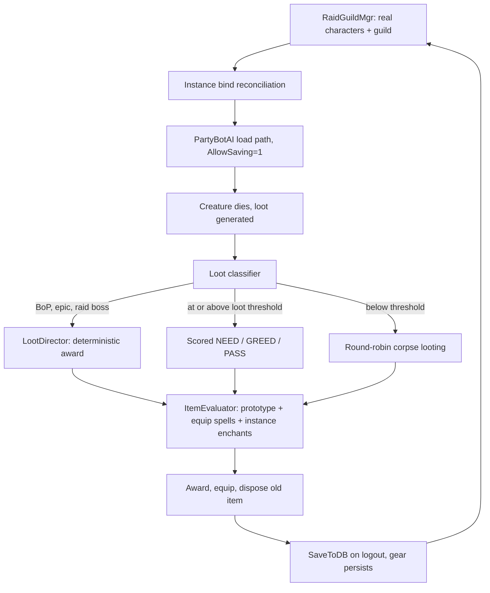

# Persistent Bot Raid Guild

Build a persistent bot raid guild whose members are real saved characters that gear up over time
through hybrid loot distribution, backed by a vanilla-aware item scoring engine.

All claims below were verified against the code. Line numbers are accurate as of review.

## Progress

Maintained as work lands so completion state does not have to be re-derived by reading the
code. See the companion document's Progress section for the combat side, the shared build and
test loop, and findings that apply to both.

Status key: **not started** / **in progress** / **done**.

### Landed

| Commit | What |
| --- | --- |
| `a19dc86dc` | Party bots can fill a raid group instead of silently capping at five |
| `e04904be4` | Test harness, which is how roster work gets verified without a client |
| `09bae86c1` | The roster table, `RaidGuildMgr`, and `.raidguild` provisioning |
| `547a3416c` | Talent specs are asked for by name instead of drawn at random, plus the six level 60 builds that did not exist |
| `b2d572839` | Those six builds rebuilt on the published vanilla specs, and a template audit that applies a spec rather than counting it |

`a19dc86dc` closes the "Joining the group" section of Phase 0 below in full: the group is
promoted to a raid when it fills, `AddMember`'s return value is checked, a bot that fails to
join is removed rather than left running its AI ungrouped, `PartyBotAddRequirementCheck`
measures against `MAX_RAID_SIZE`, and the eight `me->GetGroup()` call sites that iterated
without a null check are guarded. Verified end to end by `contrib/harness/test_raid_group.py`,
which builds a 40-member raid across 8 subgroups and asserts the 41st is refused cleanly.

Two details from that section are **not** yet addressed, because they only bite once a real
roster exists: adding members to a *defined* subgroup rather than letting `_addMember` pick
the first free one, and setting the loot method and threshold explicitly instead of inheriting
the `GROUP_LOOT`-with-uncommon-threshold default that `Group::Create` hardcodes. Both belong
with roster provisioning.

The concurrent-creation race is also still open. It is currently avoided only by the harness
adding bots one at a time with a gap between them; roster spawning must create the group once,
up front.

`547a3416c` makes the roster's `spec` column mean something. A bot takes a spec by name through
`CombatBotBaseAI::m_specName`, or by hand with `.partybot add mage fire-pve`; selection is
otherwise deterministic rather than random; and six missing level 60 builds are seeded. Verified
by `contrib/harness/test_premade_specs.py`. Provisioning still has to set `m_specName` from the
roster row — the column is loaded and written but nothing applies it yet — and levels other than
60 remain unsolved, which is written up under Phase 3.

`b2d572839` replaces those six builds with the ones the surviving 1.12 guides agree on, because the
first set was written from recall and only checked for legality, which four bad builds passed. It
also adds `contrib/harness/audit_premade_specs.py`, which applies every level 60 template to a
character and reads the build back; all twenty it can reach spend 51 of 51 points on legal tiers.

### Findings that changed the plan

- **A roster character's account needs no `realmd` row, and this is now tested rather than
  reasoned.** The claim was read out of `AccountMgr::GetSecurity` falling back to
  `SEC_PLAYER` and `LoadFromDB` skipping the ownership check for bots, but nothing had ever
  logged one in. A character whose account number exists in no table anywhere reaches the
  world through `.harness login` normally. What the account is still needed for is
  distinctness: `PlayerBotMgr::AddBot` refuses a bot whose account already has a session, so
  a roster sharing one account would spawn its first member and silently stop.
- **The player name cache and the `characters` table can disagree, and provisioning against
  the cache turns that into two characters with one name.** `GetPlayerGuidByName` answers
  from `m_playerNameToGuid`, `Player::SaveNewPlayer` is a `REPLACE` keyed on guid, and
  `Player::DeleteFromDB` is the only thing that clears the cache entry. So any path that
  drops a cache entry while leaving the row makes the name look free, and the next provision
  writes a second character under it. Observed for real: three test runs produced a duplicate
  `Rgtesttwo`. Provisioning now asks the table.
- **Erasing a character that is still leaving the world misses it.** `.character erase`
  resolves the name through the same cache, and a character part way out of the world is not
  reliably found, so the erase reports "Player not found!" and the row survives. This is what
  produced the duplicate above. Anything that dismisses a roster member has to wait for it to
  be gone before deleting it, not merely ask it to log out.
- **A subgroup cannot be assigned when a member is summoned, because it is not in the group
  yet.** The bot joins on its own first update tick, a couple of seconds after the session
  loads, so anything that tries to place it at the point of spawning is placing a player the
  group has never heard of. Placement is reconciled from a world-update timer instead. The
  same gap is why the group is promoted to a raid before anyone is summoned rather than when
  the sixth member is turned away.
- **Persistence is now demonstrated rather than argued.** The whole reason for the load path
  is that `Player::Create` sets `m_saveDisabled` and nothing clears it, which was read out of
  the source. It is now a test: a level set on a summoned member is still there after the
  member is dismissed and summoned again.
- **A talent spec is a set, not an order, and that is the whole reason sub-60 members do not
  work.** The plan had asked for ordered spend lists without saying what the current data
  actually is: `player_premade_spell` is `(entry, spell)` with no sequence column at all, so a
  template can only ever be applied whole, at the level it was authored for. Templates exist at
  five levels and nowhere else. Written up under Phase 3.
- **Talent trees are client data with no server-side table, so nothing in SQL can check a
  build.** There is no `talent` table in the world database; trees live in Talent.dbc. Combined
  with specs being applied through `LearnSpell`, which validates nothing, an authored build had
  no checker anywhere. `contrib/harness/talent_dbc.py` reads the DBCs the server reads and is
  now that checker. It immediately found two prerequisites that were not obvious from the game:
  Deep Wounds requires Improved Rend at rank 3, and Mortal Strike requires Sweeping Strikes.
- **`TalentTabEntry::tabpage` is wrong for mage.** Tabs 41 (Fire) and 81 (Arcane) both report
  page 0, while all eight other classes are consistent. Anything naming or ordering trees must
  key off the tab id.
- **A legal build and a good build are different things, and only one of them can be checked by
  a machine.** The DBC validator confirms tiers, prerequisites and the point budget, and it
  passed six builds written from memory in which four spent points on talents that do nothing to
  a raid boss — stuns, parry, fear resistance — purely as a toll to reach the next row, and two
  were not builds anyone runs. Vanilla is a closed patch with a settled answer per spec, so
  builds get sourced from the surviving 1.12 guides and the validator's job is only to stop a
  transcription error. Two of the six splits differ by one point from the number those guides
  quote, in both cases because the quoted number is not buildable: the fire mage's published
  17/31/3 cannot reach Arcane Meditation, which sits on row 3 and so needs 15 points above it.
- **Counting a template's talents offline against Talent.dbc under-reports the build.** A
  template may store a rank id that the DBC chain for that talent does not list, so the match
  fails and the point is not counted. That produced a confident and entirely wrong conclusion
  that eleven shipped templates under-spend and that `ds-ruin-pve` is illegal; applying each one
  to a character shows all of them at 51 of 51 and legal. `contrib/harness/audit_premade_specs.py`
  is the trustworthy form. Never report a talent count that has not been applied to a character.

### Next

The `raidguild_member` table and the `.raidguild` command group of `add`, `remove`, `list`,
`provision`, `summon`, `dismiss`, `status`, `guild`, `resetbinds`, `attune` and `reload` are
done, backed by `RaidGuildMgr`. `contrib/harness/test_raid_guild_roster.py` covers authoring,
provisioning, idempotence, account distinctness, adoption of an existing character, and that
a provisioned member logs in; `contrib/harness/test_raid_guild_summon.py` covers a seven
member roster being guilded with six of them offline, reaching the world as a raid, landing
in its rostered subgroups, inheriting the leader's attunements, entering Zul'Gurub as one
instance rather than two, dropping a planted stale bind, leaving on dismissal, and keeping
what it earned across the round trip.

Still to do in Phase 0: level matching, which lands in `PartyBotAI` and `CombatBotBaseAI`
alongside the talent spend order and so waits on that agent rather than on anything here.

Two spec items follow from `547a3416c`. Provisioning should pass the roster row's `spec` to
`CombatBotBaseAI::m_specName`, which is a one line change and makes the column live. Ordered
talent spending should land **before** level matching, because a member matched to any level
other than 60 currently spends a lower level template and leaves the difference unspent.

Note the sequencing dependency in Phase 4: wipe recovery lives in the companion document but
gates raid use of this one, since without it a single wipe ends the night. It is in progress
there.

**There is a third world, `~/bin/server3`,** built the same way as server2 and for the same
reason: realm 3 on world port 8087 and SOAP 7880, with its own `characters3` database,
sharing the world database and map data. Drive it with
`VMANGOS_SOAP_URL=http://127.0.0.1:7880/`. One thing was wrong in the script it was copied
from and is worth fixing in server2 as well: `stop` waits for the SOAP port to be released,
but a graceful shutdown closes that socket early and keeps the port until the process
actually exits, so the next `start` races it and comes up with a working game port and no
SOAP at all. server3 waits for the process to go first.

## Architecture

The design rests on one existing capability: `.partybot load <name>` already loads a real database
character via `LoginPlayer()` and, with `PlayerBot.AllowSaving=1`, saves it back on logout at
[src/game/Server/WorldSession.cpp](../src/game/Server/WorldSession.cpp) line 803. Everything else
layers on top of that.

Contrast with `.partybot add`, which is a dead end for persistence: `Player::Create()` hardcodes
`m_saveDisabled = true` at [src/game/Objects/Player.cpp](../src/game/Objects/Player.cpp) lines
401-403 with the comment "only temporary bots are created this way".

Note that all `.partybot` and `.bot` commands require `SEC_ADMINISTRATOR`
([src/game/Chat/Chat.cpp](../src/game/Chat/Chat.cpp) lines 83-98, 1217). New `.raidguild` commands
should match. The human player driving this needs a GM account, which is also useful for the
instance cap discussed below.



## Phase 0 - Roster, persistence, and instance entry [in progress]

The goal is a set of stable, named, guilded characters that spawn identically every time.

**Status.** Group joining is fixed and verified (`a19dc86dc`), and the roster table,
provisioning, summoning, the guild, bind reconciliation and attunement mirroring are done and
verified live. Still not started: level matching.

### Roster [done]

Landed as `RaidGuildMgr` with a `raidguild_member` characters migration and the `.raidguild`
command group. A row describes a character that should exist; `guid` and `account` are filled
in when it does, so an unprovisioned member is the one state the roster and the `characters`
table are allowed to disagree in. Provisioning is idempotent and adopts a character that
already carries the name, which is what a rebuilt roster table needs.

Accounts are allocated from a base of 5,000,000, clear of the range `GenBotAccountId` draws
from, which starts at the highest real account plus ten thousand and rises by one per bot
spawned.

### Summoning [done]

`.raidguild summon <leader> [name]` brings the roster, or one member of it, into the world
around a named character, and `.raidguild dismiss [name]` sends it home. The leader is named
rather than taken from the session because the harness drives all of this over SOAP, where
there is no session player to take it from; an in-game caller may leave it off and mean
itself.

The three things left over from the group-joining fix land here, and all three are about
doing the work before the members arrive rather than as they do:

- The group is created once, up front, by the summon command. No member ever creates it, so
  the concurrent-creation race cannot happen however many arrive on one tick.
- It is promoted to a raid up front too, sized for what the group is about to hold rather
  than for what is being added now, so summoning the second half of a raid one member at a
  time does not leave a party to be promoted partway through.
- The loot method, looter and threshold are stated rather than inherited from
  `Group::Create`, which hardcodes them.

Subgroup placement is the exception, and cannot be done up front: the bot joins the group on
its own first update tick, seconds after the session loads, so at summon time there is no
membership to place. `RaidGuildMgr::Update` reconciles it once a second instead, and declines
silently when the wanted subgroup is full, which is the right answer to a roster that asks
for nine people in one of them.

`.raidguild status` reports who is in the world, whether the group is a raid, the subgroup
each member is in against the one it is rostered for, and the guild each one is carrying. It
exists because nothing here happens on the tick the command returns: summoning takes a
session load then a group join, and dismissal takes a logout, so anything waiting on either
has to be able to ask.

### The guild [done]

`.raidguild guild <name> [founder]` finds or founds the guild and puts every provisioned
member in it, and is idempotent, so it is how a guild is brought up to date after the roster
grows rather than something to run once.

Only the founder has to be in the world. `Guild::Create` needs a session, because it reads
the locale off it to name the default ranks; filling the tables by hand instead would leave a
guild with no ranks, so the requirement is kept rather than worked around. Everyone else goes
in through `Guild::AddMember`, which writes `guild_member` directly for an offline character.
A roster of forty does not have to be summoned to be guilded.

The one sharp edge is that the offline branch of `AddMember` reads the member's name, level
and class out of the player cache and refuses outright if there is no entry. A provisioned
member normally has one, but an adopted character need not, since adoption reads the
`characters` table precisely because the cache can be missing a row that exists. So the cache
is reloaded for that member first rather than the add failing for a character that is
demonstrably there.

Members join at `GR_MEMBER` rather than the lowest rank. Initiate is what a guild gives
someone it is still deciding about, and every one of these was written down on purpose.

### Instance binds [done]

The rule is that **a roster member holds no personal instance bind.** It is a body following
the leader, not a raider with a lockout of its own, so the group's bind should be the only
thing deciding which copy of a map it walks into. `SummonMember` clears the member's
`character_instance` rows before the session loads, and `.raidguild resetbinds [name]` does
the same on demand for weekly resets and experimentation. `.raidguild status` reports how
many binds each summoned member is carrying, which should always be none.

Clearing before the session loads is not incidental. It is the only race-free moment: after
login the bot is teleported to the leader within a couple of seconds, and if that lands it at
an instance door holding a bind that disagrees, the answer is `MANGOS_ASSERT` rather than an
error. `DungeonMap::BindPlayerOrGroupOnEnter` has four such branches
([src/game/Maps/Map.cpp](../src/game/Maps/Map.cpp) lines 2201-2305) and three of them fire on
a personal bind that does not match. Deleting the rows of an offline character is also what
`Group::ChangeLeader` and `Player::ConvertInstancesToGroup` already do, so it is not a new
kind of write.

A member already in the world keeps two things: the bind for the map it is standing on, since
unbinding that is how a character ends up inside an instance it has no claim to, and any bind
the group already agrees with.

`contrib/harness/test_raid_guild_summon.py` covers it by taking the seven member raid into
Zul'Gurub and requiring that all of them arrive in **one** copy of the map. The failure this
guards against is not a refusal at the door; it is a raid that silently splits across two
instance IDs, which from the outside looks like bots that will not follow.

The test plants a bind rather than waiting for one, and the reason is worth recording:
entering behind a group that is not permanently saved leaves no personal bind at all, because
`BindPlayerOrGroupOnEnter` only binds the entrant when `groupBind->perm` is set. A test that
merely observed binds staying at zero would therefore pass whether or not anything was being
cleared. It writes a `character_instance` row directly while the member is offline and then
requires the summon to have removed it.

The original design notes follow.

- New `RaidGuildMgr` alongside
  [src/game/PlayerBots/PlayerBotMgr.cpp](../src/game/PlayerBots/PlayerBotMgr.cpp), owning a
  database-authored roster: character name, class, race, role, spec template, loot-priority group.
  The existing `characters.playerbot` table is close but has no write path in code and is not used
  by the load path, so add a `raidguild_member` table rather than overloading it.
### Joining the group: the current path caps at five, silently [done]

Fixed in `a19dc86dc`, except for the defined-subgroup placement, the explicit loot method and
threshold, and the concurrent-creation race, all of which land with roster provisioning. The
diagnosis below is kept because it explains why those three remain.

`PartyBotAI::AddToPlayerGroup` is not usable as-is for a roster of forty, for two compounding reasons
([src/game/PlayerBots/PartyBotAI.cpp](../src/game/PlayerBots/PartyBotAI.cpp) lines 516-542).

When the human has no group yet, the bot creates one - and `Group::Create` sets the type to
`GROUPTYPE_NORMAL` unless it is a battleground group
([src/game/Group/Group.cpp](../src/game/Group/Group.cpp) line 127), so what gets created is a five-person
party. `Group::_addMember` then returns false once `IsFull()`
([src/game/Group/Group.cpp](../src/game/Group/Group.cpp) lines 1563-1566), so **bots six through forty
cannot join at all** unless the human happens to have converted to a raid beforehand.

The second half is worse than the first, because the failure is silent:

```cpp
group->AddMember(me->GetObjectGuid(), me->GetName());
```

The result is discarded, and the bot proceeds to set `m_initialized = true` and run its AI regardless. A
bot that failed to join therefore behaves as though it had, until `GetPartyLeader` notices it is not in the
leader's group and sets `requestRemoval`, at which point it despawns. The visible symptom is a roster that
mysteriously settles at five members with bots flickering in and out, and nothing in the log explaining why.

So roster provisioning must convert the group to a raid before adding anyone, add members in a defined
subgroup rather than letting `_addMember` pick the first free one, and check the return value. Two further
details matter while we are here:

- **Concurrent creation races.** If two bots initialize on the same tick with the human ungrouped, both see
  `!group` and both call `Create`, and the second `AddMember` takes the `SetOriginalGroup` path and corrupts
  the leader's group pointers. Roster spawning must create the group once, up front, rather than letting
  bots create it opportunistically.
- **`Group::Create` hardcodes the loot rules** to `GROUP_LOOT` with an uncommon threshold
  ([src/game/Group/Group.cpp](../src/game/Group/Group.cpp) lines 132-133). Since the loot design in Phase 2
  depends on the threshold and method, the raid guild must set both explicitly instead of inheriting these.

And a groupless bot is not merely idle, it is a crash. A cluster of bot AI helpers call `me->GetGroup()` and
iterate the result without a null check - `ShouldAutoRevive`, `GetMarkedTarget`, `SelectAttackTarget`,
`SelectPartyAttackTarget`, `SelectResurrectionTarget`, `SelectShieldTarget`, and `GetDistancingTarget` in
[src/game/PlayerBots/PartyBotAI.cpp](../src/game/PlayerBots/PartyBotAI.cpp), plus
`CombatBotBaseAI::AreOthersOnSameTarget` at
[src/game/PlayerBots/CombatBotBaseAI.cpp](../src/game/PlayerBots/CombatBotBaseAI.cpp) lines 1847-1850. These
are safe today only because a bot without a group is normally removed before it reaches combat code. The
silent `AddMember` failure above is exactly the condition that breaks that assumption, and a bot kicked from
the group mid-combat is another. Given that the harness will run thousands of unattended spawn cycles, these
need null guards before the harness is trusted, not after it starts crashing.

### Roster selection and size

The roster is a stable of tracked characters that can exceed any single group size; the human picks a
subset per zone. This is a selection feature, not a constraint — the hard caps are generous.

- Group composition is chosen per run: 4 bots for a 5-man, 19 for a 20-man, 39 for a 40-man, with
  role balance (tanks, healers, damage) preserved by the selector. A roster larger than 40 is
  desirable so there is real choice, and so characters can sit out and still exist.
- **Select on intended group size, not `maxPlayers`.** The engine cap comes from SQL `map_template`
  rather than a DBC ([src/game/Database/SQLStorages.cpp](../src/game/Database/SQLStorages.cpp) line
  43), it is patch-aware, and it is frequently a loose ceiling rather than the design target: most
  5-mans allow 10, Upper Blackrock Spire allows 15 at patch 1 and 10 from patch 8, Dire Maul allows
  5, Zul'Gurub and Ahn'Qiraj Ruins allow 20, and the 40-man raids allow 40. Selecting by design
  intent avoids accidentally bringing 9 bots into a 5-man because the cap permits it.
- The cap itself is not tight. `DungeonMap::CanEnter` rejects only when
  `GetPlayersCountExceptGMs() >= GetMaxPlayers()`
  ([src/game/Maps/Map.cpp](../src/game/Maps/Map.cpp) lines 2131-2137), so one human plus 39 bots
  enters a 40-man cleanly. Dead members still count
  ([src/game/Maps/Map.cpp](../src/game/Maps/Map.cpp) lines 1828-1834), which matches real WoW
  behavior; it only matters if you want to swap a dead bot for a fresh one mid-run, which requires
  removing the dead one first.

### Levels and progression

**Design principle: level is a free parameter, gear is the progression.** The human levels solo and
summons the roster only for hard quests and 5-mans, so bots can never earn enough experience to keep
pace. Bots therefore always spawn at the human's current level, while everything that makes the roster
feel like a guild — gear, upgrades, loot history — is earned in content run together.

- Bots do gain experience normally, with no bot exclusion in `Player::GiveXP` or in
  `Group::RewardGroupAtKill`, and `.levelup` and `.character level` both accept a target name. None of
  that is needed under this model, but it means an earned-experience variant remains possible later.
- `.partybot add` already defaults a new bot to the leader's level
  ([src/game/PlayerBots/PlayerBotMgr.cpp](../src/game/PlayerBots/PlayerBotMgr.cpp) line 880). The
  persistent `.partybot load` path does **not** adjust level, so level matching is the change needed.
- **Talent builds must be stored as an ordered spend list, not a finished spec.** The spawn path calls
  `GiveLevel` followed by `InitTalentForLevel`
  ([src/game/PlayerBots/PartyBotAI.cpp](../src/game/PlayerBots/PartyBotAI.cpp) lines 621-626), and a
  level 25 bot has roughly 16 points to spend. Storing a build as an ordered sequence and spending the
  first N points for the current level keeps every level valid and keeps specs coherent as the roster
  climbs.
- Spell ranks must follow level too, so a bot dropped to level 25 is not casting rank 11 Frostbolt.
- **This work lands in the one code path that currently preserves earned gear by doing nothing at all.**
  See "The init paths that destroy earned gear" below before touching it.
- Item scoring must be level-aware rather than tuned for level 60 best-in-slot, since a level 30 roster
  gearing up in Scarlet Monastery is the common early case.
- Because level is decoupled from identity, the roster is reusable across the human's own alts. Note the
  one asymmetry: a bot geared at 60 and then dropped to 25 for an alt run holds gear it no longer meets
  the requirements for, so the roster needs either per-level gear snapshots or an accepted rule that
  alts start a fresh roster.
- There is no level requirement on `MapEntry` any more; `level_min` and `level_max` were dropped from
  `map_template` in migration `20210220230709_world.sql`. Gating lives on
  `areatrigger_teleport.required_level` and applies from patch 1.4
  ([src/game/Handlers/MiscHandler.cpp](../src/game/Handlers/MiscHandler.cpp) lines 764-772), with
  `Instance.IgnoreLevel` as a bypass.
- `.partybot load` imposes no level restriction. The `+10` level cap applies only to
  `.partybot clone` ([src/game/PlayerBots/PlayerBotMgr.cpp](../src/game/PlayerBots/PlayerBotMgr.cpp)
  lines 849-853), and `PartyBot.MaxBots` is only checked inside `PartyBotAddRequirementCheck`, which
  the load path skips entirely.

### Content gating and attunement

Attunement chains are the campaign's progression spine, not an obstacle to delete. Gate the human
normally, and **mirror the human's attunements onto the roster** so a chain is run once rather than
forty times. The human earns access; the guild inherits it.

- Conditions are evaluated **per entering player**, against that player's own session
  ([src/game/Handlers/MiscHandler.cpp](../src/game/Handlers/MiscHandler.cpp) lines 758-795), so all 40
  characters would each need attunement to walk a portal. There is no `Instance.IgnoreCondition`
  config; only `Instance.IgnoreLevel` and `Instance.IgnoreRaid` exist.

**Mirroring beats teleport bypass.** `Player::TeleportTo` never evaluates conditions, so teleporting
bots past a portal does work, but it leaves three holes that mirroring closes: the Upper Blackrock Spire
door to Blackwing Lair is a `LOCK_KEY_ITEM` check requiring the Seal of Ascension (item 12344) **in each
player's inventory** ([src/game/Objects/GameObject.cpp](../src/game/Objects/GameObject.cpp) lines
2203-2228), the Lothos Riftwaker gossip route into Molten Core carries its own condition, and any future
in-instance object check would need bypassing separately. Granting the real state once is less code than
special-casing every gate.

**A hardcoded manifest was the plan and is not what landed, because writing one down proved the
idea wrong.** The manifest below said Naxxramas was gated on quests 9121, 9122 or 9123; this
server's own trigger asks for 9378, and nothing about a list kept in a header can notice that it
has drifted from the database it is describing. So mirroring reads the doorways instead. See
"Mirroring, as built" below; the manifest is kept because it is still the clearest statement of
what the gates are, with the Naxxramas line corrected.

The verified gates are narrower than expected:

- **Molten Core** (area triggers 3528 and 3529): quest **7848** or **7487** rewarded. Not an item. The
  Aqual Quintessence is for summoning Ragnaros and is unrelated to entry.
- **Onyxia's Lair** (area trigger 2848): **item 16309** in inventory. Note this is the amulet this
  codebase actually checks, not item 18406 or 13628.
- **Blackwing Lair** (area trigger 3726): **no condition at all**, `required_condition = 0`, only level
  50 and a raid group. Quest 7761 matters solely for the Orb of Command corpse-resurrection shortcut
  ([src/scripts/eastern_kingdoms/burning_steppes/blackwing_lair/instance_blackwing_lair.cpp](../src/scripts/eastern_kingdoms/burning_steppes/blackwing_lair/instance_blackwing_lair.cpp)
  lines 1091-1104). The real gate is the UBRS door key above.
- **Naxxramas** (area trigger 4055): quest **9378** rewarded, through condition 9124. Argent Dawn
  Honored gates *accepting* the quest, not entering the instance.
- **Ahn'Qiraj**, both 20 and 40 (area triggers 4008 and 4010): **game event 83 inactive**. This is
  server-wide state, not per-player, so there is nothing to mirror.

Grant path per bot: `AddQuest` followed by `FullQuestComplete` for quest gates (the same calls behind
`.quest complete`), `StoreNewItem` for item gates, and `ReputationMgr::SetReputation` for faction 529 if
Argent Dawn standing is ever wanted for flavor. Run the sync when the roster is spawned, skipping
anything a bot already has, and remember the raid-group requirement in
`MapManager::CanPlayerEnter` still applies independently of attunement.

### Mirroring, as built [done]

`.raidguild attune <leader> [name]` walks every `areatrigger_teleport` that leads to a dungeon,
follows its `required_condition` through the `conditions` tree, and collects the
`CONDITION_QUESTREWARDED` and `CONDITION_ITEM` leaves. A member is then given every leaf **the
leader already satisfies and the member does not.**

Whether a composite is an AND or an OR is deliberately not considered, which sounds like a
shortcut and is not. A member holding everything the leader holds satisfies whatever the leader
satisfies, whichever way the tree is wired, so the shape never needs to be interpreted. It also
means the two Molten Core triggers cost nothing to handle: the window entrance is
`OR(quest 7487, quest 7848)` and the leader's copy of one of them is what gets passed on, while
the lava entrance is `AND(patch, race and class)` and yields no leaves at all. The Ahn'Qiraj
gates fall out the same way, being a game event rather than anything a character can carry.

Reading `ConditionEntry` needed accessors, since only `Meets` was public and "is it satisfied"
is the one question mirroring cannot use. `GetType` and `GetValue1` through `GetValue4` were
added alongside the existing `GetTeam`.

Two things this does not cover, both known. The Upper Blackrock Spire door to Blackwing Lair is
a `LOCK_KEY_ITEM` on a gameobject rather than an area trigger condition, so the Seal of Ascension
is not found by walking triggers. And `RewardQuest` pays out experience, which on a roster below
sixty would move levels around; attunement quests are level 55 content, so a roster running them
is at sixty already, but it is a real edge and level matching should account for it.

The test gives the leader one gate of each shape, Attunement to the Core for a quest and the
Drakefire Amulet for an item, mirrors, and then mirrors again. The second pass granting nothing
is the assertion that matters: since a grant only happens when the leader has something the
member lacks, nothing left to grant means no member is missing anything the leader holds. It
proves the property without the test needing to know which quests and items this server's
doorways ask for, which is the same reason the code does not know either.

### Ahn'Qiraj and server-wide world events

Much better supported than assumed. The war effort is a complete 13-stage state machine in
[src/game/HardcodedEvents.cpp](../src/game/HardcodedEvents.cpp) (stage enum at
[src/game/HardcodedEvents.h](../src/game/HardcodedEvents.h) lines 237-251), with resource stock held in
the `variables` table and three independent levers for a solo player:

- `.wareffort setstage <0-12>` to jump stages, `.wareffort setresource <itemId> <count>` to fill
  individual objectives, and `.wareffort info` to inspect. Stage 7 opens the gong; stage 8 stops event
  83 and opens the raids.
- `Rate.WarEffortResourceComplete` (default 0.0) auto-fills a percentage of every objective per period,
  so the collection phase can progress passively while the human plays.
- `sql/custom/repack/AQ-SET_GATES_OPEN.sql` sets the stage variable directly, and `.event stop 83`
  opens the raid portals on their own.

**The Black Qiraji Resonating Crystal is obtainable, including solo.** The Scarab Gong is scripted as
`go_scarab_gong` in [src/scripts/kalimdor/silithus/silithus.cpp](../src/scripts/kalimdor/silithus/silithus.cpp)
lines 2063-2231, and quest 8743 is tied to game event 85, which stage 7 activates. Critically, this
codebase tracks `VAR_WE_GONG_BANG_TIMES` but **never uses it to block the reward** — only the first
ringer triggers the gate cinematic and the ten-hour war, while every completion awards the crystal. The
retail one-per-realm limit is not implemented, so ringing the gong and getting the mount works.

The scepter chain itself is mostly database quests with one substantial scripted cinematic, quest 8519
with Anachronos and the dragonflights. That chain is real content to play through rather than something
needing new code; the work is running world bosses and raids for the shards, which is what the roster is
for.

Two other world events are already implemented and worth knowing about, since both fit the campaign:
the **Scourge Invasion** that precedes Naxxramas, complete with a victory counter that unlocks vendor
tiers, and the **elemental invasions**. Both are hardcoded event drivers with the same `.event` and
`.variable` levers.
- Account provisioning is simpler than it first appears: bot accounts do **not** need to exist in
  realmd. `sAccountMgr.GetSecurity()` falls back to a default `SEC_PLAYER` entry for unknown IDs
  ([src/game/AccountMgr.cpp](../src/game/AccountMgr.cpp) lines 205-207) and the realmd row is never
  consulted during bot login. All that is required is a **distinct nonzero `account` value on each
  character row**, so that `PlayerBotMgr::AddBot` does not trip the "account is already online"
  check ([src/game/PlayerBots/PlayerBotMgr.cpp](../src/game/PlayerBots/PlayerBotMgr.cpp) lines
  423-427). This is a characters-database concern only.
- Guild registration: `Guild::Create(Player* leader, std::string name)`
  ([src/game/Guild/Guild.cpp](../src/game/Guild/Guild.cpp) line 126) needs no petition but does
  require an **online** leader with a session. `Guild::AddMember(ObjectGuid, uint32 rank, uint32
  petitionId = 0)` at line 197 works on **offline** characters via `PlayerCacheData`, so bots can be
  enrolled without being spawned. The member cap is never enforced;
  `GuildAddStatus::GUILD_FULL` is defined and never returned.

### Instance entry and binding

This was the largest gap in the original plan and needs a code change, not just an operating
procedure.

**A later audit found the spawn path pre-empting bind resolution entirely.** `PlayerBotAI::SpawnNewPlayer`
creates a persistent state and binds the new bot to it as **permanent** before the bot is even added to the
map ([src/game/PlayerBots/PlayerBotAI.cpp](../src/game/PlayerBots/PlayerBotAI.cpp) lines 116-121):

```cpp
if (instanceId && mapId > 1) // Not a continent
{
    DungeonPersistentState* state = (DungeonPersistentState*)sMapPersistentStateMgr
            .AddPersistentState(sMapStorage.LookupEntry<MapEntry>(mapId), instanceId, time(nullptr) + 3600, false, true);
    newChar->BindToInstance(state, true, true);
}
```

Worth being precise about the blast radius, because the obvious reading overstates it. The third argument is
`load`, and `Player::BindToInstance` skips its `INSERT INTO character_instance` when `load` is true
([src/game/Objects/Player.cpp](../src/game/Objects/Player.cpp) lines 16000-16021). So this creates an
in-memory permanent bind and **not** a durable raid lockout row; it does not accumulate database rows across
restarts. What it does do is still enough to matter: for the life of that session the bot holds a *permanent*
personal bind, personal binds beat group binds in `GetBoundInstanceSaveForSelfOrGroup` (lines 16050-16058),
and permanent binds are explicitly skipped by the reset-on-group-join path. A bot that spawned into one
instance can therefore refuse to follow the group into another, and the raid silently splits across two
instance IDs of the same map.

The reconciliation check does not catch it either. `DungeonMap::BindPlayerOrGroupOnEnter` compares the group
bind against the entered map only in the branch where the player has **no** personal bind
([src/game/Maps/Map.cpp](../src/game/Maps/Map.cpp) lines 2259-2282); when a personal bind exists it merely
asserts that bind matches. So the mismatch that matters is the one case that goes unchecked. Roster entry
must clear or align every bot's personal bind before teleporting, and should prefer temporary group binds.

- `.partybot load` captures the leader's instance ID at
  [src/game/PlayerBots/PlayerBotMgr.cpp](../src/game/PlayerBots/PlayerBotMgr.cpp) lines 1031-1034
  and stores it in `m_instanceId`, but **the load path never uses it**. `Player::TeleportTo` has no
  instance parameter; instance selection is resolved entirely through
  `Player::GetBoundInstanceSaveForSelfOrGroup`
  ([src/game/Objects/Player.cpp](../src/game/Objects/Player.cpp) lines 16044-16062), where a
  **personal bind takes precedence over the group bind**. A bot carrying a stale `character_instance`
  row for the target map will be sent to the wrong instance.
- `.partybot add` already does this correctly for temporary bots, calling `BindToInstance` before
  entry in `PlayerBotAI::SpawnNewPlayer`
  ([src/game/PlayerBots/PlayerBotAI.cpp](../src/game/PlayerBots/PlayerBotAI.cpp) lines 115-121). The
  fix is to give the load path equivalent handling: reconcile or clear conflicting personal binds,
  then bind the bot to the leader's `DungeonPersistentState` before teleporting.
- `DungeonMap::BindPlayerOrGroupOnEnter` contains `MANGOS_ASSERT(false)` for a permanent personal
  bind pointing at a different instance ([src/game/Maps/Map.cpp](../src/game/Maps/Map.cpp) lines
  2201-2305). A mismatched roster is a debug crash, not a graceful failure, so bind reconciliation
  needs to happen before entry rather than being discovered at the door.
- `MapManager::CanPlayerEnter` ([src/game/Maps/MapManager.cpp](../src/game/Maps/MapManager.cpp)
  lines 180-218) requires `group->isRaidGroup()` unless the player is a GM or `Instance.IgnoreRaid`
  is set. `Group::ConvertToRaid()` is therefore a hard prerequisite for entry, not a convenience.
- Instance-per-hour throttling is a non-issue: `CheckInstanceCount` is per account and re-entry to an
  already-known instance ID is always allowed
  ([src/game/AccountMgr.cpp](../src/game/AccountMgr.cpp) lines 441-459).
- Provide a `.raidguild resetbinds` maintenance command, since weekly raid resets and experimentation
  will leave stale binds across the roster.

### Persistence: there are two bot lifecycles and only one of them can save

This is the foundational constraint of the whole document, and it is sharper than "enable a config
option." There are two mutually exclusive bot lifecycles:

- **Generated bots** (`.partybot add`, `.partybot clone`, BattleBot) go through `SpawnNewPlayer` into
  `Player::Create`, which sets `m_saveDisabled = true` unconditionally with the comment "only temporary
  bots are created this way" ([src/game/Objects/Player.cpp](../src/game/Objects/Player.cpp) line 403).
  **That flag is never cleared.** The only assignment of `false` anywhere in the codebase is inside the
  race-change path, which sets it straight back to `true`. `Player::SaveToDB` returns immediately on
  `IsSavingDisabled()` (line 16452), so the 15-minute periodic save timer fires and silently does
  nothing. These bots can never persist, and `PlayerBot.AllowSaving` does not change that.
- **Database-loaded bots** (`.partybot load <name>`, `.bot add <name>`, the `playerbot` table) log in a
  real `characters` row through `LoginPlayer`, and stay saveable as long as `AllowSaving` is on
  ([src/game/Handlers/CharacterHandler.cpp](../src/game/Handlers/CharacterHandler.cpp) lines 478-479).

The roster must therefore be provisioned as real characters up front and spawned **only** through the
load path. There is no supported way to promote a generated bot into a persistent one without code
changes. `AllowSaving` is not a facade — `SaveToDB` genuinely writes equipment, inventory, item
instances with durability, spells, talents, skills, money, reputation, and quests — but the bot lifecycle
defaults to ephemeral and most spawn commands actively destroy progression.

### The init paths that destroy earned gear

Three functions will erase a roster bot's progression if they ever run on it:

- `ApplyPremadeGearTemplateToPlayer` calls `AutoUnequipItemFromSlot` across **every** equipment slot
  before applying the template ([src/game/ObjectMgr.cpp](../src/game/ObjectMgr.cpp) lines 12378-12380).
- `LearnPremadeSpecForClass` calls `ResetTalents(true)`
  ([src/game/ObjectMgr.cpp](../src/game/ObjectMgr.cpp) lines 12426-12428).
- `PartyBotAI::CloneFromPlayer` unequips everything and copies the clone source's gear.

Today the roster is safe from all three by accident: `PartyBotAI` init branches on `m_race && m_class`,
and the database-loaded branch runs none of them
([src/game/PlayerBots/PartyBotAI.cpp](../src/game/PlayerBots/PartyBotAI.cpp) lines 615-661). It survives
because it does nothing.

**That is a direct collision with level matching.** The level-matching design in the previous section
requires adding `GiveLevel`, talent spending, and rank adjustment into exactly the branch whose safety
comes from its own emptiness. The rule for that work: level and talents may be rewritten on spawn,
equipment may not, and `ResetTalents` must be reached only through a path that provably does not touch
inventory. This needs a test that spawns a geared roster bot, despawns it, and asserts the item GUIDs in
`character_inventory` are unchanged.

### Remaining save warts

- Two on-login mutations get persisted. The bot teleports to the coordinates captured near the leader at
  load time (**not** a dynamic follow) at
  [src/game/PlayerBots/PartyBotAI.cpp](../src/game/PlayerBots/PartyBotAI.cpp) line 660, and health and
  power are forced to 100 percent at lines 668-669. The latter applies to **every** init path. Gate both
  behind an "is roster bot" check.
- **Saves are logout-driven, not crash-safe.** The periodic timer is `PlayerSave.Interval`, defaulting to
  15 minutes ([src/game/World.cpp](../src/game/World.cpp) line 583), and the reliable save happens on
  logout ([src/game/Server/WorldSession.cpp](../src/game/Server/WorldSession.cpp) lines 801-804). If the
  player is not in the world at logout, saving is **forced off** entirely (lines 754-757). Roster
  despawn must go through a path that saves, and a hard kill mid-raid loses up to fifteen minutes of
  loot. Consider an explicit save on award rather than trusting the timer.
- `SaveToDB` writes `GetSession()->GetAccountId()` into `characters.account` (line 16488), overwriting
  the provisioned value with the synthetic bot account. Harmless but surprising, and it means the
  account column cannot be used as roster metadata.
- Bot sessions need no `realmd` account row, since `GenBotAccountId` allocates synthetic ids above
  `max(account.id) + 10000` and `LoadFromDB` skips the account-ownership check for bots
  ([src/game/Objects/Player.cpp](../src/game/Objects/Player.cpp) lines 14693-14700). Only `characters`
  rows are required. `CharactersPerRealm` caps client-side creation at 10 and does not bind here.
- Provision bags explicitly. Neither the random nor the premade gear path adds any, leaving only the
  16 backpack slots, which is not enough for loot plus a consumable loadout.
- Trading is blocked for `IsSavingDisabled()` players, and `Group` skips its database insert for them,
  so mixing generated and roster bots in one group produces inconsistent behavior. Keep the roster pure.
- Guild membership is genuinely persistent for offline characters. `Guild::AddMember` falls back to
  `PlayerCacheData` when the player is offline
  ([src/game/Guild/Guild.cpp](../src/game/Guild/Guild.cpp) lines 230-242), and `Guild::Create` needs only
  a leader with no petition or signature requirement, so programmatic creation works.

## Phase 1 - Item evaluation engine [not started]

This is the core new capability and has no existing foundation. The only "is A better than B" logic
in the entire bot codebase is hunter ammo selection by item level. The random gear path filters on
presence of a primary stat and then picks uniformly at random
([src/game/PlayerBots/CombatBotBaseAI.cpp](../src/game/PlayerBots/CombatBotBaseAI.cpp) line 2780),
and only fills empty slots (line 2677) with no concept of replacement.

### The vanilla itemization problem

Verified with real data. `ItemStat` carries only seven mods (mana, health, agility, strength,
intellect, spirit, stamina) at
[src/game/Objects/ItemPrototype.h](../src/game/Objects/ItemPrototype.h) lines 27-36, and
`Player::_ApplyItemBonuses` ([src/game/Objects/Player.cpp](../src/game/Objects/Player.cpp) lines
6960-7013) switches over exactly those. There is no crit, hit, or spell power anywhere in the stat
array.

Everything that decides BiS in vanilla arrives as equip-trigger spells. Staff of Dominance (entry
18842) carries `stat_type1=5 stat_value1=37` for intellect and its entire spell damage contribution
in `spellid_1=18384, spelltrigger_1=1`. Robe of the Archmage (14152) is the same shape. These are
cast as passive auras by `Player::ApplyItemEquipSpell`
([src/game/Objects/Player.cpp](../src/game/Objects/Player.cpp) lines 7208-7248).

So the evaluator has three input layers, not one:

- Prototype fields read directly: `ItemStat`, `Armor`, `Block`, the six resistance fields (lines
  471-476), and `Damage[]` with `Delay` for weapon scoring.
- Every `Spells[i]` with `SpellTrigger == ITEM_SPELLTRIGGER_ON_EQUIP`, resolved to its aura effects.
  The relevant aura types are `SPELL_AURA_MOD_DAMAGE_DONE` (13), `SPELL_AURA_MOD_HIT_CHANCE` (54),
  `SPELL_AURA_MOD_SPELL_HIT_CHANCE` (55), `SPELL_AURA_MOD_SPELL_CRIT_CHANCE` (57),
  `SPELL_AURA_MOD_CRIT_PERCENT` (52), `SPELL_AURA_MOD_ATTACK_POWER` (99),
  `SPELL_AURA_MOD_RANGED_ATTACK_POWER` (124), and `SPELL_AURA_MOD_HEALING_DONE` (135).
  `ObjectMgr::CorrectItemEffects` documents hundreds of these spell IDs in comments and can seed a
  lookup table, but `spell_template` aura data is authoritative.
- **Per-instance enchantments.** `Item::GetProto()` is a shared template lookup and never varies per
  instance, but random properties are stored on the instance in `ITEM_FIELD_RANDOM_PROPERTIES_ID`
  and applied through enchantment slots 3-5 by `Item::SetItemRandomProperties`
  ([src/game/Objects/Item.cpp](../src/game/Objects/Item.cpp) lines 816-833). Evaluating a bot's
  currently equipped gear therefore requires walking its enchantment slots, and evaluating a drop
  requires resolving `LootItem::randomPropertyId` through `ItemRandomPropertiesEntry::enchant_id[]`
  to `SpellItemEnchantmentEntry`. Vanilla has positive random **properties** only; there is no
  negative-ID suffix system and no `ItemRandomSuffix` store in this codebase.

### Mechanics

- Stat weights in a `raidguild_stat_weight` table keyed by class and **spec** so tuning needs no
  recompile. Spec rather than role, because a fire and a frost mage weight hit differently and the
  roster already records spec per member.
- Upgrade delta, not absolute score: compare the candidate against the item currently occupying the
  target slot. Handle two-hand versus one-hand plus offhand, the two ring and two trinket slots,
  `ITEM_FLAG_UNIQUE_EQUIPPED`, and `ItemSet` bonuses via `m_itemSetEffects`.
- Reuse `ItemPrototype::GetAllowedEquipSlots`
  ([src/game/Objects/Item.cpp](../src/game/Objects/Item.cpp) line 577) for slot resolution rather
  than reimplementing it.

### Safety first: scoring will be wrong, so make wrong answers survivable

The evaluator is the component most likely to be subtly incorrect, and the failure that matters is not a
suboptimal choice — it is an **irreversible** one. A tank receiving Thunderfury and vendoring it is not a
scoring problem to be solved with better weights; it is a problem of having allowed destruction at all.
Accuracy is a quality goal. Irreversibility limits are a correctness requirement, and they come first.

There are already **three** live examples of exactly this failure in the bot code, none of which have
anything to do with scoring. A dedicated audit pass found the other two after the first turned up.

The pattern is always the same: the bot needs a slot, so it destroys whatever is in one. This survived
because a throwaway bot's bags hold nothing but generated reagents, so there was never anything of value to
lose.

**One: the reagent top-up.** `CombatBotBaseAI::DoCastSpell` tops up a missing reagent on cast failure, and
to make room it destroys whatever occupies the first backpack slot, unconditionally
([src/game/PlayerBots/CombatBotBaseAI.cpp](../src/game/PlayerBots/CombatBotBaseAI.cpp) lines 2884-2892):

```cpp
if ((result == SPELL_FAILED_NEED_AMMO_POUCH ||
    result == SPELL_FAILED_ITEM_NOT_READY) &&
    pSpellEntry->Reagent[0])
{
    if (Item* pItem = me->GetItemByPos(INVENTORY_SLOT_BAG_0, INVENTORY_SLOT_ITEM_START))
        me->DestroyItem(INVENTORY_SLOT_BAG_0, INVENTORY_SLOT_ITEM_START, true);

    AddItemToInventory(pSpellEntry->Reagent[0]);
}
```

The bound `pItem` is never read; it is a non-null check followed by a destroy. It fires on a *cast failure*,
meaning it is most likely during exactly the chaotic moments when nobody is watching inventories.

**Two: hunter ammo.** `AddHunterAmmo` does the identical thing to the identical slot
([src/game/PlayerBots/CombatBotBaseAI.cpp](../src/game/PlayerBots/CombatBotBaseAI.cpp) lines 2945-2951),
then calls `me->SetAmmo(...)`, overwriting the character's saved ammo choice. This one gets worse in
combination with the next finding.

**Three, and the worst of them: equipping.** `CombatBotBaseAI::EquipOrUseNewItem` destroys **the currently
equipped item** to free the slot for a new one
([src/game/PlayerBots/CombatBotBaseAI.cpp](../src/game/PlayerBots/CombatBotBaseAI.cpp) lines 2977-2990):

```cpp
uint32 slot = me->FindEquipSlot(pItem->GetProto(), NULL_SLOT, true);
if (slot != NULL_SLOT)
{
    if (Item* pItem2 = me->GetItemByPos(INVENTORY_SLOT_BAG_0, slot))
        me->DestroyItem(INVENTORY_SLOT_BAG_0, slot, true);
    ...
    me->EquipItem(slot, pItem, true);
}
```

The trigger is what makes this severe: it runs on **trade completion**
([src/game/PlayerBots/CombatBotBaseAI.cpp](../src/game/PlayerBots/CombatBotBaseAI.cpp) lines 3358-3378),
and bots auto-accept every trade unconditionally. So the most natural way a human would ever hand a bot an
upgrade - open a trade window and give it the sword - is a path that permanently deletes the sword it was
replacing. The old item is not mailed, not bagged, just gone. The same function also immediately *uses* any
consumable in the bot's backpack, so traded potions are drunk on receipt rather than saved.

That function has two further defects worth fixing at the same time, since they are in the code being
touched anyway. It calls `EquipItem` without `CanEquipItem`, bypassing unique-equipped, proficiency, and
class restrictions; and it never calls `AutoUnequipOffhandIfNeed`, so a two-hander can be equipped
alongside a shield, or an off-hand alongside a two-hander.

**A quieter fourth: silent loss instead of destruction.** `AddItemToInventory` checks `CanStoreNewItem` and
simply does nothing when bags are full - there is no else branch
([src/game/PlayerBots/CombatBotBaseAI.cpp](../src/game/PlayerBots/CombatBotBaseAI.cpp) lines 2897-2906).
Callers treat it as infallible. `AddHunterAmmo` in particular destroys the first backpack slot, fails to
store the ammo, and then calls `SetAmmo` anyway, leaving a hunter whose ammo field points at ammo it does
not have. Auto-shot then keeps failing, which re-enters `AddHunterAmmo`, which destroys the next thing in
slot 0. That is a **destructive loop**, and it is the single most dangerous behavior found in this pass.

All four must be fixed in the gear-preservation work ahead of any evaluator work: find a free slot rather
than clearing an occupied one, move replaced gear to bags or mail rather than destroying it, honor
`CanEquipItem`, and propagate storage failure to callers instead of swallowing it.

**All four are now fixed [done].** The hunter ammo one landed with the spec work; the other three
are the commit that follows this note. `AddItemToInventory` returns whether the item is really in
the bags, and `AddHunterAmmo` only sets the ammo field when it is, which is what breaks the
destructive loop. The reagent top-up no longer clears the first backpack slot, so a reagent that
will not fit is now simply a reagent that will not fit. `EquipOrUseNewItem` asks `CanEquipItem`
instead of `FindEquipSlot`, so unique-equipped, class and level restrictions are honored rather
than walked past; sends the replaced item to the bags or the mail through
`Player::AutoUnequipItemFromSlot` instead of destroying it, and declines the swap if that fails;
and calls `AutoUnequipOffhandIfNeed` afterwards.

Two things are deliberately left. Consumables are still used on receipt rather than saved, which
is the remaining half of the trade problem and wants its own change. And none of this has a live
test, unlike the rest of Phase 0: `EquipOrUseNewItem` is reachable only from trade completion and
there is no way to drive a trade over SOAP, so a harness command that calls it directly is the
prerequisite for testing it. The roster suites were run to confirm nothing regressed, which is not
the same as confirming these paths behave.

The safety rules proper:

- **Nothing is ever destroyed on the strength of a score.** Disposal is limited to an explicit allowlist:
  grey and white items, and greens meaningfully below the member's current tier. Anything blue or above is
  kept, and the fallback when bags fill is the mail path that
  `Player::AutoUnequipItemFromSlot` already uses, never `DestroyItem`.
- **Pinned items are invisible to the evaluator.** Legendaries, questline rewards, and anything the human
  marks stay equipped and undisposable regardless of what the score says. Because legendary and questline
  rewards are granted deliberately to a nominated member rather than earned by a bot, that grant path sets
  the pin at the same time. Thunderfury therefore never enters scoring in the first place.
- **Every award and disposal is logged**, so a bad weight is diagnosable after the fact rather than
  discovered as a missing item weeks later.
- **Unique, class-restricted, and level-restricted items** are filtered before scoring rather than scored
  and then rejected.

### Where ranking data should come from

External item databases are the wrong first stop, for a specific reason: **this server's own
`item_template` is authoritative and the external sources are not.** VMaNGOS is patch-scoped with a `patch`
column and its own itemization corrections, so an item's stats here can legitimately differ from a
reference site. Scoring against anything other than the server's own data introduces disagreements that are
very hard to debug. Wowhead in particular offers no public bulk API, and scraping it is both against its
terms and fragile.

What genuinely cannot be derived from `item_template` is **how much each stat is worth to each spec**, and
that is theorycrafting output rather than item data. Reference sites do not publish it either.

It is worth being blunt that no importable dataset of vanilla-1.12 stat weights exists. The obvious
candidate does not fit: the open-source `wowsims/classic` project is a **Season of Discovery** simulator,
carrying runes, phase-scoped level caps, and SoD-only specs such as Shaman Warden, so its itemization and
weights are wrong for a 1.12 server. The remaining options are commercial and closed, or scattered
per-class theorycrafting posts. Worse, the sims themselves compute weights *dynamically per gear set*
precisely because weights are non-linear and gear-dependent, so any static per-spec table is an
approximation no matter where it comes from.

That argues for inverting the intended use of community data. Weights are small enough to hand-author -
roughly twenty specs times a handful of stats - and anyone WoW-literate can get them approximately right.
What community best-in-slot lists are genuinely good for is **checking the result**, not seeding it:

- Transcribe a published BiS list per spec into a fixture, and assert that the evaluator's ranking of those
  items reproduces the expected order. Disagreement means the weights are wrong, and the test says which
  slot and which item.
- This makes external data a **test oracle rather than a runtime dependency**, which avoids the licensing
  and format friction entirely, needs no scraping, and gets stronger over time as fixtures accumulate.
- It also localizes the curation effort where it pays: the override list only needs entries where the
  formula demonstrably misfires, and the fixture tests are what reveal those.

So the model has three layers, in increasing authority:

1. **Computed score** from the server's own data, using the three input layers above times the per-spec
   weights. This carries the long tail: the thousands of items nobody will ever curate.
2. **Curated overrides** for the few hundred items that actually matter. An explicit ranking table, keyed
   by spec and slot, that wins over the computed score. This is the practical answer to "how do we
   prioritize the item stack properly" — for raid gear, do not trust a formula when a known-correct answer
   exists.
3. **Pins and locks**, which win over everything and are described above.

### Vanilla-specific traps that break naive scoring

Worth enumerating, because each one produces a confidently wrong answer rather than a near miss:

- **Weapon speed is not a stat.** Slow weapons are disproportionately valuable where damage is
  proc-driven or normalized — Windfury and Seal of Command being the obvious cases — while rogues want a
  fast offhand. Scoring on `Damage[]` alone will hand the enhancement shaman a fast dagger.
- **Hit has a cap and stats past it are worthless**, so weights cannot be linear. The same applies to
  weapon skill on weapons, which is partly a hit effect.
- **Healing power and spell damage are different stats** carried by similar-looking equip auras.
  `SPELL_AURA_MOD_HEALING_DONE` is worth nothing to a shadow priest and everything to a holy one.
- **Tanks do not want damage stats.** Without an explicit tank weighting that values stamina, armor,
  defense, and block, a naive "more is better" score puts damage plate on the main tank.
- **Set bonuses mean an individually worse piece can be the correct choice.** This is why `ItemSet` is in
  the mechanics list rather than an afterthought.
- **Resistance gear is situational, not absolute.** Fire resistance is near-worthless generally and
  decisive for Ragnaros, so resistance belongs to the per-encounter loadout rather than to the score.
- **On-use effects have no place in a stat model.** Their value depends on cooldown alignment and the
  encounter, which is exactly the kind of judgement the curated override layer exists to encode.

## Phase 2 - Hybrid loot distribution [not started]

### A bot killing blow can lock the human out of the corpse

Fix this before anything else in this phase, because it silently removes loot from the run. When a bot lands
the killing blow it becomes `loot.roundRobinPlayer`, and its `SMSG_PARTYKILLLOG` handler clears that
assignment again so real players can loot - but only for three of the four loot methods
([src/game/PlayerBots/PartyBotAI.cpp](../src/game/PlayerBots/PartyBotAI.cpp) lines 564-592):

```cpp
if (pGroup->GetLootMethod() == ROUND_ROBIN ||
    pGroup->GetLootMethod() == GROUP_LOOT ||
    pGroup->GetLootMethod() == NEED_BEFORE_GREED)
```

`MASTER_LOOT` is absent, and `Player::CanOpenLoot` makes that omission bite because its `MASTER_LOOT` case
has no `break` and falls through into `ROUND_ROBIN`
([src/game/Objects/Player.cpp](../src/game/Objects/Player.cpp) lines 15376-15386):

```cpp
case MASTER_LOOT:
    if (loot->hasOverThresholdItem())
        return true;
case ROUND_ROBIN:
    if (loot->roundRobinPlayer == 0 || loot->roundRobinPlayer == GetGUID())
        return true;
    return loot->hasItemFor(this);
```

So under master loot, on any corpse with nothing above the threshold, the human cannot open a corpse a bot
killed. Bots never loot and never send `CMSG_LOOT_RELEASE`, so nothing clears it and the corpse stays shut
until it decays. The effect is a steady, unexplained trickle of missing trash loot and gold across every
run - the kind of bug that gets misdiagnosed as a drop-rate problem for weeks. Add `MASTER_LOOT` to the
handler, and clear the assignment for every method rather than enumerating them.

The same root cause has a broader form worth fixing in one go: under **any** method, under-threshold items are
filtered out of the loot view for anyone who is not the round-robin player
([src/game/LootMgr.cpp](../src/game/LootMgr.cpp) lines 873-882), and the assignment is normally cleared when
that player releases the corpse - which a bot never does. Clearing the assignment unconditionally on a bot
killing blow resolves both shapes.

Three defects in the roll machinery also need fixing before bots receive real loot, since all three destroy or
strand items:

- **A winning roll whose winner is offline strands the item permanently.** The need path sets
  `item->lootOwner = maxguid` without clearing `is_blocked`, and the greed path has no offline branch at all
  ([src/game/Group/Group.cpp](../src/game/Group/Group.cpp) lines 1199-1200 and 1225-1250). `is_blocked` was set
  at roll start, autoloot refuses blocked items, and nothing ever clears it - so the item sits unlootable until
  the corpse decays.
- **A failed store destroys the item.** Both the roll award path and `HandleLootMasterGiveOpcode` mark
  `is_looted = true` and decrement `unlootedCount` even when `StoreNewItem` returns null
  ([src/game/Handlers/LootHandler.cpp](../src/game/Handlers/LootHandler.cpp) lines 734-749). Capacity is
  checked beforehand, so this needs a race or a bag change to trigger, but the outcome is silent permanent loss
  and it is trivial to guard.
- **Master loot does not check recipient range.** The master must be within reward distance of the corpse, but
  the recipient only needs to be on the same map
  ([src/game/Handlers/LootHandler.cpp](../src/game/Handlers/LootHandler.cpp) lines 668-672), bypassing the
  eligibility rule enforced at roll start.

Good news on the part that worried us most: when every bot passes instantly, rolls resolve immediately rather
than burning the 60-second timeout, because completion is checked against votes received rather than by timer
([src/game/Group/Group.cpp](../src/game/Group/Group.cpp) lines 997-1000), and an all-pass roll correctly
unblocks the item and frees the roll object. The timeout only bites when an eligible voter neither votes nor
leaves - which, in our setup, means the human. Since the human is getting an explicit right of first refusal
anyway, that is the same code path we are already changing.

### Three paths, not two

The original two-path design was wrong. Verified in `Group::GroupLoot`
([src/game/Group/Group.cpp](../src/game/Group/Group.cpp) lines 883-887) and `NeedBeforeGreed` (lines
906-910): only items with `Quality >= m_lootThreshold` reach `StartLootRoll`. Everything below is
flagged `is_underthreshold` and **never rolled** — it is looted round-robin or manually. So:

- **The human gets right of first refusal.** Before any bot is considered, anything the human can
  actually use is offered to them, and only declined items enter bot distribution. This is the one
  place the campaign deliberately departs from guild simulation: a genuine one-in-forty share is
  miserable, and guaranteeing every drop is boring. Offer, then fall through.
- The mechanism for "offer, then fall through" already exists and needs no new prompt UI. `Roll` stores
  a per-player vote initialized to `ROLL_NOT_EMITED_YET`
  ([src/game/Group/Group.cpp](../src/game/Group/Group.cpp) lines 88-98), so the server can distinguish
  "the human has not answered yet" from "the human passed" by inspecting the active roll in
  `Group::RollId`. Let the normal roll start, hold bot decisions until the human's vote leaves
  `ROLL_NOT_EMITED_YET`, and resolve from there. `LOOT_ROLL_TIMEOUT` is 60 seconds
  ([src/game/Group/Group.cpp](../src/game/Group/Group.cpp) line 67) and `Group::EndRoll` treats
  non-voters as passes, which gives a free timeout path if the human walks away.
- Bots sending NEED needs no new validation work. `HandleLootRoll`
  ([src/game/Handlers/GroupHandler.cpp](../src/game/Handlers/GroupHandler.cpp) lines 370-388) only
  range-checks the roll type; `CanUseItem` is consulted when *building* the eligible voter list for
  need-before-greed, not when accepting a vote. Changing `rollType` in the queued packet is sufficient.
- Master loot is a viable alternative vehicle, but a constrained one: `HandleLootMasterGiveOpcode`
  requires the group to be in `MASTER_LOOT`, the human to be `GetLooterGuid()`, and the human to have
  the loot window actually open ([src/game/Handlers/LootHandler.cpp](../src/game/Handlers/LootHandler.cpp)
  lines 619-649). That makes the human's first refusal implicit and visual, at the cost of requiring
  them to open every corpse.
- **Major raid pieces** go to the `LootDirector` for deterministic award. Test: `Bonding ==
  BIND_WHEN_PICKED_UP`, quality at or above a configurable floor defaulting to `ITEM_QUALITY_EPIC`,
  and raid boss context via `creature->IsWorldBoss()`, `CREATURE_STATIC_FLAG_RAID_BOSS_MOB`, or
  `Map::IsRaid()`.
- **At or above the loot threshold**, bots make scored roll decisions, replacing the unconditional
  pass at [src/game/PlayerBots/CombatBotBaseAI.cpp](../src/game/PlayerBots/CombatBotBaseAI.cpp)
  lines 3412-3425 with NEED on a real upgrade, GREED if usable or worth vendoring, PASS otherwise.
- **Below the threshold**, implement round-robin corpse looting. Bots currently never loot corpses at
  all, and `PartyBotAI` actively releases its round-robin claim after each kill
  ([src/game/PlayerBots/PartyBotAI.cpp](../src/game/PlayerBots/PartyBotAI.cpp) lines 564-586) to stay
  out of a human's way, which is wrong for a raid that is 39 parts bot.

### Hook point and invariants

Hook at the end of `Creature::GenerateLootForBody`
([src/game/Objects/Creature.cpp](../src/game/Objects/Creature.cpp) line 1650), which runs at kill
time before `lootForBody` is set and before `GroupLoot` starts any rolls. There is no `ScriptMgr`
loot hook; the only existing extension point is `CreatureAI::FillLoot`
([src/game/AI/CreatureAI.h](../src/game/AI/CreatureAI.h) lines 172-173), which replaces generation
wholesale and is useful for per-boss overrides without core patches.

**Extract, do not reimplement.** The correct award sequence already exists twice, in `Group::CountTheRoll`
([src/game/Group/Group.cpp](../src/game/Group/Group.cpp) lines 1182-1184) and in
`HandleLootMasterGiveOpcode` ([src/game/Handlers/LootHandler.cpp](../src/game/Handlers/LootHandler.cpp)
lines 733-749). Lift it into a shared `GrantLootItem(Player*, Loot*, uint8 slot)` and call that from the
director rather than writing a third copy, because the invariants below are exactly what gets missed.

Awarding an item directly must respect several invariants that are easy to miss:

- **Do not erase from `loot.items`.** `Roll` objects store `itemSlot` and `LootView` is built from
  slot indices, so erasing shifts indices and desyncs any open loot window. Set `is_looted = true`
  instead.
- **Destroy any in-flight `Roll` for that slot.** If a roll was already started, leaving it in
  `Group::RollId` means the 60-second timer fires later and resolves the same item a second time. Clear
  `is_blocked` and remove the roll object together with the award.
- **Call `Loot::NotifyItemRemoved(slot)`.** Any client with the corpse open otherwise keeps showing a
  phantom item it cannot take.
- **Decrement `unlootedCount`**, which was incremented in `Loot::AddItem`
  ([src/game/LootMgr.cpp](../src/game/LootMgr.cpp) lines 459-486). Skipping this leaves `empty()`
  true while `isLooted()` stays false, so the corpse stays flagged lootable with nothing in it.
- **Pass `randomPropertyId`.** It is rolled once in the `LootItem` constructor
  ([src/game/LootMgr.cpp](../src/game/LootMgr.cpp) lines 333-348) and must be forwarded to
  `StoreNewItem(dest, itemid, update, randomPropertyId)`. Regenerating it produces a different roll;
  omitting it silently drops the random property.
- **Check space first.** `CanStoreNewItem` before `StoreNewItem`. The engine's own precedent for a
  winner with full bags is to set `LootItem::lootOwner` so only that player can retrieve it
  ([src/game/Group/Group.cpp](../src/game/Group/Group.cpp) lines 1175-1200); do not reuse
  `lootOwner` for other purposes.
- **Loot rights are a snapshot.** `m_allowedLooters` is populated at generation time from group
  members who were `IsInWorld()` and `IsAtGroupRewardDistance(looted)`
  ([src/game/LootMgr.cpp](../src/game/LootMgr.cpp) lines 512-537). A bot out of range at the kill
  gets no loot rights, and the killing blow does not retroactively grant them. There is also an
  asymmetry worth knowing: a dead bot whose corpse was in range lands in `m_allowedLooters` but is
  excluded from rolls, because `Group::StartLootRoll` checks `IsWithinLootXPDist` against the ghost
  position ([src/game/Group/Group.cpp](../src/game/Group/Group.cpp) lines 1006-1054).
- `Player::AutoStoreLoot` ([src/game/Objects/Player.cpp](../src/game/Objects/Player.cpp) line 20568)
  is **not** a drop-in for corpse looting despite looking like one. It does not set `is_looted`, does
  not decrement `unlootedCount`, and does not call `NotifyItemRemoved`, so corpses never empty. It is
  used today only for disenchant loot, where `loot.clear()` follows immediately. Mirror
  `HandleAutostoreLootItemOpcode` per item instead.

### Award follow-through

- Add a loot-priority ledger so pure "biggest upgrade wins" does not funnel every drop to whichever
  bot happens to be worst geared. A simple award count or DKP-style value per member, persisted
  alongside the roster.
- On award, equip and dispose of the replaced item. `Player::AutoUnequipItemFromSlot`
  ([src/game/Objects/Player.cpp](../src/game/Objects/Player.cpp) lines 19820-19844) already mails the
  old item when bags are full, so vendoring it via `ModifyMoney` plus `DestroyItemCount` is a small
  addition.
- Awarding at drop time is what makes this work at all: `Item::CanBeTraded()` returns false
  permanently once an item soulbinds ([src/game/Objects/Item.cpp](../src/game/Objects/Item.cpp) line
  932), and there is no guild bank in this codebase to stage items in.

### Legendary and questline rewards on bot characters

Vanilla's best items are not drops, they are quest chains: Thunderfury, Sulfuras, Quel'Serrar,
Benediction, the hunter epic bows. Several of them belong on a tank or a healer who, in this setup, is a
bot. That needs an explicit answer.

**A bot cannot complete these chains organically, and should not try.** Taking Thunderfury as the worst
case: quest 7786 requires the turning-in player to personally hold both Bindings of the Windseeker plus
ten Elementium Bars and the Essence of the Firelord, the chain runs through Highlord Demitrian's gossip
in Silithus, and Prince Thunderaan is summoned by a gossip or quest end script. Bots have no quest
handling and no gossip handling whatsoever. Building bot gossip automation to service a handful of
legendary chains is a bad trade.

**Grant the outcome instead, and let the human choose the recipient.** This is the same decision already
made for professions and world buffs, and it is consistent rather than a special case. Because bindings
and the finished weapon are soulbound, the human cannot trade the result to a bot, so the item must be
created directly on the chosen roster member with `StoreNewItem` and equipped with `EquipItem`. The
natural shape is a small extension of the loot director: when a questline completes, the human nominates
which roster member receives the reward, and the director grants and equips it and records it in the same
ledger as raid drops.

The human's own class chains stay entirely normal. It is only rewards destined for a bot that need the
grant path, and the raid content that feeds them — Molten Core for the bindings and the essence, world
bosses for other chains — is exactly what the roster exists to clear.

## Phase 3 - Raid readiness [not started]

- Consumable loadouts per role in a database table, provisioned on spawn, consumed through
  `CastItemUseSpell` or the existing `UseItemEffect` pattern at
  [src/game/PlayerBots/CombatBotBaseAI.cpp](../src/game/PlayerBots/CombatBotBaseAI.cpp) line 3100.
  `Player::CastItemUseSpell` already has explicit bot support via
  `spell->SetClientStarted(!IsBot())` at
  [src/game/Objects/Player.cpp](../src/game/Objects/Player.cpp) line 7460, so no client is needed.
  Cooldown categories and elixir battle/guardian slot rules already apply to bots through
  `spell_elixir`, so consumable behavior is authentic for free.
- Replace the fake food and drink spells 1131 and 1137 in `DrinkAndEat`
  ([src/game/PlayerBots/PartyBotAI.cpp](../src/game/PlayerBots/PartyBotAI.cpp) lines 185-234) with
  real item consumption for roster bots.
- Resistance loadouts: a per-encounter gear set table plus a swap routine using
  `AutoUnequipItemFromSlot` and `EquipItem`. No equipment manager exists in vanilla, so this is
  built from scratch. Currently the only resistance handling anywhere in the bot code is paladin
  auras and shaman totems, chosen at random from a pool.
- **Armor cannot be swapped in combat, and this is a design constraint rather than an obstacle to work
  around.** `ItemPrototype::CanChangeEquipStateInCombat` returns true only for weapons and projectiles
  ([src/game/Objects/ItemPrototype.h](../src/game/Objects/ItemPrototype.h) lines 508-523), and
  `CanUnequipItem` returns `EQUIP_ERR_NOT_IN_COMBAT` for everything else
  ([src/game/Objects/Player.cpp](../src/game/Objects/Player.cpp) lines 9780-9797). Resistance sets must
  therefore be staged before the pull, which matches how players actually did it. Any encounter design
  that wants a mid-fight set swap needs rethinking instead.
- Repair and economy, which matter more than they look. Bots take the standard **10 percent
  durability loss on every death** with no exemption
  ([src/game/Objects/Unit.cpp](../src/game/Objects/Unit.cpp) lines 1169-1181), so a wipe-heavy
  progression project degrades the whole roster fast. `DurabilityRepairAll(bool cost, float
  discountMod)` ([src/game/Objects/Player.cpp](../src/game/Objects/Player.cpp) line 4959) requires
  **no vendor proximity** when called server-side and has no NPC or range checks; `discountMod` is
  simply a cost multiplier, so passing 0 gives a free repair. Add vendor selling of surplus loot and
  gold tracking if repairs should be paid for honestly.
- Gold is less of a problem than it looks, because it already flows. Bots never open a corpse, but when
  the **human** loots money it is split across every group member within range
  ([src/game/Handlers/LootHandler.cpp](../src/game/Handlers/LootHandler.cpp) lines 302-324), so a roster
  accumulates gold passively with no new code. Selling surplus is the harder half: there is no
  vendor-less sell API, only `HandleSellItemOpcode` behind a vendor interaction check, so disposal is
  either `DestroyItem` or a direct `ModifyMoney` credit standing in for a sale.
- World buffs are cheaper than expected and worth using rather than hiding behind a flag. Rallying Cry
  of the Dragonslayer (22888), Warchief's Blessing (16609), and Spirit of Zandalar (24425) are all
  implemented as **area** effects cast by invisible emitter creatures spawned on the relevant quest
  turn-in, so a roster parked in Orgrimmar receives them without per-bot work. Songflower Serenade
  (15366) is single-target from a GameObject click and needs one click per bot, and Dire Maul tribute
  buffs come from gossiping the surviving guards. Note that `AuraRemovalMgr` and the
  `instance_buff_removal` table already strip world buffs on entering Zul'Gurub, Ahn'Qiraj, and
  Naxxramas, matching Classic.
- Enchantments will not happen by themselves, and vanilla raid throughput assumes them. There is no
  `.enchant` command, but `Item::SetEnchantment` plus `Player::ApplyEnchantment` is the API, and the
  `player_premade_item` table already carries an `enchant` column that `StoreNewItemInBestSlots`
  honors ([src/game/ObjectMgr.cpp](../src/game/ObjectMgr.cpp) lines 12387-12395). The `.premade`
  command saves a geared character's `PERM_ENCHANTMENT_SLOT` values, so templates are the cheap path.
- Professions are absent from the bot code entirely, and in Classic they are where resistance gear and
  the best consumables come from. `Player::SetSkill` exists and bots already get
  `UpdateSkillsToMaxSkillsForLevel` on spawn, so granting profession skill is easy; actually crafting
  is not. **Recommendation: do not build professions.** Real crafting would need recipe learning, skill
  progression, reagent acquisition, and bag management, none of which exists for bots, whereas granting
  the outputs directly follows patterns the codebase already uses everywhere — premade gear templates
  with enchants, `AddAllSpellReagents`, and direct `StoreNewItemInBestSlots`. The authenticity loss is
  invisible in play; the engineering saving is large. What the raid actually needs from professions is a
  short fixed list: flasks and elixirs, enchants already applied to gear, sharpening and weightstones,
  and the crafted best-in-slot pieces such as Lionheart Helm, Titanic Leggings, and the Bloodvine set.
  All of those are a handful of item grants.
- One exception keeps `SetSkill` in play: some items check the **skill value on use**, not merely
  possession. Goblin Sapper Charges require Engineering 205, and several engineering trinkets behave the
  same way. So grant a real skill number wherever usability is gated on it, and grant only the item
  where it is not, which covers potions, enchanted gear, and crafted armor.
- Raid composition needs vanilla-specific rules, not generic role balance. A 40-man wants roughly eight
  to ten healers, enough warriors to cover multi-tank fights, and shaman coverage spread across
  subgroups for totems. Encode this in the roster selector rather than leaving it to the human.

### Talent specs: assignable per member [mostly done at level 60, open below it]

Landed in `547a3416c`. Bots take a spec by name or entry through `CombatBotBaseAI::m_specName`,
which is what a roster row's `spec` column feeds, and `.partybot add mage fire-pve` is the manual
form. Selection no longer ends in a random draw, the loader no longer couples specs to gear, and
six missing level 60 builds now exist. What remains open is levels other than 60, described at the
end of this section.

Specs are fully controllable, and the existing machinery is better than expected. A spec is stored as two
SQL rows rather than a hardcoded build: `player_premade_spell_template` carries entry, class, level, role,
and name, and `player_premade_spell` carries the explicit list of spells for that entry
([src/game/ObjectMgr.cpp](../src/game/ObjectMgr.cpp) lines 12252-12345). Application resets talents and
then learns each spell, resolving talent ranks through `GetFirstSpellInChain` and `GetTalentSpellPos`
([src/game/ObjectMgr.cpp](../src/game/ObjectMgr.cpp) lines 12399-12437).

The authoring path needs no SQL editing. `.character premade savespec <name>` dumps the logged-in
character's `character_spell` rows, minus racial and starting spells, into a new template
([src/game/Commands/CharacterCommands.cpp](../src/game/Commands/CharacterCommands.cpp) lines 2172-2228),
and `.character premade spec <entry|name>` applies one. So the workflow is to level or copy a character,
spec it exactly as wanted in-game, save it under a name, and hand that name to a roster member. The
alternative, used for the six specs below, is to generate the rows from Talent.dbc and check them.

**A loader trap sat directly in the path of our intended design, and it failed silently. Fixed.**
`LoadPlayerPremadeTemplates` loads four things in sequence - gear templates, gear items, spec templates,
spec spells - and it used to `return` if either *gear* query came back empty, so the two later sections
never ran. The consequence was precisely inverted from what we want: our design deliberately **does not**
use premade gear templates, because applying one wipes the earned gear this whole project exists to
accumulate, and leaving those tables empty stopped every talent spec from loading while the log named a
third table that was fine. Two systems that look independent were coupled by control flow, and the
failure mode was "my carefully authored specs do nothing". The sections are independent now, verified
against a copy of the world database with both gear tables truncated: all 59 spec templates still load.

Three more defects in the same system, all of which bite a roster:

- **Talents are applied with `LearnSpell`, never `LearnTalent`**
  ([src/game/ObjectMgr.cpp](../src/game/ObjectMgr.cpp) lines 12428-12435), so nothing validates tier
  prerequisites or the point budget against level. An authored template with a bad row produces an illegal
  build - deep talents granted without the tree investment beneath them, or more points spent than the level
  allows, with free points clamped to zero and no error. This is still true at runtime and is not worth
  fixing there; it is instead checked at both ends. `contrib/harness/author_premade_specs.py` validates a
  build against Talent.dbc before it can be written, and `.harness talents` reports spend per tree against
  what the level allows and names any talent standing on nothing. Both earn their keep: the validator
  caught two prerequisites in the arms build that the game enforces and the author did not know about.
- **Below-level fallback under-spends talents**, which is the open half of this section. See below.
- **`.character premade savespec` captures the whole spellbook**, not just talents
  ([src/game/Commands/CharacterCommands.cpp](../src/game/Commands/CharacterCommands.cpp) lines 2205-2220),
  and re-application resets talents but never removes previously learned non-talent spells. Specs therefore
  accumulate cruft across changes. Both save commands also omit the `role` column, so it defaults to
  `ROLE_INVALID`. That no longer feeds a random draw, but it does mean a saved spec is invisible to
  role-based selection until the column is set by hand.

**What blocked deliberate composition was the selection logic, not the data. Fixed.**
`LearnPremadeSpecForClass` filtered templates by class and level, preferred one whose `role` matched, and
otherwise picked at random. Party bot init calls it *before* `AutoAssignRole` when no role is preset
([src/game/PlayerBots/PartyBotAI.cpp](../src/game/PlayerBots/PartyBotAI.cpp) lines 1044-1047), so the role
was still `ROLE_INVALID` at selection time and the first spawn always took the random path. Note that this
ordering cannot simply be reversed: `AutoAssignRole` infers the role from the talents the spec is about to
grant, so it has nothing to read before one is applied. The answer is to remove the need to guess rather
than to reorder.

A named spec now wins outright, which is also the only way to express a build the role enum cannot: that
enum holds tank, melee damage, ranged damage and healer, so a fire and a frost mage are the same value and
the choice between them used to be a coin flip. Failing a name, selection is totally ordered — preferred
role, then highest level, then entry — with the entry tie-break there because the template map is a
`std::unordered_map` and ties genuinely resolved differently between runs. With no role known it prefers a
damage build. Composition rules can now be real constraints: at least two protection warriors, a target
number of frost mages before Molten Core, shaman spread across subgroups.

`AutoAssignRole` remains unreliable in a way worth knowing: it detects specs by hardcoded single spell IDs
such as `SPELL_SANCTITY_AURA = 20218`
([src/game/PlayerBots/CombatBotBaseAI.cpp](../src/game/PlayerBots/CombatBotBaseAI.cpp) lines 17-29), which
miss when the bot knows a different rank of the same talent. A roster that names both spec and role never
consults it, so this is now only a fallback path, but it is still wrong.

**Six level 60 specs were missing entirely**, seeded by
[sql/migrations/20260808220000_world.sql](../sql/migrations/20260808220000_world.sql) and then rebuilt on
researched builds by
[sql/migrations/20260808230000_world.sql](../sql/migrations/20260808230000_world.sql): there was no fire
mage, no arms warrior, no SM/Ruin warlock, no dagger rogue, no full-budget priest healer and no cat druid,
which between them are most of a raid's damage and one of its healing specs. The shipped 53 templates
cover levels 19, 29, 39, 49 and 60, with everything below 60 being a PvP twink build.

The rebuild is the more useful half of that. The first version was written from memory of vanilla
theorycraft and checked only for legality, and legality turns out to say very little: a build can spend
all 51 points, stand on every prerequisite, and still be a bad character. Four of the six bought talents
that do nothing to a raid boss — Impact, Deflection, Martyrdom, Improved Nature's Grasp — purely as a toll
to reach the next tier, and two were the wrong build outright. The warlock was a deep destruction spec
nobody raids, when the two real choices are DS/Ruin, already shipped, and SM/Ruin, which was the actual
gap. The druid had no Restoration points and therefore no Furor, which is the talent the entire cat
rotation is built on. The current six are the builds the surviving 1.12 guides agree on: fire 18/31/2,
arms 31/20, SM/Ruin 30/0/21, Seal Fate daggers 30/16/5, holy 21/30, powershifting cat 14/32/5.

**The shipped level 60 templates are sound, which took a live check to establish.** Counting a
template's points by matching its `player_premade_spell` rows against Talent.dbc says that eleven of the
seventeen under-spend and that `ds-ruin-pve` holds Ruin one point short of legal. All of that is false. A
template may store a rank id the DBC chain for that talent does not list, so the offline count silently
misses talents and reports a build poorer than it is — `fury-dw-pve` looks like 33 points in Fury with no
Bloodthirst and is really 34 with it. The only trustworthy measure is to apply a spec to a character and
read the build back, which is what `contrib/harness/audit_premade_specs.py` does: every level 60 template
spends all 51 points and stands on legal tiers. Do not trust a talent count that never touched a
character. The audit cannot reach the three paladin specs, because it drives a Horde leader and paladins
are Alliance only in vanilla; those want an Alliance leader before they can be called clean.

Roster size is unconstrained in any way that matters. The guild member cap is never enforced, and bot
accounts only need distinct nonzero `account` values on the character rows, so an eighty-member roster
that you select forty from per raid is fine and is the intended shape.

Two hazards to respect:

- `ApplyPremadeSpecTemplateToPlayer` calls `GiveLevel` up to the template's level when the player is
  lower. Applying a level 60 template to a level 30 bot **levels it to 60**, which collides directly with
  matching bots to the human's level. Either keep templates per level band or spend talents in a
  recorded order, which is why ordered talent spending sits in the provisioning stage.
- The same function calls `ResetTalents(true)`, so spec application must happen **once at provisioning**
  and never on each spawn. This is already safe by accident: the database-load path in
  [src/game/PlayerBots/PartyBotAI.cpp](../src/game/PlayerBots/PartyBotAI.cpp) lines 652-661 does not call
  `LearnPremadeSpecForClass` at all, and only the temporary-character path does. Preserve that boundary.

#### Open: every level that is not 60 [next]

A template is a **set** of finished talent spells, not a spend order. `player_premade_spell` is
`(entry, spell)` with no ordering column and no `ORDER BY` on load, so there is nothing anywhere that
says which talent a build takes first. Templates exist only at levels 19, 29, 39, 49 and 60. Those five
levels land cleanly and every other level does not, which matters because the design matches bot level to
the human's.

Concretely, four level 45 bots for a five-man today: no exact match, so selection falls back to every
template *below* 45 and takes the highest, which is the level 39 twink build. `GiveLevel` only fires when
the bot is *lower* than the template, so they stay level 45 and spend a 30 point build with 36 points
available. Six points vanish silently, into a spec tuned for level 39 battlegrounds. Nothing reports this;
`.harness talents` is now the thing that would, since it prints spent against available.

Two ways out, and the second is the one to build:

- **Templates at every level.** Fifty levels times roughly two specs a class is several hundred rows to
  author and maintain, and each is a separate chance to be wrong. Rejected on volume.
- **An ordered spend list per spec.** Add a sequence column so a spec becomes "take these talents in this
  order" and application spends down the list until the point budget for the character's level runs out.
  One row set per spec covers every level, a level 45 character gets the first 36 points of the level 60
  build, and levelling a member re-spends the tail without re-authoring anything. This is what the
  provisioning stage has always assumed, and `contrib/harness/author_premade_specs.py` is already the
  right place to emit it, since it resolves talents by name and can check legality *at every prefix* of
  the order rather than only at the end. That prefix check is the real work: an order is only valid if
  each point spent is legal at the moment it is spent, which hand-authoring will not get right.

Until that exists, keep roster members at 60, or accept under-spent talents below it.
- A `.raidguild report` command showing per-member gear score, resistance totals, durability,
  enchantment coverage, and consumable stock, which doubles as the readiness check before a raid
  attempt.

## Phase 4 - Bridge to encounter awareness [not started]

- Expose the roster and scoring data to the encounter-directive layer described in
  [bot-raid-encounter-awareness.md](bot-raid-encounter-awareness.md), so mechanics work can assume a
  geared raid.
- Gate attempts on readiness, for example warning when raid-wide fire resistance is too low for
  Ragnaros.
- Wipe recovery is specified in the encounter document, since it is combat behavior, but it is a hard
  dependency for this one: without it, a single wipe ends the raid night.

## Risks and open items

- Scoring quality is the make-or-break factor. Vanilla itemization is irregular enough that
  hand-tuned weights per class and role will need iteration; expect the weight table to be edited a
  lot.
- Bind reconciliation is the highest-risk correctness work, because the failure mode is an assert
  rather than a clean error. Build the `.raidguild resetbinds` tooling before the first raid test.
- Server load from 39 persistent `Player` objects on one map is real but acceptable for a local
  single-player server.
- Save-on-logout means bugs are destructive to the roster. Back up the characters database before
  each test session, and consider a dry-run mode that logs awards without applying them.
- Deferred: whether offspec sets are tracked per member, and whether the human player participates
  in the priority ledger or is always given first refusal.
